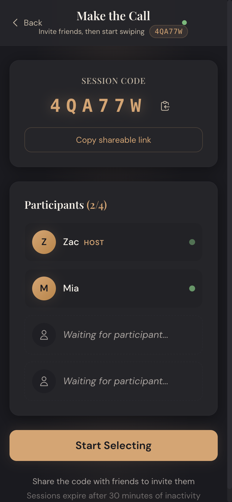
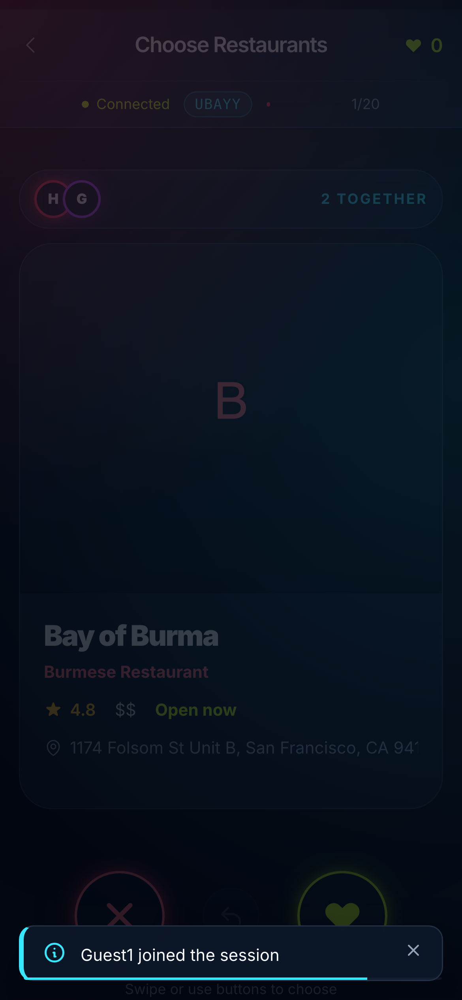
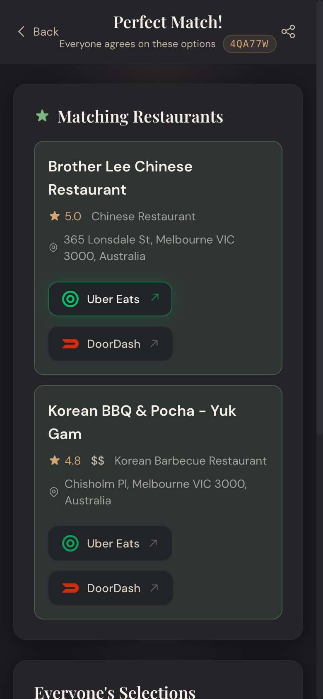
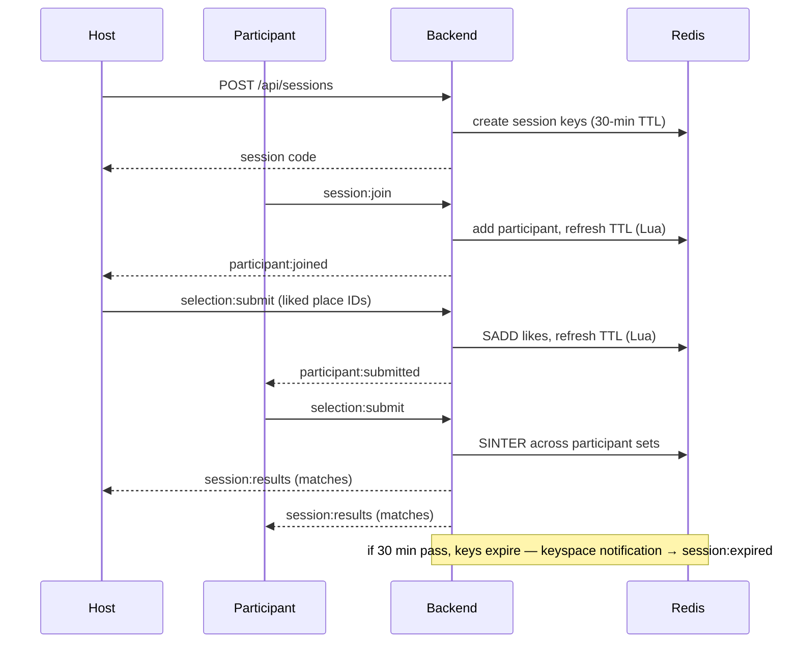

<p align="center">
  
</p>

# Dinder

**Swipe. Match. Eat.** Dinder is a real-time app for groups of 2–4 who can't decide where to eat: everyone swipes through nearby restaurants, and the moment the last person submits, Redis computes the overlap and pushes the matches to every phone at once.

<p align="center">
  <a href="https://www.dinder.it.com"></a>
  <a href="LICENSE"></a>
  
</p>

<p align="center">
  <a href="https://www.dinder.it.com">Live demo</a> ·
  <a href="#how-it-works">How it works</a> ·
  <a href="#demo">Demo</a> ·
  <a href="#architecture">Architecture</a> ·
  <a href="#local-development">Local development</a>
</p>

## Demo

<p align="center">
  
</p>

## Screenshots

<p align="center">
  
  
  
</p>

<p align="center"><em>Share a code → everyone swipes → the group's overlap, revealed in real time.</em></p>

## Features

- **No account needed** — enter a name, get a 6-character session code, share it. The core flow is fully anonymous.
- **Real-time presence** — participants appear in the lobby as they join, via Socket.IO rooms keyed by session code.
- **Swipe selection** — like or pass on real nearby restaurants fetched from the Google Places API, with ratings, price level, and cuisine.
- **Set-intersection consensus** — each participant's likes live in a Redis set; the group's matches are computed with a single [`SINTER`](backend/src/store/sessionStore.ts) when the last person submits.
- **Ephemeral by design** — every session key carries a 30-minute TTL, refreshed atomically across all of a session's keys by an inline [Lua script](backend/src/store/sessionStore.ts) on each interaction. No cleanup jobs, no stale data.
- **Push expiry** — Redis keyspace notifications fire when a session's keys expire, and the backend broadcasts `session:expired` so clients aren't left polling a dead session.
- **Optional Google sign-in** — a Supabase-backed friends feature lets returning users sign in and find each other; the swipe flow never requires it.

## How it works



The full client/server event contract — `session:join`, `selection:submit`, `session:restart`, `session:leave` inbound; `participant:joined/submitted/left/disconnected`, `session:results`, `session:restarted`, `session:expired` outbound — is typed once in [`shared/types/websocket-events.ts`](shared/types/websocket-events.ts) and imported by both sides, so the frontend and backend cannot drift apart silently.

## Architecture

npm workspaces monorepo, three packages:

| Package | What it is |
|---|---|
| `backend/` | Node 20 + TypeScript, Express 4, Socket.IO 4.7, ioredis, Zod validation. One [handler file per socket event](backend/src/websocket/), services for sessions, friends, and restaurant search. |
| `frontend/` | React 18 + Vite, Tailwind, Zustand for state, socket.io-client. Mobile-first. |
| `shared/` | `@dinder/shared` — the typed WebSocket event contract and Zod schemas both sides import. |

**The Redis data model is the app.** A session is a handful of keys (`session:<code>`, `session:<code>:participants`, `session:<code>:<participantId>:selections`, …), all carrying the same 30-minute TTL. Consensus is `SINTER` over the per-participant selection sets, and TTL refresh happens in one atomic inline Lua script so a session's keys can never expire out of sync — all in [`sessionStore.ts`](backend/src/store/sessionStore.ts). [`sessionExpiryNotifier.ts`](backend/src/redis/sessionExpiryNotifier.ts) subscribes to keyspace `expired` events to tell connected clients the moment a session dies.

REST is deliberately thin — `POST /api/sessions`, `GET /api/sessions/:code` — everything live goes over the socket.

## Local development

Prerequisites: Node 20+, Docker (for Redis), and a [Google Places API key](https://developers.google.com/maps/documentation/places/web-service/get-api-key).

```bash
git clone https://github.com/Zacplischka/dinner_app.git
cd dinner_app
npm install

# Redis
docker run -d -p 6379:6379 redis:7-alpine

# backend (terminal 1) — http://localhost:3001
echo "GOOGLE_PLACES_API_KEY=your-key-here" > backend/.env
cd backend && npm run dev

# frontend (terminal 2) — http://localhost:3000
cd frontend && npm run dev
```

Or `./start.sh`, which starts Redis (Docker), the backend, and the frontend in one go.

### Environment variables

| Variable | Needed for |
|---|---|
| `GOOGLE_PLACES_API_KEY` | Restaurant search — required at backend boot |
| `PORT`, `REDIS_HOST`, `REDIS_PORT`, `REDIS_PASSWORD`, `FRONTEND_URL` | All have local defaults |
| `SUPABASE_URL`, `SUPABASE_JWT_SECRET`, `SUPABASE_SERVICE_ROLE_KEY` | Optional Google sign-in / friends feature only |

### Testing

The project was built spec-first: the WebSocket contract is typed once in [`shared/types/websocket-events.ts`](shared/types/websocket-events.ts), and [contract tests](backend/tests/contract/) assert the backend against it (they need Redis running):

```bash
cd backend && npm test              # unit tests
cd backend && npm run test:contract # contract + integration tests (Redis required)
cd frontend && npx playwright test  # end-to-end specs
```

Honest status: the suite is extensive (~200 cases across unit, contract, integration, and Playwright e2e) but not currently all green — some backend unit tests have drifted from newer restaurant-search code. Treat the contract tests as the source of truth for the realtime protocol.

## Deployment

Both services deploy to [Railway](https://railway.app): the backend via Railpack (`npm ci && npm run build && npm run start` from the repo root), the frontend as a static SPA. See [`DEPLOY_GUIDE.md`](DEPLOY_GUIDE.md).

## License

[MIT](LICENSE) © Zac Plischka
