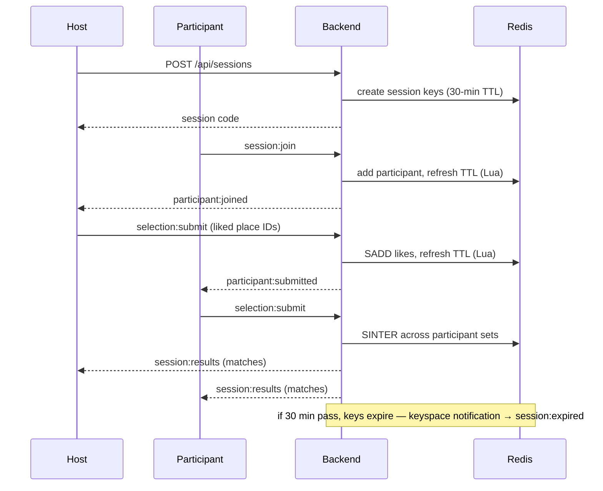

<p align="center">
  
</p>

# Dinder

**Swipe. Match. Eat.** Dinder is a real-time app for groups of 2–4 who can't decide where to eat: everyone swipes through nearby restaurants, and the moment the last person submits, Redis computes the overlap and pushes the matches to every phone at once.

<p align="center">
  <a href="https://www.dinder.it.com"></a>
  <a href="LICENSE"></a>
  
</p>

<p align="center">
  <a href="https://www.dinder.it.com">Live demo</a> ·
  <a href="#how-it-works">How it works</a> ·
  <a href="#demo">Demo</a> ·
  <a href="#architecture">Architecture</a> ·
  <a href="#local-development">Local development</a>
</p>

## Demo

<p align="center">
  
</p>

## Features

- **No account needed** — enter a name, get a 5-character session code, share it. The core flow is fully anonymous.
- **Real-time presence** — participants appear in the lobby as they join, via Socket.IO rooms keyed by session code.
- **Swipe selection** — like or pass on real nearby restaurants fetched from the Google Places API, with ratings, price level, and cuisine.
- **Set-intersection consensus** — each participant's likes live in a Redis set; the group's matches are computed with a single [`SINTER`](backend/src/store/sessionStore.ts) when the last person submits.
- **Ephemeral by design** — every session key carries a 30-minute TTL, refreshed atomically across all of a session's keys by an inline [Lua script](backend/src/store/sessionStore.ts) on each interaction. No cleanup jobs, no stale data.
- **Push expiry** — Redis keyspace notifications fire when a session's keys expire, and the backend broadcasts `session:expired` so clients aren't left polling a dead session.
- **Optional Google sign-in** — a Supabase-backed friends feature lets returning users sign in and find each other; the swipe flow never requires it.

## How it works


```mermaid
sequenceDiagram
    participant H as Host
    participant P as Participant
    participant S as Backend
    participant R as Redis

    H->>S: POST /api/sessions
    S->>R: create session keys (30-min TTL)
    S-->>H: session code
    P->>S: session:join
    S->>R: add participant, refresh TTL (Lua)
    S-->>H: participant:joined
    H->>S: selection:submit (liked place IDs)
    S->>R: SADD likes, refresh TTL (Lua)
    S-->>P: participant:submitted
    P->>S: selection:submit
    S->>R: SINTER across participant sets
    S-->>H: session:results (matches)
    S-->>P: session:results (matches)
    Note over S,R: if 30 min pass, keys expire — keyspace notification → session:expired
```

The full client/server event contract — `session:join`, `selection:submit`, `session:restart`, `session:leave` inbound; `participant:joined/submitted/left/disconnected`, `session:results`, `session:restarted`, `session:expired` outbound — is typed once in [`shared/types/websocket-events.ts`](shared/types/websocket-events.ts) and imported by both sides, so the frontend and backend cannot drift apart silently.

## Architecture

npm workspaces monorepo, three packages:

| Package | What it is |
|---|---|
| `backend/` | Node 20 + TypeScript, Express 4, Socket.IO 4.7, ioredis, Zod validation. One [handler file per socket event](backend/src/websocket/), services for sessions, friends, and restaurant search. |
| `frontend/` | React 18 + Vite, Tailwind, Zustand for state, socket.io-client. Mobile-first. |
| `shared/` | `@dinder/shared` — the typed WebSocket event contract and Zod schemas both sides import. |

**The Redis data model is the app.** A session is a handful of keys (`session:<code>`, `session:<code>:participants`, `session:<code>:<participantId>:selections`, …), all carrying the same 30-minute TTL. Consensus is `SINTER` over the per-participant selection sets, and TTL refresh happens in one atomic inline Lua script so a session's keys can never expire out of sync — all in [`sessionStore.ts`](backend/src/store/sessionStore.ts). [`sessionExpiryNotifier.ts`](backend/src/redis/sessionExpiryNotifier.ts) subscribes to keyspace `expired` events to tell connected clients the moment a session dies.

REST is deliberately thin — `POST /api/sessions`, `GET /api/sessions/:code` — everything live goes over the socket.

## Local development

Prerequisites: Node 20+, Docker (for Redis), and a [Google Places API key](https://developers.google.com/maps/documentation/places/web-service/get-api-key).

```bash
git clone https://github.com/Zacplischka/dinner_app.git
cd dinner_app
npm install

# Redis
docker run -d -p 6379:6379 redis:7-alpine

# the backend reads backend/.env
echo "GOOGLE_PLACES_API_KEY=your-key-here" > backend/.env

# backend on http://localhost:3001, frontend on http://localhost:3000
npm run dev
```

### Environment variables

| Variable | Needed for |
|---|---|
| `GOOGLE_PLACES_API_KEY` | Restaurant search for Eat Out and Takeaway Sessions |
| `SPOONACULAR_API_KEY` | Sourced Recipes for the Cook Branch |
| `PORT`, `REDIS_HOST`, `REDIS_PORT`, `REDIS_PASSWORD`, `FRONTEND_URL` | All have local defaults |
| `SUPABASE_URL`, `SUPABASE_SERVICE_ROLE_KEY` | Optional Google sign-in / friends feature only |
| `VITE_BACKEND_URL`, `VITE_API_BASE_URL` | Frontend → backend; default to the local backend on port 3001 |
| `VITE_SUPABASE_URL`, `VITE_SUPABASE_ANON_KEY` | Frontend sign-in; without them auth is disabled with a console warning |

### Scripts

Everything runs from the repo root. `shared/` builds first — `backend` and `frontend` import `@dinder/shared` as a file dependency — and `build` and `typecheck` take care of that.

```bash
npm run dev          # backend + frontend together
npm run build        # shared → backend → frontend, in that order
npm test             # backend + frontend vitest suites (the backend's include contract + integration, which need Redis)
npm run typecheck    # builds shared, then tsc --noEmit on both
npm run lint         # eslint both workspaces
npm run format       # prettier both workspaces
npm run analyze:pr   # fallow audit against origin/main
npm run gen:types    # regenerate supabase/database.types.ts
```

Narrower runs go through the workspace: `npm run test:unit --workspace=backend`, `npm run test:contract --workspace=backend` (Redis required), `npm run test:e2e --workspace=frontend` (Playwright; `mobile-chrome` is the primary project). The WebSocket contract is typed once in [`shared/types/websocket-events.ts`](shared/types/websocket-events.ts) and the [contract tests](backend/tests/contract/) assert the backend against it — they are the source of truth for the realtime protocol.

The `check:*` scripts are repo-level checkers with no build step (Node, one bash script); the corpus ones cover the Owned Recipe pipeline in [`scripts/corpus/`](scripts/corpus/) ([ADR 0012](docs/adr/0012-owned-recipes-are-authored-from-fact-records.md)). All but `check:frontend-serving` run in CI's lint job:

| Script | What it checks |
|---|---|
| `check:comment-paths` | Documentation paths cited in `backend/src`, `frontend/src` and `shared/types` comments still resolve on disk |
| `check:production-edge` | The production edge's cache and health contracts — document and fingerprinted-asset headers, purge responses, the declared Cloudflare rollout state. Its `verify` step needs a CI-only cache purge first |
| `check:frontend-serving` | The `Caddyfile` serves a fresh frontend build correctly — needs Caddy installed |
| `check:reading-stage` | Corpus reading stage: robots.txt refusal, the UK/EU publisher skip, the three-publisher floor |
| `check:authoring-stage` | Corpus authoring stage: a draft that lifts text from a source capture is caught |
| `check:corpus-images` | Corpus image pipeline: prompts, crops, R2 URLs and cost accounting |
| `check:gate-layers` | Corpus gate: the structural rules and the two-model-family culinary judges |
| `check:tally-gate` | Corpus tally layer: grading what Woolworths store 1101 can price |
| `check:human-gate` | Corpus human-review layer: the sample is stratified, deterministic and a tenth of the batch |

CI ([`ci-cd.yml`](.github/workflows/ci-cd.yml)) runs `typecheck`, `lint`, both unit suites and the `check:*` scripts in one job and the contract suite against a Redis service in another; a green `main` auto-deploys.

## Deployment

Both services deploy to [Railway](https://railway.app): the backend via Railpack (`npm ci && npm run build && npm run start` from the repo root), the frontend as a static SPA.

## License

[MIT](LICENSE) © Zac Plischka
