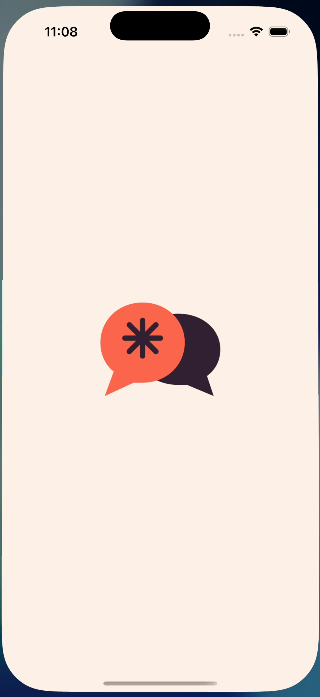
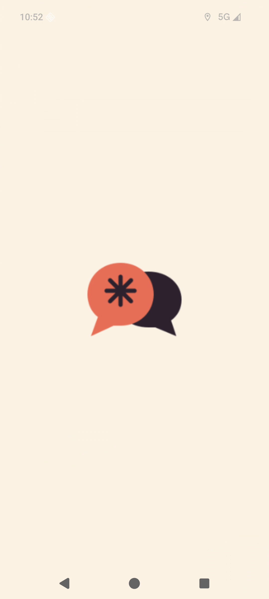

# Native YupCrew artwork (#482)

Verified 9 September 2026. These are exports of the existing web identity, with
no change to application IDs, signing, entitlements, or store configuration.

## Source and export

- `frontend/public/yupcrew-icon.svg`, SHA-256
  `7e4eefe46d7c2c0b56886c9fba79c3cc693c8b05cb94f850e2fb43c0c906c87e`.
- `frontend/public/yupcrew-mark.svg`, SHA-256
  `ec4acb656de1a88557741da66f158b6397737dd0ad3a678381f027eac0c96d82`.
- Renderer: `rsvg-convert 2.60.0`; no runtime dependency added.
- Cream background: `#FFF4E8`. Preserve the SVG paths and aspect ratio.

The iOS app icon is a 1024 × 1024 opaque RGB export of the icon SVG, rendered
with `rsvg-convert --width 1024 --height 1024 --background-color '#FFF4E8'`.
The splash is a centered mark on a square cream canvas. Its logical size is
640 × 640, exported at 640, 1280 and 1920 pixels for 1x, 2x and 3x. The mark
width is `canvasWidth * 512 / 2732`; its SVG viewBox is 58 × 48. The storyboard
uses the same 640-point logical image size and retains aspect-fill behavior.

The initial 2732-pixel draft compiled but the iOS launch snapshot rejected it:
`Estimated size (29900800) is over limit (25000000)`. The smaller correctly
scaled resources preserve the artwork's proportions and passed a cold launch
on a fresh simulator. Compilation alone did not catch this.

Android legacy icons use the icon SVG at 48dp in each existing density; round
icons clip it to its circular 512-pixel canvas. Adaptive foregrounds place the
58 × 48 mark at (25, 30) within a transparent 108 × 108 canvas, scaled per
density. The maximum painted radius is 32.65dp, inside the 33dp safe radius.
Adaptive backgrounds and the Android 12+ splash background use cream. Obsolete
Capacitor foreground/background drawables were removed so resource qualifiers
cannot select the template. Legacy splash canvases retain their existing
dimensions and center a 128dp-wide mark at each density.

## Visual evidence

| Baseline template | Current native cold launch |
| --- | --- |
|  |  |
|  |  |

The baseline images are extracted from commit `c9d5d4cb7b768e00ea64564232a820b89fd17099`.
The current images are frames from real native cold-launch recordings, not
browser previews or composited mockups. The current iOS icon is also directly
reviewable in `frontend/ios/App/App/Assets.xcassets/AppIcon.appiconset/`.

## Verification

- Checked all 30 PNG resources: dimensions, opaque iOS icon, cream splash
  backgrounds, transparent legacy icon corners, and adaptive safe geometry.
  Parsed the launch/adaptive XML and confirmed the three iOS catalog scales.
- Built the development web bundle and synced both native projects.
- Xcode 26.3 (17C529): Debug simulator build passed. Applied a local ad hoc
  signature to the build artifact; strict signature verification passed.
  Installed and cold-launched `it.com.dinder.app.dev` on a fresh iPhone 17 Pro
  simulator running iOS 26.3; observed the brand splash then the app home screen.
- Android API 36 emulator: Debug app and instrumentation APK compiled with
  Java 21; installed `it.com.dinder.app.dev` and cold-launched MainActivity.
  `am start -W` reported a COLD launch and the recorded frame shows the logo.

Artifact SHA-256 values for the captured development builds:

| Artifact | SHA-256 |
| --- | --- |
| iOS App executable | `ede8f7a483ba71e48855d84d39315a584678357e209d15d51cd34375bdeb0458` |
| iOS Assets.car | `0488eaa92fc3472cf45356c5e2bdc2d7130b0dd04de9e27198979716d72847fd` |
| Android app-debug.apk | `5f4283867f3a576b5e240831fafa22c1ba26dc46e0f04e8ed1cfc1275e7cb21f` |

This proves simulator/emulator artwork and launch behavior. Physical-device,
distribution signing and store evidence remains the separate #481 gate.
