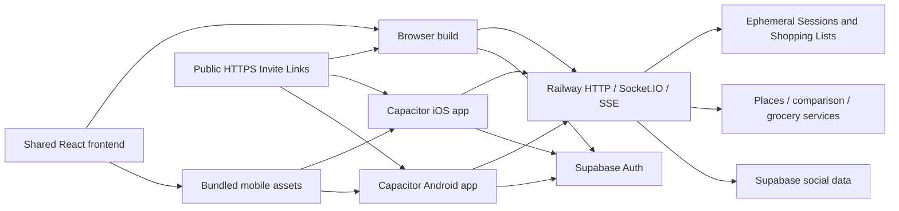

# Dinder / Heykeen: Android and iOS app release plan

Prepared 8 September 2026. **Planning only; implementation and store submission have not started.**

Confirmed scope: a **free, Australia-first release** on Google Play and Apple's App Store. Heykeen is the working public brand; Dinder remains the repository/package name. This plan incorporates the existing [rebrand plan](heykeen-rebrand-plan.md) and the current, uncommitted brand changes without changing them.

## 1. Recommended outcome

Package the existing React application with **Capacitor**, add the mobile capabilities needed for a reliable experience, and retain the existing Railway backend, Redis, Supabase and browser application. Friends should be able to participate together from an iPhone app, Android app or ordinary browser. Downloading remains optional for someone following an Invite Link.

This is a shared frontend with two native projects, two signing configurations and two store release processes. Capacitor runs the React interface in the platform WebView and exposes device APIs; it does not convert React DOM components into native SwiftUI or Android views. It supports adding native projects to an existing application with a built asset directory. [Capacitor installation](https://capacitorjs.com/docs/getting-started).

The first release includes the existing Eat Out, Takeaway, Cook and Watch branches, guest Sessions, optional accounts and Friends, Shopping Lists, Cook View, comparison and Group Order handoffs. Preserve the current two-to-four-person use case, dietary handling, collaborative Ready flow and honest outcome language. The app helps people choose and hands off to providers; it does not book tables, sell groceries or stream films.

**Planning allowance:** 31–46 focused engineering days before contingency; reserve roughly **8–12 working weeks** including 20–30% contingency. Allow **9–14 calendar weeks** for a solo implementation with account enrollment, testers and review. These are estimates derived from the work below, not quotes or guaranteed store dates. A device prototype is a much smaller first checkpoint: approximately 3–5 days after the basic setup decisions.

### Alternatives considered

| Approach | Fit for this repository | Decision |
| --- | --- | --- |
| Capacitor with bundled React assets | Reuses routes, UI, state, API contracts and backend; adds native integration where needed | Recommended, subject to the device prototype gate |
| React Native / Expo | Can reuse TypeScript models and some services; DOM, CSS, routing and gesture UI would need substantial work | Reconsider only if measured WebView performance or required native UX defeats the prototype |
| Separate Swift and Kotlin apps | Maximum platform control; two additional client implementations to maintain | No demonstrated requirement justifies this cost |
| PWA / home-screen install | Useful existing browser channel, but does not deliver both requested store apps | Preserve as a companion |
| Android Trusted Web Activity | Android-only packaging path; still leaves a separate iOS solution | Does not simplify this two-platform release |

No additional UI framework is required alongside Capacitor. Do not rewrite the backend or replace Zustand, React Router, Socket.IO or existing tests merely because mobile clients are being added.

## 2. What the repository already provides

Audit basis: local checkout at `094c9bd` plus the working-tree changes present during this review. Findings below are source inspection, not proof that a native build or the live services currently pass.

| Area | Evidence in the current repository | Consequence for mobile |
| --- | --- | --- |
| Frontend | `frontend/package.json`, `frontend/src/App.tsx`, `frontend/vite.config.ts`: React 18, Vite 5, React Router, Zustand; output `frontend/dist` | Strong reuse candidate; audit exact locked dependencies during the prototype |
| Web installation | `frontend/public/manifest.webmanifest` supplies Heykeen name/icons; no service-worker registration found in inspected app sources | Home-screen metadata exists; offline functionality and native packaging do not |
| Group communication | `services/socketService.ts`, `services/socketBindings.ts`; Express + Socket.IO in `backend/src/server.ts` | Existing reconnect/rejoin machinery can be extended rather than replaced |
| Streamed comparison | `frontend/src/services/comparisonStream.ts` uses `EventSource` | Native WebView testing must include SSE as well as HTTP and Socket.IO |
| Participant identity | `stores/sessionStore.ts` and `socketBindings.ts` store Session state and rejoin tokens in `sessionStorage` | App termination needs explicit durable recovery; keep browser tab isolation intact |
| Lifetimes | `backend/src/store/sessionStore.ts`: 30-minute Session inactivity TTL; `ShoppingListService.ts`: fixed seven-day list lifetime | Installation must not imply permanent Sessions or indefinite saved recipes |
| Authentication | `services/supabase.ts`: Google OAuth, browser-origin redirect, automatic URL session detection | Needs mobile callback handling and an iOS-compliant equivalent sign-in option |
| Friends | `backend/src/api/friends.ts`, `FriendsService.ts`, `friendsStore.ts`: authenticated graph and exact-email discovery | Preserve existing accounts; handle Apple's private relay addresses and missing profile fields |
| Deletion / safety | No account-deletion, report or end-user block route found in inspected API/UI; schema allows `blocked` and service checks it | Schema support alone is not a usable deletion or moderation feature |
| Browser assumptions | Sharing, geolocation, clipboard, external links and wake lock use browser APIs | Adapt at existing shared functions, plus the direct callers listed below |
| Public links | Backend creates Invite Links from `FRONTEND_URL`; Results and Shopping List shares use browser location | Packaged app origins must never become public share URLs |
| Backend origins | `backend/src/server.ts` maintains explicit HTTP and Socket.IO origin allowlists | Add tested native origins to both; retaining web origins is essential |
| Web serving | Root `Caddyfile` serves built files and falls back to `index.html`; Cloudflare fronts public routes | Association files need real JSON responses and exceptions from redirects/SPA fallback |
| Verification | Vitest, backend contracts, Playwright mobile Chromium; CI's e2e job is not currently a dependency of production verification | Reuse coverage, add real-device evidence and make mobile release gates explicit |
| Toolchain | Local Node `24.14.1`, Xcode `26.3`; discovered Java installations 17/18; existing CI declares Node 20 | Local iOS tools are promising; choose the correct Gradle JDK and upgrade mobile build CI's Node version |

Relevant design constraints remain [optional auth and guests](adr/0003-auth-is-optional-guests-are-first-class.md), [participant identity](adr/0009-ephemeral-group-state-is-keyed-by-display-name.md), [additive contracts](adr/0007-contracts-evolve-additively-across-deployments.md), and [gathering before dealing](adr/0015-gather-before-choosing-the-deck.md).

## 3. Target architecture and release boundaries

### Packaging and configuration

1. Add `frontend/capacitor.config.ts` and generated `frontend/ios/` and `frontend/android/` projects. Use `webDir: 'dist'`; commit native project configuration and lockfiles, excluding build outputs and signing secrets.
2. Build and bundle the frontend into each signed release. **Do not ship `server.url` pointing at the live website**; Capacitor documents that setting for live reload, not production. Do not introduce remote JavaScript update infrastructure in v1. [Configuration](https://capacitorjs.com/docs/config).
3. Keep `VITE_API_BASE_URL` and `VITE_BACKEND_URL` for the remote services; add one explicit public web origin for user-facing links. Native release builds must fail if required URLs are missing, non-HTTPS or accidentally point at a development backend.
4. Use separate development/staging and production configuration. Staging builds must not silently consume production API budgets or publish real Session links. Give staging a distinct app identifier if installed alongside production.
5. Prefer an operator-controlled, stable API hostname before shipping binaries; provision and verify it against the existing Railway service. If the current Railway hostname is retained, treat its stability as a release contract. Changing an embedded endpoint later requires keeping old clients working.
6. Native application bundles are public. They may contain Supabase public/anon configuration, but no Supabase service-role key, Places server key, Apple signing key, R2 credentials, corpus keys or store upload credentials.

Use a current supported Capacitor 8 release and pin the resolved versions after the prototype. Its documented baseline is Node 22+, Xcode 26+, iOS deployment target 15, Android minimum API 24 and target/compile API 36. These are different from store submission deadlines. Support at the framework floor still needs device testing; raise the product minimum only for a recorded reason. Newer Capacitor 8.5 guidance also changes iOS scene lifecycle handling, so use the matching generated template. [Capacitor 8 baseline](https://capacitorjs.com/docs/updating/8-0), [8.5 lifecycle changes](https://capacitorjs.com/docs/updating/8-5).

### Build and distribution pipeline

Extend the existing npm workspace and GitHub Actions setup. Keep ordinary pull-request validation separate from signed distribution:

- Pull request: install from the lockfile, build shared types, typecheck/lint, run relevant unit/contracts and the key browser scenarios; compile Android and an unsigned iOS simulator build when native files/plugins change. Use the supported Node toolchain for Capacitor and the matching Android Studio/Gradle JDK.
- Release candidate: select a source commit and environment; build shared types and frontend assets, run Capacitor sync from `frontend/`, archive iOS on macOS, and produce a signed Android AAB. Assert the resulting endpoint settings, package IDs, permissions and version fields.
- Use one user-facing release version, with monotonically increasing iOS build numbers and Android `versionCode` values. Preserve native configuration in git; never regenerate projects blindly over entitlements or signing changes.
- Keep App Store Connect API credentials, Apple signing material and the Android upload key in restricted CI secrets or the operator's protected local signing environment. Untrusted pull requests must not receive them. Start with manual beta uploads if account automation would delay the prototype; automate the repeatable release steps by M6.
- Retain the source commit, dependency/native lockfiles, build settings, checksums, release artifacts and available crash-symbol files/source maps with controlled access. Tag completed releases and record which backend contract they require.
- Beta upload and public publication are separate steps. The release workflow must require successful checks, explicit environment selection and a reviewable candidate; a routine push to `main` must not silently publish a phone app.

This adds build/release jobs rather than replacing the web deployment. It also avoids requiring a new paid CI platform before there is evidence that the current tools are insufficient.

### Device prototype: the first go/no-go gate

On one physical iPhone and one physical Android phone, load **bundled** assets, join a shared Session with a browser participant, complete Watch/Cook, exercise HTTP/Socket.IO/SSE, background and reopen, invoke sharing and location, and prove the Google browser callback returns to the app. Verify a signed test build as soon as account access permits.

Record startup time, swipe smoothness, memory pressure and return-from-browser behavior. If a required flow is unreliable, isolate the failing integration before continuing. Only reconsider React Native after a measured failure that cannot be fixed economically in the existing interface.

## 4. Work required for a dependable app

### A. Native interaction and layout

Use small functions alongside existing services/hooks, with platform detection at device boundaries. The starting candidates are Capacitor App, Share and Geolocation; add keyboard/status-bar controls only where testing shows a need. Secure storage is a separate requirement, and must not be mistaken for plain preferences storage.

| Behavior | Implementation direction | Acceptance |
| --- | --- | --- |
| Sharing | Adapt `useShareLink`; inspect direct clipboard users in `NavigationHeader.tsx` and `GroupOrderPage.tsx` | Correct HTTPS link; cancelling a share is harmless; clipboard/manual code fallback works |
| Location | Route `LobbyChoices.tsx` and `ComparePage.tsx` through the same location function | Ask only after “Use my location”; denial, approximate permission, disabled services and timeout retain suburb/postcode entry |
| External destinations | Audit links in `MovieLinks`, Results, Shopping Lists, comparisons and orders; use platform/browser opening with allowed schemes | Maps, trailers, provider sites and retailer handoffs open outside the privileged app WebView; returning restores state |
| Android Back | Integrate with existing router and leave confirmation | Close a modal first; navigate appropriately; never silently leave an active Session or trap the user |
| Screen and keyboard | Apply safe-area insets once; test Android edge-to-edge and iOS home indicator, keyboard resize and scroll | Ready/Like/Pass/submit controls remain reachable on small phones and with large text |
| Cook View | Retain `useWakeLock`; verify native behavior, add a maintained keep-awake integration only if required | Screen remains awake while actively cooking and releases on exit/background |
| Accessibility | Preserve focus and route announcements, semantic buttons and reduced motion | VoiceOver/TalkBack complete joining, swiping via buttons, Ready, results and list claiming; no gesture-only actions |

Do not request contacts, camera, microphone, photo-library or background-location access for this scope. Sharing a text link does not need these permissions. Prefer approximate location where it meets nearby-search needs. [Geolocation API](https://capacitorjs.com/docs/apis/geolocation), [Share API](https://capacitorjs.com/docs/apis/share).

### B. Session recovery, foregrounding and storage

The server already keeps disconnected Participants and accepts a rejoin token; use that authority. A phone can suspend or terminate the process, so uninterrupted background sockets cannot be the design.

- Persist mobile recovery data when state changes, not only in a background callback. Store the active Session Code, Participant display name, rejoin capability, round/revision, last valid route and the minimal local swipe progress needed to resume. Do not persist transient connection flags or the Group Order menu.
- Keep tokens in a maintained Keychain/Android Keystore-backed storage integration. Use native preferences for non-secret lightweight progress where appropriate. Browser `localStorage` is not a reliable native durability guarantee, and Preferences is not encrypted secret storage. [Capacitor storage guidance](https://capacitorjs.com/docs/apis/preferences).
- Complete asynchronous hydration before `RequireSession` or socket initialization acts on it. On foreground/cold launch, reconnect once, rejoin once, and reconcile with server state before enabling mutations. Refresh optional authentication independently: Supabase unavailability must not prevent a valid guest Session from recovering.
- Keep current web `sessionStorage` behavior. Replacing it globally with `localStorage` would revive the documented cross-tab identity bug.
- Reconcile a restart or advanced round against server revision; discard stale local choices rather than submitting them into the new round. A connection timeout means “outcome unknown,” not permission to replay a mutation blindly.
- Clear credentials on explicit Leave, definitive expiry or rejected ownership. Transient network errors should offer retry without discarding recoverable identity. Inspect the existing reconnect failure branch, which currently resets the store for any failed rejoin.
- Make resume strict at the existing shared join service: if a request supplies a rejoin token, it must match that Session's Participant and display name or fail before leaving another Session, claiming a name, assigning Host status or mutating any roster. The current service falls back to fresh entry when no token matches; that is unsafe for durable app recovery. A rejected resume offers an explicit fresh-join action, subject to ordinary admission rules, never an automatic retry without the token.
- Make the 30-minute inactivity rule visible. Opening after expiry produces an honest expired-session screen; it must not resurrect a Session or silently join someone else's reused code.
- Restore Shopping List/Cook View progress within the list's seven-day lifetime. Purge expired local snapshots. A list capability, rejoin token and auth token must not appear in analytics, crash breadcrumbs or public previews.
- Refresh comparison streams and list state after foregrounding without starting duplicate expensive provider jobs. Keep the server's existing deduplication and budgets.

Use the existing App lifecycle events for resume/link dispatch, with one listener registration and clean teardown. Refresh the Socket.IO auth payload when credentials change; the current socket construction captures the access token at initialization. Review the server's recovered-connection middleware behavior for logout, deletion and token expiry. Session mutation authority remains the guest Participant capability; ordinary sign-out must not evict a valid Participant merely to clear Profile privileges. Start by testing existing per-request Supabase verification rather than adding a token-denylist service. [Capacitor App API](https://capacitorjs.com/docs/apis/app).

**Offline contract for v1:** the packaged interface opens and explains connectivity; creating Sessions, joining, Ready, submissions, comparison and list claims require the server. Preserve drafts and offer retry. No full offline catalogue, offline order queue or conflict-resolution engine. A read-only cached Cook View can follow later if supermarket/stove testing demonstrates demand.

### C. Invite Links, public URLs and app routing

Preserve the domain model: an **Invite Link** is the shareable Session URL; a **Session Invite** is the Friends feature. OS deep links are the delivery mechanism for these routes.

1. Select the canonical HTTPS domain in coordination with the rebrand. Add Apple Universal Links and Android App Links using real `/.well-known/apple-app-site-association` and `/.well-known/assetlinks.json` files.
2. Restrict the association/routing scope to the intended app routes: `/join?code=…`, `/session/…`, `/list/…` including Cook View, and explicitly supported auth callbacks. Keep privacy/support/deletion pages usable on the web.
3. Configure the correct Apple Team ID/bundle ID and Android package ID/**Play app-signing certificate** fingerprint. Distinguish the upload key from the signing key users receive. Prove association from TestFlight/Play-distributed builds, not just debug builds.
4. Serve the files over HTTPS as JSON without authentication, redirects, bot challenges or SPA fallback. Test both canonical and supported legacy hosts, including CDN caching and rebrand redirects.
5. Handle cold launch and a link delivered to an already-running app; deduplicate events and wait for router/storage readiness. Parse URLs with strict host, path and argument validation. Never turn an arbitrary URL into app navigation.
6. Fix the root source of outgoing links: backend `shareableLink`, `ShoppingListPage`'s `window.location.origin`, and `ResultsPage`'s `window.location.href`. `capacitor://localhost` or `https://localhost` must never be shared.
7. If the app is absent, open the existing browser flow with the code intact. Installing from a store is **not** guaranteed to carry an invite through installation; let people use the browser, re-open the original link or type the Session Code. No deferred-link attribution service is needed.
8. If someone opens a second Session while already participating, retain the existing leave/join rules and confirmation. App and browser storage are separate; do not claim seamless guest identity transfer between them. Existing signed-in accounts retain Friends after authenticating again.

See [Capacitor link setup](https://capacitorjs.com/docs/guides/deep-links). Keep the old web and recipe-image domains operational according to the rebrand plan.

### D. Authentication and account continuity

Keep guest entry first-class. For accounts, retain Google on all platforms and add **Sign in with Apple**, preferably native on iOS. Provide Apple browser sign-in on web/Android as well so an Apple-created account is usable across the product. Apple's equivalent-login requirement is a concrete consideration because Google currently authenticates the primary account; the [store requirements note](mobile-store-requirements.md) records the policy and exceptions.

- Replace the native Google redirect-to-`window.location.origin` behavior with a system-browser authentication session and a validated return route. Use Supabase's PKCE code exchange, persist its verifier securely through process recreation, and handle cancelled/failed/repeated callbacks. Do not run Google's authorization page inside the application WebView. [Google OAuth policy](https://developers.google.com/identity/protocols/oauth2/policies), [Supabase PKCE](https://supabase.com/docs/guides/auth/sessions/pkce-flow).
- Reuse Supabase Auth as identity authority. Implement the callback and storage differences in the existing auth service/store; do not introduce another user database. Configure exact production and staging return URLs. [Supabase mobile redirects](https://supabase.com/docs/guides/auth/native-mobile-deep-linking).
- For native Apple sign-in, use a maintained integration with nonce validation and Supabase token exchange. Collect a display name if Apple returns none. Native response names may only be available on first authorization; browser Apple OAuth does not supply the name in the same way. Apple's browser OAuth secret needs renewal at least every six months; assign an operational owner. [Supabase Apple integration](https://supabase.com/docs/guides/auth/social-login/auth-apple).
- Preserve existing Google identity IDs and Friendships. Different provider emails, including Apple relay addresses, must not be merged by display name or guessed similarity. Provide explicit authenticated account linking where needed and verify reauthentication/ownership. [Supabase identity linking](https://supabase.com/docs/guides/auth/auth-identity-linking).
- Verify Friends discovery with Hide My Email enabled. As the smallest compatible initial behavior, show the signed-in person the exact account address used by Friends with an explicit copy action; accept relay addresses in the existing exact-email lookup. Never require disclosure of the person's underlying real email. If this fails usability testing, scope an explicit friend-invite capability separately.
- Test sign-out, refresh expiry, login cancellation, provider revocation and deletion while a Session is open. Signing in must not unexpectedly replace the guest Participant or lose progress.

### E. Account deletion, privacy and community safety

Add an accessible Settings/account area with privacy, support, account actions, version/build and third-party credits. Add public `/privacy`, `/support` and `/delete-account` pages on the canonical website; publish usage/community terms appropriate to the actual social features.

**Deletion implementation:** add an authenticated server endpoint to delete the caller's account after confirmation and appropriate recent authentication. Derive the account ID from verified authentication, never an arbitrary client-supplied ID. Reuse the existing Supabase foreign-key cascades for Profiles, Friendships and Session Invites after confirming them against the complete migration history. Revoke provider/session access as applicable, remove account-associated data, invalidate active privileged connections, and clear device credentials. Include Apple authorization revocation in the Apple-account flow. Handle partial failure with a retryable, visible result; deleting only the profile row is insufficient.

Audit what can actually be linked to an account: guest Participants are keyed separately by display name/rejoin capability. Do not delete another person's data by matching names. Specify removal/anonymization of attributable active data and the retention of independently shared guest data, logs and backups. Verify deletion from another device and with an old token; deleting a Supabase user alone does not instantly invalidate every previously issued access token. The web deletion entry must work without having the app installed.

**Data inventory before filling store forms:**

| Data | Current/likely purpose and path | Work before declaring |
| --- | --- | --- |
| Name, email, avatar, provider identity | Optional sign-in, Profiles and Friends through Supabase | List fields actually received, linkage, processors and deletion |
| Location/suburb | Nearby restaurants and comparison through backend/Places | Inspect stored coordinates, shared lobby visibility, precision and logs; minimize retention |
| Session names, preferences, dietary choices, selections | Shared decision state in Redis | Document visibility and inactivity retention; evaluate sensitive dietary fields accurately |
| List content and shopper names | Seven-day shared Shopping List capability | Explain anyone-with-link access, retention and local progress |
| IP/request details, errors, identifiers | Railway/Cloudflare/app logging and abuse prevention | Inspect actual logger output and processor retention; redact authorization headers and private URLs |
| New native SDK diagnostics | Depends on selected plugins/monitoring | Inspect transitive SDK behavior, privacy manifests and data sent before declaring |

Do not select “no data collected” simply because accounts are optional or no advertising SDK is installed. Complete Apple's privacy disclosures, required-reason API/privacy manifests, Play Data safety and actual runtime permissions from the final binary and backend behavior. Capacitor is explicitly on Apple's required SDK privacy-manifest list; inspect the packaged SDK and any applicable binary signatures. [Apple SDK requirements](https://developer.apple.com/support/third-party-SDK-requirements/). The report records store-specific definitions; exact labels cannot be finalized from source inspection alone.

**Safety:** shared Profile, Participant and Shopper names are user content even without public chat. Apply prohibited-content terms and appropriate name validation/filtering before contribution, with reporting available from each relevant surface. Zac owns response handling; no moderation dashboard is required for the first small cohort. The v1 behaviors are:

- **Profiles:** keep a blocked Friendship with independent timestamps for each side's block against the persisted Profile IDs, and enforce that the relationship is blocked exactly when either timestamp exists. Either party may block; only that party may remove its block. Unfriend, decline, accept and profile changes cannot clear someone else's block. Removing the final block removes the relationship rather than restoring friendship automatically. Blocking invalidates pending requests and Session Invites in both directions. Old or concurrently accepted invites must fail when blocked. Serialize transitions by the canonical Profile pair even when no Friendship row exists; include request/invite creation, acceptance, unfriend and unblock in the same database enforcement through FriendsStore. Preserve direct-table denial and RLS under ADR 0008. Inspect legacy blocked rows before migration; never guess an unknown blocker or silently drop an existing block.
- **Participants:** a person can report and mute another Participant's displayed user content within the current Session. A local mute uses the existing Session Code plus unique display name, clears on Leave/expiry and changes presentation only, never membership, Ready, counts, Match calculation or domain identity keys. The actual Host may remove a non-Host Participant even while online using the shared Leave cleanup semantics: remove Selections/Submission and current-participant counts, update Lobby/Group Order state, and compute any now-complete Match. Also evict the target socket from the Session room, notify it to clear recovery, reject later commands and broadcast reconciled state to those remaining. Authorize strictly against `isHost`; today's start/cleanup authorization can allow a guest when the Host is absent and must not grant moderation authority. This is separate from today's offline/not-Ready Lobby cleanup. A Host uses Leave for their own exit; guests can report/mute an abusive Host and Leave, and the operator can terminate a Session. Removed credentials fail strict resume; a fresh disposable identity is not a permanently identifiable person and may still enter subject to normal admission rules.
- **Shoppers:** a forwarded Shopping List needs its own terms/name validation, report action and local mute of abusive `claimedBy` labels, even after the Session has expired and for a person who was never a Participant. Presentation muting is scoped to that list and preserves the visible claimed/unclaimed state. Operator remediation redacts abusive displayed name content without overwriting the identity string, changing quantities, Claim exclusivity, Tally membership, the “Yours” check or the rule that any Shopper may release a Claim. Conceal the label consistently in rows, summaries and confirmations; a neutral replacement is presentation, not proof that all redacted names are one person. An exceptional operator moderation action may revoke an abusive list capability, with an honest unavailable screen. A self-declared name never proves identity; fresh names/devices cannot be permanently blocked without changing the guest model. Test whether these scoped safeguards meet the shipped social surface's review requirements before launch; do not describe them as permanent user bans.
- **Reports:** persist only user-submitted abuse evidence needed to investigate, such as resource type/reference, reported text, timestamp and voluntary contact. No automatic Session snapshots, dietary choices, Selections, Match history or rejoin tokens. Restrict records to operator access; default to deletion 30 days after resolution unless a documented legal hold applies. This is an explicit, narrow proposed exception to ADR 0001's no-trace retention boundary; amend that ADR before adding the report store. Ordinary Session data remains ephemeral and does not become social-history data. The report endpoint must be rate-limited and accept only bounded evidence, never arbitrary resource fetch URLs.

## 5. Store preparation and policy gates

The accompanying [current store requirements research](mobile-store-requirements.md) contains source links and detailed applicability. Recheck deadlines and console-specific requirements immediately before submission.

| Item | Plan |
| --- | --- |
| Developer ownership | Zac or the intended legal entity owns both accounts, signing and app records. Choose individual versus organization before registration; organization verification can add lead time |
| Brand and identifiers | Confirm Heykeen spelling, domain and name clearance before reserving permanent package/bundle IDs. Do not infer that an attractive name is available |
| Store fees | Apple: US$99/year; Google Play: US$25 once, subject to local currency/taxes and eligibility. These fees apply even to a free app |
| Apple submission baseline | Verified research: uploads require iOS 26 SDK or later from 28 April 2026. This does not mean users must have iOS 26 |
| Google submission baseline | Verified research: new apps/updates require Android 16 target API 36 from 31 August 2026; check the actual app's Play Console before release |
| Google testing | If the developer account falls under the new-personal-account rule, recruit at least 12 opted-in closed testers for 14 continuous days, then apply for production access; approval is a separate step |
| Android native compatibility | Audit included native libraries and validate 16 KB page-size support. Enforcement wording is changing; use the current note and actual bundle validation rather than an old deadline |
| Review functionality | Demonstrate the full interactive group decision workflow and mobile integrations. A collection of links or a thin site wrapper risks rejection; native plugins do not guarantee acceptance |
| Review access | Prove dedicated, isolated ordinary review accounts and separate disposable deletion accounts during M4/M5; see the repeatable access procedure below. A 30-minute invite generated days earlier is useless |
| Geography and language | Initial distribution Australia, English; permit manual Australian location during review because reviewers may be elsewhere |
| Devices and ages | Phone-first, accessible on larger screens; explicitly decide iPad distribution and test whichever device families are enabled. Fill ratings from movie artwork/trailers and user-content capabilities; do not guess the rating from the friendly brand |
| Assets | Native icons/adaptive icon, splash, store icon, screenshots at current accepted sizes, Google feature graphic, concise descriptions, support/privacy/deletion URLs and review notes. Use fictional Profile/Participant/Shopper details and movie imagery suitable for Apple's 4+ metadata standard independently of the app's rating |
| Commercial content | Preserve TMDB/JustWatch/Places attribution and verify permissions for images, external links, comparisons and marketing screenshots. Free distribution alone is not proof that every licence permits the use |
| Payments | No payments or billing SDK in v1. Retailer/restaurant external physical-goods handoffs are distinct from future digital subscriptions; revisit store billing rules and content licences before monetization |

Do not advertise the app as a dating, random-chat, booking, streaming or checkout service. Suggested positioning: **“Choose where to eat, what to cook, or what to watch—with your people.”** On the website, preserve the truthful invitation benefit that friends can join without downloading. Apple's metadata rules require suitable store imagery even when the app has a higher age rating. [Apple guidelines 2.3.8–2.3.9](https://developer.apple.com/app-store/review/guidelines/).

## 6. Backend, security and compatibility

**The important new constraint is slow client upgrades.** A web deployment cannot replace an app already installed on a phone.

1. Add exact tested native origins to HTTP and Socket.IO configuration. Capacitor defaults are typically `capacitor://localhost` on iOS and `https://localhost` on Android; verify emitted origins in release builds. An absent Origin header or a CORS match is not authentication.
2. Keep HTTPS/WSS, normal certificate validation and restrictive navigation. Review a Content Security Policy covering bundled scripts, API connections and actual image sources. Do not enable cleartext, wildcard origins, arbitrary in-WebView navigation or debugging in release builds.
3. Extend ADR 0007 for installed clients: keep additive HTTP/event schemas and tolerate older optional fields. Record client platform, version and build in diagnostics without using them as a security credential.
4. Keep compatibility tests for the oldest supported released mobile contract, not just the current shared TypeScript package. Proposed starting policy: at least 90 days' support for superseded builds, extended when meaningful active usage remains; security exceptions get an explicit recovery/update path.
5. Add a small version/capability response only where needed for compatibility messaging. Avoid an API-version rewrite up front. If a minimum-supported-build gate is added, distinguish a suggested update from an unusable/security-blocked client and provide the correct store URL.
6. Deploy backward-compatible backend changes before mobile binaries. Store rollout rollback does not remove installed binaries; fixes need compatible server behavior or a higher-version binary. Keep the last known-good server build compatible with released apps.
7. Review the existing per-instance rate windows and external API budgets under projected mobile traffic. Keep one backend instance until scaling evidence demands otherwise; multiple instances need shared rate limiting/deduplication and a Socket.IO scaling design. Test shared-network/carrier IP behavior so legitimate friends are not blocked.
8. Preserve server-side Places/grocery/comparison access. Do not move provider keys to the phone. Free app growth still incurs service cost. Validate provider failures, quota exhaustion and stale prices without fabricated fallback data.
9. Record monitoring for app crashes/ANRs, HTTP failures, reconnect failures, auth callbacks, Session completion and provider budgets. Reuse server logs and store crash/vitals first; evaluate extra JS crash reporting only if they leave a diagnostic gap. Scrub tokens, names, dietary choices and private links.
10. Verify Supabase uptime before beta/review. Repository instructions describe a pause-prone free project and daily keepalive; review whether a paid tier/backup policy is justified once reliability becomes a public commitment. A `/health` success currently primarily checks Redis, not all dependencies.

## 7. Delivery packages, dependencies and estimates

Effort is focused person-days for one developer familiar with this codebase. Enrollment waits, tester calendar time, provider verification and review delays are additional but can overlap. Use the existing GitHub Issues workflow when implementation is commissioned; the IDs below are local planning references, not created issues.

| Package | Effort | Depends on | Deliverable and exit evidence |
| --- | --- | --- | --- |
| M0 — scope, ownership and setup | 2 days | None | Confirm name/domain, account type, identifiers, audience/device scope; inventory accounts and toolchain; line up testers |
| M1 — bundled device prototype | 3–4 days | M0 identifiers/config | Both physical platforms boot bundled UI and pass a mixed-client Session, network and callback spike; record Capacitor go/no-go |
| M2 — links and native UX | 4–6 days | M1; domain for verified links | Production-shaped link associations, canonical sharing, permissions, external handoffs, keyboard/safe areas and navigation |
| M3 — recovery and compatibility | 5–7 days | M1 | Durable native identity/progress, hydration/rejoin sequencing, restart/expiry behavior, old-client contract checks |
| M4 — accounts and Apple login | 4–6 days | M1; developer/provider configuration | Google/Apple across supported clients, secure auth persistence, relay/name handling, account linking and cancellation tests |
| M5 — deletion, privacy and safety | 4–6 days | M4; can draft policies earlier | Working deletion and web entry, report/block enforcement, moderation owner, data map and draft store declarations |
| M6 — build and release pipeline | 3–4 days | M1; final SDK/plugin list | Reproducible signed IPA/archive and AAB, secured credentials, versioning, beta distribution and current store validation |
| M7 — mixed-device beta and fixes | 4–7 days | M2–M6; can begin qualifying testing once stable | Real-device matrix, four branches, beta feedback, meaningful failures resolved, release evidence pack |
| M8 — listings, review and launch | 2–4 days | M7; production access | Verified assets/policy forms, reviewer access, Australia-only release, support and recovery runbook |
| **Base total** | **31–46 days** | | **Add 20–30% contingency; update after M1** |

Suggested sequence: begin account verification/tester recruitment immediately; complete M1 before expanding implementation. Work through M2/M3, then M4/M5 while preparing M6. Start closed testing early enough for qualifying calendar days to overlap later polish; restart/fix testing when defects require it. Finish with M7 evidence and M8 submission. No public release date should be promised before both consoles permit submission.

Zac owns legal identity, account enrollment, purchases, brand/domain decisions, the real testing cohort, moderation/support and release authorization. Implementation work produces reviewable builds, tests, policy drafts and listing assets before publication decisions. This planning task creates no purchases, live-service changes or submissions.

## 8. Verification and release acceptance

Retain existing Vitest and contract checks; add focused regressions for changed trust boundaries, recovery, URL handling, deletion and blocking. Reuse Playwright for shared UI and browser flows. Browser mobile emulation does **not** prove native plugins, app termination, signing, Universal Links, permissions or store-distributed builds work. Start native release verification with a repeatable physical-device checklist; add an automation framework only when repetition justifies it.

### Required test matrix

| Dimension | Required cases |
| --- | --- |
| Participants | Mixed iOS + Android + browser; two and four Participants; guest/registered mix; host and joiner recovery |
| Devices | Current iPhone, oldest supported iOS test environment, mid-range Android, minimum-supported Android environment, latest supported Android/WebView; larger screens if distributed |
| Branches | Eat Out; Takeaway plus comparison/order handoff; Cook including dietary constraints/list/claim/Cook View; Watch including trailers/where-to-watch attribution |
| Session edges | Ready reset after preference change; late join; same display name; fifth Participant refused; Undo; all-pass outcome; Restart; Leave; host absence; expiry |
| Links | Installed/not installed, cold/warm launch, correct code, invalid/expired code, list expired, legacy host, second Session, cancelled installation and direct browser fallback |
| Interruptions | Lock for 30 seconds; background beyond Socket.IO's two-minute recovery window; process kill; return within and after Session expiry; Wi-Fi/mobile switch; airplane mode mid-ack |
| Auth | Google/Apple success, cancellation, invalid/replayed callback, relay email, missing name, sign-out, refresh expiry, linked account, deletion and old-token/active-socket attempts |
| Permissions | Location allowed/approximate/denied/permanently denied, services off, manual suburb, share dismissed, external application absent |
| Faults | Redis/backend outage, Supabase unavailable, API quota exhausted, SSE interruption, slow/broken image, service restart, malformed response |
| Privacy/safety | No token/private-link logging, another user's delete request rejected, report received; directional block ownership, mutual blocks, stale/racing invitations and unfriend cannot bypass blocks; removed capability cannot resume; report/mute/remediation on a forwarded Shopping List after Session expiry |
| Accessibility | VoiceOver/TalkBack, large text, contrast, visible keyboard focus, reduced motion, usable controls without swipe gestures |
| Release | Clean install, beta-to-release update, preserved compatible recovery state, previous released client against new backend, signed-build deep links, Apple/Play validation |

Provisional performance targets, to validate in M1: interactive local shell within 3 seconds on the reference mid-range device; no visible sustained swipe jank; acknowledged local-network actions usually within 2 seconds when backend/providers are not doing long work. Provider searches/comparisons need honest progress and bounded recovery, not an unrealistic universal two-second deadline.

Release evidence must show all mandatory scenarios passed or an explicitly accepted non-blocking issue. Require zero known crashes, ownership/data-loss bugs, broken invitations, policy omissions or inaccessible primary actions. Run enough complete group Sessions to cover every branch and role; target at least 20 completed mixed-client Sessions in beta, while retaining any separately required Play tester count/duration.

### Store review and launch sequence

1. Produce signed release candidates with immutable build numbers and recorded source commit/configuration. Run the actual store validators and inspect privacy/permissions from the final artifacts.
2. Distribute via TestFlight and Play internal/closed tracks. Use staging for destructive testing; do a bounded, authorized production smoke with real providers before submission.
3. Supply review notes explaining guest access, manual Australian location, how to use two browser/app participants, all four branches, provider handoffs, attribution and account deletion. Use dedicated isolated ordinary review Profiles with no administrative privileges, plus separate disposable deletion fixtures. Prove two complete runs from a clean device outside Australia, using a second Profile for Friends, fresh Sessions and deletion followed by repeating with another fixture without operator help. If Google/Apple account challenges prevent repeatable supplied access, add ordinary visible Supabase password sign-in for pre-provisioned review identities, fully disclosed to reviewers, with public password registration disabled and identical authentication, rate limits, authorization and feature behavior. Do not hide the sign-in route or create a bypass/different review-only business logic. The operator validates fixture availability before every submission and may replenish only explicitly designated synthetic fixtures, never deleted real accounts. Test this during M4/M5 rather than discovering it at submission. A video supplements access; Apple's full-demo-mode alternative requires applicable legal/security constraints and prior Apple approval, not an unconditional substitute for credentials. [Apple guideline 2.1(a)](https://developer.apple.com/app-store/review/guidelines/), [Google review access](https://support.google.com/googleplay/android-developer/answer/15748846).
4. Complete each store's forms and submit; keep services and support available during review. Answer reviewer questions using the exact submitted build.
5. Publish initially to Australia when approved. Do not plan a percentage rollout for the **first production release**: Apple's phased release and Google's staged rollout are update mechanisms. Beta tracks provide the initial controlled cohort.
6. Check initial installs, links, sign-in, group completion, crashes and costs closely during the first week. Stop promotion if a material fault appears; preserve working web access and server compatibility while fixing it.
7. For later updates, use the stores' staged/phased release controls with halt criteria. Halting distribution prevents some additional installs; it does not revert apps already installed.

## 9. Cost and ongoing ownership

| Cost | Treatment |
| --- | --- |
| Apple Developer membership | US$99/year; check AU checkout currency/tax |
| Google Play registration | US$25 one-time; check checkout terms |
| Engineering | 31–46 base days plus contingency; multiply by the actual agreed rate if outsourcing. No contractor quote was obtained |
| Test hardware | At least physical access to an iPhone and representative Android phone; reuse available devices before purchasing |
| Builds | Start with existing Mac/Xcode and GitHub Actions; measure macOS runner/storage use before buying a dedicated build service |
| Backend/API/media | Existing Railway, Redis, Supabase, Cloudflare/R2, Places, comparison and grocery budgets; usage increase must be modeled from beta traffic |
| Domain/branding | Reuse the rebrand work; domain registration/renewal and final icon/store artwork are separate from advertising |
| Support/maintenance | Reserve roughly 1–2 developer days/month initially for SDK/store changes, releases and dependency review, plus variable incident/moderation effort |

For planning, budget the known **US$124 initial store fees**, actual infrastructure charges and any hardware separately from labor. Do not invent a combined monthly hosting estimate without current service usage. Establish alerts/limits from measured cost per Session, comparison and Shopping List, then test a 10× beta-volume scenario against provider budgets. Keep the existing corpus-generation operator credentials and costs out of the app runtime.

Record owners for signing-key recovery, membership renewal, Apple OAuth secret rotation, SDK deadlines, website/association-file renewal, deletion/moderation requests and provider outages. Maintain release notes and a small runbook. At each native/plugin update, revisit both privacy declarations and device regression evidence. Re-estimate M5 after the directional block, guest/Shopper safeguards and report-retention ADR amendment are detailed; 4–6 days is an initial allowance, not a committed ceiling.

## 10. Explicitly deferred and remaining decisions

**Deferred:** paid subscriptions, ads/tracking, contacts import, background location, push notifications, full offline synchronization, widgets/watch apps, in-app booking/checkout, a complete React Native rewrite, remote code-update infrastructure and multi-region/backend scaling. None is necessary to satisfy this first release.

Push notifications are a later product decision: add them if missed Friends invitations or match results are demonstrated retention problems. That phase needs opt-in UX, APNs/FCM credentials, device-token lifecycle, notification privacy, deduplication and expired-invite handling; it is not merely enabling a plugin.

Decisions required before their dependent implementation, with current defaults:

| Decision | Default / needed evidence |
| --- | --- |
| Public name/domain | Heykeen working name; actual ownership/clearance still to confirm |
| Developer legal owner | Zac to select individual or organization based on actual ownership and public seller identity |
| Account availability | Keep guest entry and existing Friends; add Apple alongside Google |
| Platform order | Prototype both immediately; beta both; publish each when approved rather than assume same-day approvals |
| Device scope | Phone-first; iPad/device-family choice must be deliberate |
| Content age audience | General adult/friend-group positioning; final ratings and any age controls based on real content/policy, not an invented rating |
| Support/moderation | Zac initially; define contact, response process and retained evidence before beta |
| Timeline/budget | Re-estimate after M1; current scope has no approved engineering spend or committed date |

**Next concrete deliverable:** M0's account/domain/device readiness record followed by M1's installable iOS and Android prototype and mixed-client test evidence. That checkpoint establishes whether the inexpensive shared-code approach actually meets this app's needs before committing to the remainder.

## Evidence limits

This plan is grounded in inspected source files, local tool versions and current official documentation. No developer-console account state, final domain ownership, production provider configuration, active traffic, licence entitlement or existing hardware inventory was verified. No native projects were generated, dependencies installed, tests executed or app behavior changed for this planning task. The recent Supabase changelog index was checked; no reviewed entry established a change to this proposed auth flow, but exact SDK/provider configuration must still be verified during implementation.
