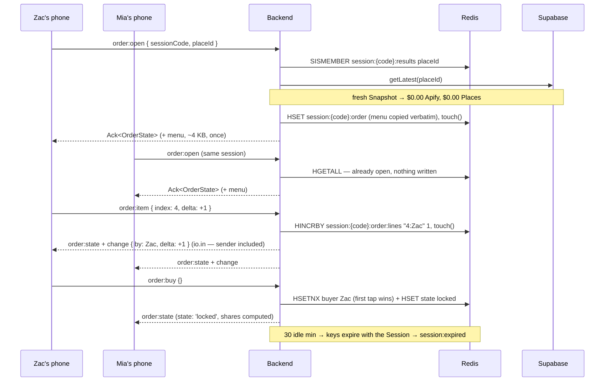

# Group Order — the pinned basket

After a Session completes, one full-width button on the **crowned** card — the Match when there is one, the
Top Pick when there is not — takes the whole group to a shared basket for that Venue. Everyone adds items from their own phone off the real Storefront menu; rows land live in each
other's colour, the items total climbs, and each person sees what they personally owe. Whoever is about to
spend their own money taps "I'll order" — that one tap claims the Buyer and locks the basket — and the
screen becomes a handoff: a tick-off checklist and a link to the exact store page for the Buyer, a "you owe
$31.20" line and a share button for everyone else. Dinder never places the order or touches money, and the
last screen says so.

## Why

A group of four decides on 11 Inch Pizza in ninety seconds and then loses fifteen minutes passing one phone
around a table so everybody can point at what they want. The data to fix that already exists and is already
paid for: `backend/tests/fixtures/comparison/ubereats-search-11-inch-pizza.json` is a real captured menu of
51 priced items, and every Comparison already writes that menu to `comparison_snapshots` as an append-only
Snapshot (`supabase/migrations/20260713082034_create_comparison_snapshots.sql`). A Snapshot is fresh for six
hours (`SNAPSHOT_FRESHNESS_MS`, `shared/types/comparison.ts:39`), so a group ordering over a Venue anyone
already compared costs zero Apify spend and zero Google Places spend — `ComparisonService.ts:79` returns the
fresh Snapshot before `fetchPlaceDetails` on line 90 ever runs. The whole feature is therefore two Redis
keys, three commands and one broadcast over data we are already storing and throwing away.

## What the user sees

### 1. Results — the crowned card gains one button

The button renders directly under the hero, above the existing three-pill `DeliveryActions` row
(`frontend/src/pages/ResultsPage.tsx:462`), which has only 309px at 375px and cannot take a fourth pill.

**Exactly one button exists on the page, and it is on the crown.** `ResultsPage.tsx:407` is
`overlappingOptions.map(...)` — the match card is already *plural* today, one per overlapping Restaurant —
and `top-pick.md:292/312` extracts that same `[data-match-card]` markup as `MatchCard` and reuses it
verbatim inside the collapsed `Other matches (N)` disclosure. So the button cannot simply live "in the match
card": it would render on every collapsed card, all of which pass the `order:open` gate, and tapping Pizza
Palace would land you in a Noodle House basket. `MatchCard` takes an `isCrown` boolean and the button plus
its sub-label are gated on it. Near Miss cards and collapsed other-match cards do not get it.

```
┌─────────────────────────────────────┐ 375
│  ←   Perfect Match!            [↗]  │
├─────────────────────────────────────┤
│         ✦   MATCH!   ✦              │
│    Everyone found the same spark.   │
│  ┌───────────────────────────────┐  │
│  │ ▓▓▓▓▓ hero photo ▓▓▓▓▓▓▓▓▓▓▓▓ │  │
│  │ 11 Inch Pizza                 │  │
│  │ ★ 4.6   $$   Pizza            │  │
│  │ 5 Cecil St, Fitzroy           │  │
│  │ ┌───────────────────────────┐ │  │
│  │ │      Order together       │ │  │ ← new, full-width, btn-primary
│  │ └───────────────────────────┘ │  │
│  │ ─────────────────────────────  │  │
│  │ [Uber Eats↗][DoorDash↗][Comp] │  │
│  └───────────────────────────────┘  │
└─────────────────────────────────────┘
```

Copy: **`Order together`**. Sub-label under it, 12px muted: **`Build one basket from everyone's phones`**.

It renders optimistically. It hides only after `order:open` has acked `NOT_FOUND { reason: 'no_menu' }`
for that placeId in this session (remembered in the order store, not persisted).

### 2. Order — opening

Warm path (the normal case): the `order:open` ack returns instantly and this screen is never seen. Cold
path: the page runs the existing SSE flow —
`subscribeToComparison(placeId, { onComparison, onError })`, whose real signature is
`(placeId, handlers, source?)` with `handlers` **required**
(`frontend/src/services/comparisonStream.ts:39-43`) — with **no** `source` param, so the #68 kill-gate
vocabulary stays clean, and re-fires `order:open` once on the terminal `comparison` event.

```
┌─────────────────────────────────────┐
│  ←   Group order                    │
├─────────────────────────────────────┤
│                                     │
│              ◐ (spinner)            │
│                                     │
│      Getting tonight's menu…        │
│   This can take up to a minute the  │
│   first time. Everyone else is      │
│   waiting on the same fetch.        │
│                                     │
└─────────────────────────────────────┘
```

Dead end — `NOT_FOUND { reason: 'no_menu' }`. Never spins, never offers a retry, because **both** Storefronts
came back `not_found`, and a `not_found` capture is cached for the full six hours with no invalidation API.

```
┌─────────────────────────────────────┐
│  ←   Group order                    │
├─────────────────────────────────────┤
│  No menu for this venue on Uber     │
│  Eats or DoorDash.                  │
│                                     │
│  You can still order the old way:   │
│  [ Uber Eats ↗ ]  [ DoorDash ↗ ]    │
└─────────────────────────────────────┘
```

#### Every other way opening can fail

The spinner above has exactly one exit that is not a screen, and that is the warm ack. Everything else lands
here. `order:open` is retried **at most once**, and no branch may end on a spinner. The layout is the
`no_menu` card: one heading line, one body line, then the two existing delivery-search buttons
(`DeliveryActions`' Uber Eats / DoorDash pills, reused verbatim) unless the row says otherwise.

| what happened | detected as | heading | body | buttons |
|---|---|---|---|---|
| Cold fetch failed, or the SSE died — including the 5-cold-comparisons/IP/hour 429 whose body `EventSource` cannot read (`comparison.ts:30-31`, synthesised as `STREAM_CLOSED` at `comparisonStream.ts:56-63`) | `onError` fires with any code, **or** `order:open` returns `reason: 'stale'` a second time | **`Couldn't get tonight's menu.`** | **`We may have hit tonight's limit on price lookups. Try again in an hour, or just order the usual way.`** | the two delivery links |
| Snapshot still not fresh after the SSE reported success | second `order:open` acks `NOT_FOUND { reason: 'stale' }` | same as above | same as above | the two delivery links |
| `COMPARISON_FAILED` mid-flight (`ComparisonService.ts:118-124` emits it and inserts **no** Snapshot, so a naive retry loops on `stale` forever) | `onError` code `COMPARISON_FAILED` | same as above | same as above | the two delivery links |
| Only `not_found` on both Platforms | `NOT_FOUND { reason: 'no_menu' }` | **`No menu for this venue on Uber Eats or DoorDash.`** | **`You can still order the old way:`** | the two delivery links; also hides `Order together` for that placeId for the rest of the Session |
| The socket reconnected but the rejoin has not landed yet, or the user is genuinely no longer in the Session | `NOT_IN_SESSION` | **`You're not in this session any more.`** | **`Someone may have restarted it, or you were away too long.`** | one **`Back to results`** (`/session/:code/results`) and one **`Start over`** (`/`) |
| The Session expired or was never there | `SESSION_NOT_FOUND`, or `sessionStatus === 'expired'` | **`This session has expired.`** | **`Sessions last 30 minutes. Start a new one to swipe again.`** | one **`Start over`** (`/`) |
| A Restart voided the Match while this page was open | `VALIDATION_ERROR` (the placeId is no longer in `session:{code}:results`), or the `session:restarted` push | *no screen* — the page navigates straight to `/session/:code/select`, the same `useEffect` on `sessionStatus` that `ResultsPage.tsx:244-250` runs | | |
| Malformed persisted Snapshot, or anything unhandled | `INTERNAL_ERROR` | **`Something went wrong getting the menu.`** | **`You can still order the old way:`** | the two delivery links |

`NOT_IN_SESSION` is the one worth reading twice. A hard reload of `/session/:code/order` — ordinary iOS
behaviour after backgrounding — races the auto-rejoin: the rejoin is an un-awaited `void joinSession(...)`
fired *inside* the `connect` handler (`socketBindings.ts:44-54`), and `waitForConnection`
(`socketBindings.ts:205`) resolves on socket connect, not on rejoin completion. See § Contract for the
one-line fix that makes this screen rare rather than routine; it stays specified because "rare" is not
"never".

### 3. Order — the basket (`state === 'building'`)

`h-screen-dvh flex flex-col`, mirroring `SelectionPage.tsx:264`. Nothing on the page scrolls except the
middle band.

```
┌─────────────────────────────────────┐ 375
│  ←   Group order            5 min   │  sticky NavigationHeader
├─────────────────────────────────────┤
│ (Z) (M) (J) (S)                     │  FIXED — roster, participantRingClass
│ $42.60 $31.20  —    $53.00          │  live subtotal, or — for nothing yet
│ 11 Inch Pizza · Uber Eats · prices  │
│ as at 7:42 pm      [~12% cheaper]   │
├─────────────────────────────────────┤
│ In the basket                       │  SCROLLS
│ ┌─────────────────────────────────┐ │
│ │ 2 ×  Margherita     $46.00 (Z) ×│ │  × only on your own rows
│ │ 1 ×  Garlic Focaccia $12.00 (M) │ │
│ │ 1 ×  Coke (Can)       $7.00 (Z)×│ │
│ └─────────────────────────────────┘ │
│                                     │
│ Base items only — add sizes and     │
│ extras at checkout.                 │
│ ▾ Pizza (17)                        │  native <details>, one per section
│    Margherita              $23.00   │  tapping the row IS +1
│    Hawaiian                $25.84   │
│    Pepperoni               $24.50   │
│ ▸ Drinks (11)                       │
│ ▸ Pasta (6)                         │
│ ▸ Salad (5)                         │
│ ▸ Limited Edition Pizzas (4)        │
│ ▸ Foccacia (3)                      │
│ ▸ Calzone (3)                       │
│ ▸ Sweets Pizzas (2)                 │
├─────────────────────────────────────┤
│ Items                      $127.40  │  PINNED
│ You owe                     $53.00  │  accent colour
│ Jo hasn't added anything yet        │
│ ┌─────────────────────────────────┐ │
│ │          I'll order             │ │
│ └─────────────────────────────────┘ │
└─────────────────────────────────────┘
```

The section list and its counts are read off the **Pinned Menu at render time**, never hardcoded. The eight
sections above are the real Uber Eats fixture, measured:
`Pizza 17, Drinks 11, Pasta 6, Salad 5, Limited Edition Pizzas 4, Foccacia 3, Calzone 3, Sweets Pizzas 2`
= 51 items. **A section with zero items after de-duplication is not rendered.** That rule is load-bearing,
not tidiness: `uberEatsStorefront.ts:85-99` already prefers the non-promotional section when one id appears
twice, so `Featured items` and `Offers` are already empty today, and the DoorDash de-dupe this spec mandates
empties `Most Ordered` completely (all 12 of its rows are duplicate ids of a real category — measured).
Neither fixture has a `Sides`.

Exact copy:

- Roster badge: that person's live subtotal, e.g. **`$42.60`**; **`—`** while they have added nothing.
- Venue line: **`11 Inch Pizza · Uber Eats · prices as at 7:42 pm`**.
- Cheaper badge (only when the pinned Snapshot's `cheaperMenu` named this Platform): **`~12% cheaper`**.
- Basket heading: **`In the basket`**. Empty: **`Nothing in the basket yet — tap a menu item to add it.`**
- Menu heading: **`Base items only — add sizes and extras at checkout.`**
- Totals: **`Items`** / **`You owe`**.
- Progress line, derived entirely from `lines[].by` — one name: **`Jo hasn't added anything yet`**; two or
  more: **`Jo and Sam haven't added anything yet`**; three or more: **`Jo, Sam and 2 others haven't added
  anything yet`**; everybody has: **`Everyone's added something`**.
- The primary button is always **`I'll order`**. There is no second button and no state to reverse.

> **No "I'm done" signal, and no server-side convergence rule.** The roster subtotal is strictly more
> information than a `picking…`/`done` flag — it says *what* they picked, live — and `lines[].by` already
> names who has added nothing. Whoever is about to spend their own money taps `I'll order`; nothing another
> person does blocks it, and the server applies no rule about it either. Adding an explicit "I'm finished,
> and I mean it" signal later is one new command with zero contract break (ADR 0007); see § Out of scope.

**Accessibility, because additions deliberately do not toast.** The basket list is
`role="status" aria-live="polite"` (the pattern `SelectionPage` already uses), announcing
`{qty} × {name} added by {who}. Items now {total}.` — otherwise a screen-reader user gets *nothing* when the
group's total moves, which is the one thing this screen exists to convey. Menu rows and the `×` are real
`<button>`s with a min 44px target and an explicit `aria-label` (`Add Margherita, $23.00` /
`Remove one Margherita`). The fee input in §5 gets a `<label>` and `inputMode="decimal"`.

### 4. Someone else adds an item

The row slides into the same basket in **their** ring colour (`animate-slide-up` plus a one-shot ring
flash) and the items total climbs. **No toast** — twenty toasts across four people is noise, and the toast
stack (`z-[60]`, `frontend/src/components/Toast/ToastProvider.tsx:21`) would sit over the pinned total.
Removals *do* toast, so nothing vanishes silently: **`Zac removed Margherita`**.

Both of those need to know *who did what*, which the full-state broadcast deliberately does not carry. That
is what `order:state`'s one optional `change` field is for (see § Contract): toast only when
`change.delta === -1 && change.by !== me`, ring-flash only when `change.delta === 1`. No previous-vs-next
diff, no client-side reconciliation, no extra client state — which is the property that made full-state
broadcasts worth choosing in the first place.

### 5. Handoff — the Buyer (`state === 'locked'`, `order.buyer === you`)

```
┌─────────────────────────────────────┐
│  ←   Group order                    │
├─────────────────────────────────────┤
│         ✦  LOCKED IN  ✦             │  match-celebration / animate-match-pop
│  You're ordering from 11 Inch Pizza │
│  on Uber Eats                       │
│                                     │
│  Pizza                              │
│   ☐  2 × Margherita                 │
│   ☐  1 × Hawaiian                   │
│  Sides                              │
│   ☐  1 × Garlic & Cheese Focaccia   │
│  Drinks                             │
│   ☐  1 × Coke (Can)                 │
│                                     │
│  Items                     $127.40  │
│  Prices as at 7:42 pm. Check them   │
│  at checkout.                       │
│                                     │
│  Delivery + fees from the checkout  │
│  screen                             │
│  ┌──────────┐                       │
│  │ $ 8.99   │                       │
│  └──────────┘                       │
│                                     │
│  What everyone owes you             │
│   Mia $31.20 · Jo $22.80 · Sam      │
│   $19.40                            │
│  ┌─────────────────────────────────┐│
│  │        Copy the split           ││
│  └─────────────────────────────────┘│
│  ┌─────────────────────────────────┐│
│  │        Open Uber Eats           ││  <a href={storeUrl} target=_blank>
│  └─────────────────────────────────┘│
│  One of you orders — Dinder can't   │
│  check out for you.                 │
└─────────────────────────────────────┘
```

Copy verbatim: **`You're ordering from 11 Inch Pizza on Uber Eats`** · **`Items`** ·
**`Prices as at 7:42 pm. Check them at checkout.`** ·
**`Delivery + fees from the checkout screen`** · **`What everyone owes you`** ·
**`Copy the split`** · **`Open Uber Eats`** (or `Open DoorDash`) ·
**`One of you orders — Dinder can't check out for you.`**

**The Buyer sees the split too.** Recovering the money is the whole point of the feature, and the person who
just spent theirs was the only Participant with no view of who owes them what. `shares` is already computed
and already on the Buyer's own `order:state` payload, so this is a list render off `shares` (the Buyer's own
row excluded) plus one clipboard button carrying
`11 Inch Pizza — Mia $31.20, Jo $22.80, Sam $19.40. Zac paid $127.40 + $8.99 delivery.` Zero contract
change, zero server work.

Typing in the fee input broadcasts `order:buy { feeCents: 899 }` (debounced 400 ms) and every other phone's
"you owe" updates live. The field is dollars and the wire is cents, so the conversion is
`parseDollarsToCents` in `frontend/src/utils/money.ts` — `Math.round(Number(clean) * 100)`, because
`8.99 * 100` is `898.999…` in float — rejecting NaN, negatives and anything over 100000 **before** emitting.
The named test table is `8.99 → 899`, `0 → 0`, `.5 → 50`, `1,234.56 → 123456`, and `abc` / `-5` /
`99999999` → rejected, no emit.

### 6. Handoff — everyone else

```
┌─────────────────────────────────────┐
│  ←   Group order                    │
├─────────────────────────────────────┤
│         ✦  LOCKED IN  ✦             │
│  Zac is ordering from 11 Inch Pizza.│
│                                     │
│  You owe $31.20 — 1 × Margherita,   │
│  1 × Coke (Can), + $2.25 delivery.  │
│                                     │
│  ┌─────────────────────────────────┐│
│  │        Copy my share            ││
│  └─────────────────────────────────┘│
└─────────────────────────────────────┘
```

Copy: **`Zac is ordering from 11 Inch Pizza.`** ·
**`You owe $31.20 — 1 × Margherita, 1 × Coke (Can), + $2.25 delivery.`** (the `+ $X delivery` clause is
omitted while `feeCents` is 0) · button **`Copy my share`** → the clipboard-only pattern at
`ResultsPage.tsx:349-355` verbatim (`navigator.clipboard.writeText(...).then(toast.success).catch(
toast.error)`), carrying exactly that sentence. Toast: **`Share copied!`** / **`Could not copy`**.
There is no `navigator.share` branch — `grep -rn "navigator.share" frontend/src frontend/tests` returns
zero hits, so a share sheet is new code plus a feature-detect, not reuse. `Copy the split` in §5 uses the
same three lines.

**What the human does next, precisely.** The Buyer taps the button, the delivery app opens on the real store
page (not a search page), they re-add those items to the platform's own cart by hand, and check out and pay
on their own account. Everyone else pastes their share into the group chat and PayIDs the Buyer. Dinder holds
no Platform credential, places no order and touches no payment — **that boundary is ADR 0009, written by
this feature** (see § Files touched); ADR 0003 says only that a Participant is identified by socket and not
by account, which is why this screen cannot assume anyone is signed in, and it says nothing about payment
credentials. The checklist is a shopping list, which is the honest ceiling of a scraped menu with no options
data. There is no confirmation screen, no order status and nothing to poll; the Group Order expires with the
Session.

## Domain language

Add to `CONTEXT.md` under a new `### Group order` heading, after the price-comparison block:

**Group Order**:
One shared basket that every Participant of a Session adds to from their own phone, for the Venue the
Session matched on. It exists only in Redis for the life of the Session, is priced from a Pinned Menu, and
ends when a Buyer locks it. Dinder never places it.
_Avoid_: cart, group cart, shared cart, checkout — **as names for the Group Order**. "Checkout" and "cart"
refer only to the Platform's own, which is where the human actually pays, and this document uses them that
way throughout.

**Pinned Menu**:
The Storefront menu copied verbatim out of a Snapshot into the Group Order when it opens, and never re-read.
Item identity inside a Group Order is the array index into it, which is immutable because the copy is frozen
and the source Snapshot is append-only (ADR 0005).
_Avoid_: cached menu, menu snapshot, catalogue

**Order Line**:
One Participant's quantity of one Pinned Menu item. Two Participants ordering the same dish are two Order
Lines, never one — that is what makes the per-person split fall out with no line ids.
_Avoid_: cart item, basket item, order item

**Buyer**:
The Participant who tapped "I'll order". Claiming the Buyer and locking the Group Order is one action; the
first tap wins and there is no transfer. Authority follows the money.
_Avoid_: host, owner, payer, orderer

**Share**:
What one Participant owes: their Order Lines plus their portion of the Buyer's stated delivery-and-fees
number, split evenly across Participants with at least one Order Line. Shares always sum exactly to the
Group Order total.
_Avoid_: split, tab, portion, IOU

The feature also uses the existing terms Session, Participant, Match, Top Pick, Venue, Platform, Storefront,
Snapshot, Freshness Window and Restart with their existing meanings. It adds no *other* domain terms.
`roster`, `basket` and `handoff` appear in this document as lowercase UI nouns — the tile strip, the list of
Order Lines, the post-lock screen — and deliberately do **not** go in CONTEXT.md: they name pixels, not
domain concepts, and the domain concepts behind them are Participant, Order Line and Buyer.

**Who writes this.** The five terms above are an acceptance line on **issue 2a**, not a floating chore. The
glossary must merge with the code that first uses the words, not after it.

## Design

### Data model

Two new Redis keys, both built by private helpers in `backend/src/store/sessionStore.ts` alongside the
existing eight (`sessionStore.ts:57-64`), and **both appended to the explicit `keys` array inside `touch()`
(`sessionStore.ts:125-136`)**. That append is the single most important line in the feature:
`REFRESH_TTL_LUA` (`sessionStore.ts:67-73`) takes a literal key list, not a pattern, so a key left out of it
either outlives the Session or expires under a live basket. Zero Supabase schema change, zero migration.

**1. `session:{code}:order` — HASH.** Written once at open, never re-derived.

| field | value | mutability |
|---|---|---|
| `placeId` | the matched Restaurant's Google place_id | fixed at open |
| `venueName` | `snapshot.venueName` | fixed at open |
| `platform` | `'ubereats'` \| `'doordash'` — derived server-side, see hard cases | fixed at open |
| `storeUrl` | `snapshot.payload[platform].storeUrl` | fixed at open |
| `pricesAt` | `snapshot.fetchedAt`, ISO string | fixed at open |
| `cheaperPercent` | integer string, present only when `deriveComparison().cheaperMenu` named this platform | fixed at open |
| `menu` | JSON string — `snapshot.payload[platform].menu` copied **verbatim**, ~4 KB | fixed at open |
| `buyer` | displayName | set once by `order:buy`, via `HSETNX` |
| `feeCents` | integer string, `'0'` until the Buyer types one | mutable by the Buyer |
| `state` | `'building'` \| `'locked'` | `'locked'` once, by `order:buy` |

One `HGETALL` is the entire order metadata. Two fields that an earlier draft pinned here — `imageUrl` and
`snapshotId` — are **gone**: no screen renders an image (§1 uses the Places `photoUrl` on the results card;
§3/§5/§6 draw none), and `snapshotId` only ever existed for a re-read-and-assert design this document
rejects and which `comparisonSnapshotStore` could not serve anyway (no fetch-by-id). ADR 0007 makes a
contract field permanent; two of them for a future the spec argues cannot exist is exactly the scaffolding
this project doesn't build. If a hero photo is wanted on the order page later, it is one field then.

**2. `session:{code}:order:lines` — HASH.** Field `{index}:{displayName}`, value qty as an integer string.
`HINCRBY` to add or remove, `HDEL` when it reaches 0. `index` is the array index into the Pinned Menu. The
field is parsed by splitting at the **first** colon, so a displayName (zod only length-checks it, 1–50 chars,
any characters) can never make the key ambiguous.

**TTL.** `openOrder`, `addLine`, `claimBuyer` and `setFee` all call `touch()`. Ordering is
activity — a group taking 25 minutes over a menu slides the 30-minute TTL forward indefinitely. A genuinely
idle 30 minutes loses the Group Order with everything else; `session:expired`
(`backend/src/redis/sessionExpiryNotifier.ts:76-80`) and its frontend handler
(`socketBindings.ts:182-185`) already cover it.

**Lifecycle.** Both keys get a `pipeline.del(...)` in `resetForRestart` (`sessionStore.ts:511-529`) and in
`deleteSession` (`sessionStore.ts:248-263`). A Restart voids the Match, so it must void the Group Order.

**Item identity** is the array index into the Pinned Menu. ADR 0005 makes Snapshots append-only and never
updated, and our copy is frozen for the Group Order's life, so the index is permanent by construction — a
stronger id than the actors' own uuids, which both resolvers discard anyway. **The trap to avoid:** read
`snapshot.payload[platform].menu` (the raw capture), never `deriveComparison`'s output. `deriveComparison`
de-duplicates (`uniqueMenuItems`, `comparisonMatcher.ts:60-68` — an order-preserving `filter`) and then
**partitions** the menu into `matchedItems` plus `unmatched.{ubereats,doordash}`
(`comparisonMatcher.ts:19-47`). There is no single ordered array to index into. Only the raw capture has one.

**Why copy the menu into Redis instead of re-reading the Snapshot per tap.**
`backend/src/store/comparisonSnapshotStore.ts` exports only `getLatest` (line 30) and `insert` (line 47) —
there is no fetch-by-id — so a per-tap `getLatest` + assert-`snapshotId` design has no lookup behind its
assert and hard-fails the instant any newer row lands for that placeId. One 4 KB copy at open costs one
Supabase read for the whole order, puts zero I/O on the tap path, and makes a newer Snapshot, a lapsed
Freshness Window and a later malformed row all irrelevant.

**Why displayName and not participantId.** participantId *is* socket.id (`joinHandler.ts:68`), and a rejoin
beyond the 2-minute `connectionStateRecovery` window deletes the prior participant and their keys
(`SessionService.ts:315`, `sessionStore.ts:324-326`). A basket keyed on participantId would be silently
destroyed by a reconnect — the exact bug that already eats Submissions. displayName is unique per Session
(`CLAIM_DISPLAY_NAME_LUA`, `sessionStore.ts:77-87`) and is already the key of `allSelections` on the wire.

**Why no price crosses the wire from a client.** `order:item` carries only `{ index, delta }`. The server
reads `name` and `price_cents` out of the pinned `menu` field and derives the displayName from the caller's
participant record. A client cannot dictate a price and cannot address someone else's Order Line.

### Contract

All additions go in `shared/types/websocket-events.ts`. **Every one is NEW — nothing existing is widened,
renamed or reshaped**, which is the strongest form of ADR 0007 compliance. There is no new REST route, no
new SSE event and no new `ApiErrorCode`. `MenuItemCapture` is reused from `shared/types/comparison.ts:3` —
there is no new item type.

```ts
import type { MenuItemCapture } from './comparison.js';

export type OrderPlatform = 'ubereats' | 'doordash';

export interface OrderLine {
  index: number;      // array index into the Pinned Menu
  name: string;       // resolved server-side from the Pinned Menu
  priceCents: number; // resolved server-side from the Pinned Menu
  qty: number;
  by: string;         // displayName
}

export interface OrderShare {
  displayName: string;
  itemsCents: number;
  feeCents: number;   // this person's slice of the Buyer's fee
  totalCents: number; // itemsCents + feeCents
}

export interface OrderState {
  sessionCode: string;
  placeId: string;
  venueName: string;
  platform: OrderPlatform;
  storeUrl?: string;
  pricesAt: string;         // ISO, the Snapshot's fetchedAt
  cheaperPercent?: number;  // only when cheaperMenu named this platform
  lines: OrderLine[];
  buyer?: string;           // displayName
  feeCents: number;
  itemsCents: number;
  totalCents: number;       // itemsCents + feeCents
  shares: OrderShare[];
  state: 'building' | 'locked';
  /** Present ONLY on the order:open ack — the ~4 KB Pinned Menu. */
  menu?: MenuItemCapture[];
}
```

**NEW client→server `order:open`** — the only message that carries the menu, so ~4 KB crosses the wire once
per client instead of on every broadcast. Idempotent: if a Group Order is already open it returns live state
untouched, which makes it the rejoin / reload / late-join recovery path with no extra event.

```ts
export interface OrderOpenPayload { sessionCode: string; placeId: string }

/** NOT_FOUND carries a machine-readable reason so the page knows whether to retry. */
export interface OrderUnavailableError extends ApiError {
  code: 'NOT_FOUND';
  reason: 'stale' | 'no_menu';
}
export type OrderOpenResponse =
  | Ack<OrderState>
  | { success: false; error: OrderUnavailableError };
```

`OrderUnavailableError` extends the existing `ApiError` rather than adding a `reason` field to it, so the
global error shape and `isApiError` (`shared/types/api-errors.ts:43`) are untouched — the failure branch is
still structurally an `Ack` failure, it just carries one extra field the order page reads.

Errors: `SESSION_NOT_FOUND`; `NOT_IN_SESSION` if the caller is not in the participants set;
`VALIDATION_ERROR` if `placeId` is not a member of `session:{code}:results` (one `SISMEMBER` — the first
production reader that key has ever had; see the Top Pick hard case for what that set must contain);
`NOT_FOUND` with `reason: 'stale'` (no fresh Snapshot, **or either Storefront is `failed`** — run the SSE
stream and retry once) or `reason: 'no_menu'` (**both** Storefronts `not_found`, or the chosen menu is empty
— a permanent dead end, do not retry). The client never chooses the Platform; the server derives it.

**`stale` vs `no_menu` splits on `StorefrontStatus`, not on "unresolved".** The status union is
`'resolved' | 'not_found' | 'failed'` (`shared/types/comparison.ts:1`), and `isFresh`
(`ComparisonService.ts:205-217`) caches a snapshot containing a `failed` storefront for **2 minutes**, not
six hours — it is explicitly retryable. Folding `failed` into the permanent branch would let one flaky Apify
run inside a 2-minute window hide `Order together` for the rest of the Session and show copy saying the
venue has no menu, which is false. One extra condition in `OrderService.open`, and `noMenuPlaceIds` stays
honest.

**NEW client→server `order:item`** — one command covers add, increment and remove.

```ts
export interface OrderItemPayload { sessionCode: string; index: number; delta: 1 | -1 }
export type OrderItemResponse = Ack<null>;
```

`index` is bounds-checked against the Pinned Menu length; anything else acks `VALIDATION_ERROR`. Rejected
with `VALIDATION_ERROR` once `state === 'locked'`.

**NEW client→server `order:buy`** — the first call from anyone claims `buyer` **and** sets
`state = 'locked'` in one action. There is no separate lock command and no auto-lock. Subsequent calls set
`feeCents` and are rejected with `VALIDATION_ERROR` unless the sender is the Buyer. `feeCents` must be an
integer 0–100000.

```ts
export interface OrderBuyPayload { sessionCode: string; feeCents?: number }
export type OrderBuyResponse = Ack<null>;
```

**NEW server→client `order:state`** — emitted to `io.in(sessionCode)` (including the sender, like
`participant:submitted`, `submitHandler.ts:83`) after every mutation. Full computed state every time: lines,
totals and shares are all denormalised server-side. No deltas, no client reconciliation, no ordering
hazards. A basket is 4–15 lines, so the payload is a few hundred bytes; `menu` is always omitted.

```ts
export interface OrderStateEvent {
  sessionCode: string;
  order: OrderState;
  /** What this broadcast was caused by. Absent on the open/reconnect emit. */
  change?: { by: string; name: string; delta: 1 | -1 };
}
```

`change` is the whole reason §4 can toast **`Zac removed Margherita`** and ring-flash the new row while the
client still does no reconciliation: one field, produced by the mutation that already knows all three
values, instead of a previous-vs-next diff the client would otherwise have to keep state for. Because the
event goes to `io.in(sessionCode)` *including* the sender, the toast rule is
`change.delta === -1 && change.by !== me` — Zac must not be told that Zac removed something.

Three new keys on `ClientToServerEvents`, one new key on `ServerToClientEvents`.

**Fee split, exactly.** Split evenly across Participants with at least one Order Line (order nothing, pay
nothing), with the remainder distributed one cent at a time in ascending displayName order, so
`sum(shares[].totalCents) === itemsCents + feeCents` always. That invariant is the one unit test named
below. If nobody has an Order Line, `shares` is empty and the fee is simply not split — the order total
still includes it.

**One-line reconnect fix, not a new event.** In `socketBindings.ts`'s `connect` handler, inside the existing
auto-rejoin's `.then()` (`socketBindings.ts:44-54`), re-fire `order:open` **when the current route is the
order page**. The guard is the route, not the order store: `orderStore` is deliberately non-persisted, so on
a hard reload — ordinary iOS behaviour after backgrounding — a store-guarded re-fire is a no-op, leaving
only `order:open`-on-mount, which races the rejoin and acks `NOT_IN_SESSION`. Nothing in the codebase
exposes "rejoin done" (`waitForConnection`, `socketBindings.ts:205`, resolves on socket connect), and this
is the seam that already knows, so it costs one line here rather than a promise to plumb or a second re-emit
path in `joinHandler`. The `NOT_IN_SESSION` screen in §2 stays specified as the backstop.

### Flow



### Files touched

**Five genuinely new files** (`OrderService.ts`, `orderHandler.ts`, `GroupOrderPage.tsx`, `orderStore.ts`,
`utils/money.ts`) plus one new ADR. The `sessionStore.ts` and `websocket-events.ts` rows are the two
substantial edits; the remaining eight rows are one-to-three lines each.

| path | change | why |
|---|---|---|
| `shared/types/websocket-events.ts` | add the payload/state types above, 3 keys on `ClientToServerEvents`, 1 on `ServerToClientEvents` | the contract; ADR 0006 makes it the authority |
| `backend/src/store/sessionStore.ts` | 2 private key helpers; **both appended to `touch()`'s key array**; `pipeline.del` in `resetForRestart` and `deleteSession`; five order ops (`openOrder`, `readOrder`, `addLine`, `claimBuyer`, `setFee`) | sole owner of the keyspace and of TTL |
| `backend/src/services/OrderService.ts` | **NEW** — open (Supabase read, freshness check, `failed`-vs-`not_found` split, platform derivation, menu pin), the three mutations, and the totals/shares derivation | the only genuinely new domain logic |
| `backend/src/websocket/orderHandler.ts` | **NEW** — three handlers, structurally copied from `submitHandler.ts` (module-scope `z.object`, `safeParse` → `VALIDATION_ERROR`, `toApiError(error).body`, ack **before** broadcast, `io.in(...)`, one `logger.info`) | transport only |
| `backend/src/server.ts` | construct `OrderService` in the composition root (line ~51-68); three `socket.on` registrations in the existing `io.on('connection')` block (line 226-243) | wiring |
| `docs/adr/0009-*.md` | **NEW** — the two decisions this feature rests on, promoted out of a Hard-cases row: ephemeral group state is keyed by displayName and never by participantId; Dinder holds no Platform credential and never checks out | both are one "consistency refactor" away from being silently reversed |
| `backend/src/services/ComparisonService.ts` | add `export` to `isFresh` (line 205) — no other change | "fresh enough to pin" can never drift from "fresh enough to serve" |
| `backend/src/services/doorDashStorefront.ts` | make the multi-buy count group **capturing** and divide by it; de-duplicate menu rows by `item.id`, preferring the non-`Most Ordered` category | money correctness before anything sits on it; also fixes the live Comparison |
| `frontend/src/services/socketService.ts` | three `emitAck<T>` wrappers | existing generic transport |
| `frontend/src/services/socketBindings.ts` | one `order:state` key on the `onEvent` literal; one line in the `connect` rejoin's `.then()` re-firing `order:open` when the route is the order page; one `orderStore` clear wherever `resetSelections` fires (`session:restarted`, leave, joining a different session); three command re-exports | the UI seam; pages import from here |
| `frontend/src/stores/orderStore.ts` | **NEW** — non-persisted Zustand store: `order`, `menu`, `noMenuPlaceIds` (mirrors `authStore`/`friendsStore`, which are also unpersisted) | `socketBindings` owns store mutations; the 4 KB menu must not go to localStorage |
| `frontend/src/pages/GroupOrderPage.tsx` | **NEW** — the whole screen: roster, basket, `<details>` menu, pinned totals, both handoff branches, the eight failure screens, **and its own `useEffect` on `sessionStatus`** mirroring `ResultsPage.tsx:244-250` (restart → `/select`, expired → the expiry screen). `socketBindings`' `session:restarted` handler only mutates the store — it never navigates | the feature |
| `frontend/src/App.tsx` | one `<Route path="/session/:sessionCode/order" …>` | the route table is one place (`App.tsx:44-69`) |
| `frontend/src/pages/ResultsPage.tsx` | extract/consume `MatchCard` with an `isCrown` prop; the `Order together` button + sub-label rendered **only** when `isCrown`, above `DeliveryActions` | the entry point; without `isCrown` the button multiplies across the `Other matches (N)` disclosure |
| `frontend/src/utils/money.ts` + `frontend/src/pages/ComparisonViewPage.tsx` | **NEW file** — lift `formatPrice` (`ComparisonViewPage.tsx:32-37`) and add `parseDollarsToCents`; import in both pages | third use of the same `Intl.NumberFormat`, and the fee field's dollars→cents parse is money-path logic that needs one home and one test table |
| `frontend/src/components/NavigationHeader.tsx` + `frontend/src/components/ConfirmLeaveModal.tsx` | add `'ordering'` to the `confirmContext` union — which is declared in **both** files (`NavigationHeader.tsx:26`, `ConfirmLeaveModal.tsx:11`) — plus one `case` in each of the four `switch (context)`es, all of which live in `ConfirmLeaveModal.tsx:28,40,55,67`; `NavigationHeader` needs only the union and the existing pass-through at `:212` | reuse the existing leave modal |
| `CONTEXT.md` | the five new terms above, under a new `### Group order` heading — **an acceptance line on issue 2a** | the glossary is binding, and no issue owning it means no one writes it |

## What this reuses instead of building

- `backend/src/store/comparisonSnapshotStore.ts` `getLatest(placeId)` — the single Supabase read per Group
  Order. Already validates with `isSnapshotPayload`. No new query, no new table, no migration.
- `backend/src/services/ComparisonService.ts` `isFresh` (line 205) — reused verbatim by adding one `export`.
- `backend/src/services/comparisonMatcher.ts` `deriveComparison` — called in-process (pure, no I/O) purely
  to read `cheaperMenu?.platform` and `.percent` when picking the Storefront. Its `matchedItems` /
  `unmatched` partition is never used for the menu.
- `frontend/src/services/comparisonStream.ts` `subscribeToComparison` — the entire cold-Snapshot path,
  unchanged. Group Order therefore adds **zero** new Apify surface and inherits the existing 5-cold-
  comparisons/IP/hour limit (`backend/src/api/comparison.ts:29-31`) and the in-flight dedupe
  (`ComparisonService.ts:134-141`): four phones opening at once = one actor run.
- `backend/src/store/sessionStore.ts` `touch()` + `REFRESH_TTL_LUA` — the two new keys are appended to the
  existing key array; TTL is inherited, not reinvented. Same for the `pipeline.del` lines in
  `resetForRestart` and `deleteSession`.
- `session:{code}:results` — validated with one `SISMEMBER` in `order:open`. This gives a currently
  write-only key (`sessionStore.ts:489-493`) its first production reader instead of adding a new one.
- `backend/src/websocket/submitHandler.ts` — copied structurally for `orderHandler.ts`: inline `z.object`,
  `safeParse` → `VALIDATION_ERROR` ack, `toApiError(error).body` for `DomainError`, ack before broadcast,
  `io.in(sessionCode).emit(...)`, one `logger.info` the contract test asserts.
- Redis `HSETNX` for the Buyer claim — first-tap-wins with no Lua, no lock and no transfer flow.
- `frontend/src/services/socketBindings.ts` `onEvent` object literal — `order:state` is one added key;
  `socketService.ts` `emitAck<T>` is the generic for all three commands.
- `frontend/src/pages/SessionLobbyPage.tsx:164-191` — the participant tile with its ring is quoted directly
  for the roster; only the trailing badge changes. Unlike the lobby, which hardcodes `Live` on every tile and
  lies (#6), this roster is driven by each person's real live subtotal off `shares`.
- `frontend/src/utils/participantStyles.ts` `participantRingClass(index)` — per-person colour on basket rows,
  identical to lobby, deck and results.
- `frontend/src/pages/ResultsPage.tsx` `match-celebration` / `animate-match-pop` / `.match-rays` — reused
  verbatim for the lock beat, so the second climax rhymes with the Match.
- `frontend/src/hooks/useToast.ts` `toast` singleton, imported directly by `socketBindings` — the removal
  toast needs no hook and no context.
- Native `<details>` for the menu sections — the pattern already ships at `ResultsPage.tsx:547-573` and in
  `UnmatchedSection` (`ComparisonViewPage.tsx:71-88`). No accordion component, no JS state.
- `StorefrontCapture.storeUrl` from the Pinned Menu's Snapshot — the handoff's outbound button finally uses
  the exact store URL the Storefront Resolver already produced, instead of `backend/src/api/redirect.ts`'s
  Places-billed search deep link.
- `NavigationHeader` `confirmOnBack` + `ConfirmLeaveModal` — one added value on an existing union.
- **Genuinely new, nothing to ride on:** the two Redis keys and their ops, `OrderService` (totals, shares,
  platform derivation, menu pinning), `orderHandler`, `GroupOrderPage`, `orderStore`, `money.ts`, and ADR
  0009. Everything else on this list is an import or a one-line edit.

## Hard cases

| case | behaviour |
|---|---|
| **Can you group-order a Top Pick when there was no Match?** `computeAndStoreResults` SADDs the literal `'__empty__'` into `session:{code}:results` on zero overlap (`sessionStore.ts:489-492`, asserted `backend/tests/integration/results-no-overlap.test.ts:52-56`), so the `order:open` `SISMEMBER` would reject every crowned Top Pick — the exact ending sprint 1 exists to rescue. **This is decided, not inherited.** | **Yes.** `completeSession` (`SessionService.ts:385-386` — the single site both the submit path `:453` and the leave path `:500` funnel through, and the site where `top-pick.md` computes the crown) SADDs the crowned placeId into `session:{code}:results` after `computeAndStoreResults` returns, via one new `sessionStore` op, when `!hasOverlap && topPick`. Three lines and a test. The `'__empty__'` sentinel stays — `topPick` is `undefined` on an empty deck. Nothing else reads the set, so the semantics simply widen from "the Match" to **"the placeIds this Session may act on"**. **Consequence for scheduling:** this changes `completeSession`, so it must land *with* `top-pick-backend-crown`, and that issue's "Out of scope — persisting the Top Pick to Redis" line must be struck. Rejected alternative: gating `Order together` on `hasOverlap`. It is cheaper by three lines and it deletes the feature on a large share of Sessions — the group with no consensus is the group that most needs one shared basket. |
| **Which Platform's menu?** The only first-party fixture yields 40 matched items whose **median** price difference is zero, so `cheaperMenu === undefined`. (Not "identical prices": 6 of the 40 differ today — the four San Pellegrino drinks at ue 1200 / dd 900, Fanta (Can) at 700 / 500, Rocket Salad at 1900 / 1748 — the median just rounds to 0 at `comparisonMatcher.ts:79-84`.) | A constraint, not a screen: you order from the cheaper Storefront and Dinder picks it. The server derives it once at `order:open` — `cheaperMenu?.platform ?? (ubereats resolved ? 'ubereats' : 'doordash')` — writes it to the pinned hash, and states it in the header (`… · Uber Eats · prices as at 7:42 pm`), with the `~12% cheaper` badge only when `cheaperMenu` is actually set. Four clients cannot pick four Platforms because none of them picks. No platform-choice screen, no toggle. |
| **Menu items have no stable id** — `MenuItemCapture` is `{name, price_cents, section?, tags[]}` and both resolvers discard the actors' uuid/id. | They have one: the array index into the Pinned Menu. ADR 0005 makes the source Snapshot append-only and our copy frozen, so the index is permanent by construction. Two rules: read the raw `snapshot.payload[platform].menu`, never `deriveComparison`'s output; and the client sends only the index, so the server resolves name and price itself. |
| **The pinned Snapshot ages past its 6-hour Freshness Window, or someone else's cold Comparison inserts a newer row mid-basket.** | Nothing happens — we never read the Snapshot again. The menu and every price live in the order hash from open to lock. This is the specific reason the design copies rather than re-reads: `comparisonSnapshotStore` has no fetch-by-id, so any re-read-and-assert-`snapshotId` scheme would hard-fail the basket the moment a newer row appeared. The Session's 30-minute TTL expires long before 6 hours matters, so there is no re-pin path to build. |
| **DoorDash multi-buy prices are captured as unit prices** — the fixture's five `"2 for A$7.00"` rows persist as `price_cents: 700`. | Fixed before anything sits on it. `doorDashStorefront.ts:98` is `/^(?:\d+\s+for\s+)?A\$(\d+)\.(\d{2})$/` — the count group is **non-capturing**, so there is no `match[n]` to read and a literal reading of "capture it" divides the price by the *dollars*. Make the group capturing — `/^(?:(\d+)\s+for\s+)?A\$(\d+)\.(\d{2})$/` — reindex the two price groups to `match[2]`/`match[3]` (line 100), and return `Math.ceil(cents / (match[1] ? Number(match[1]) : 1))` (line 101) → 350. **Three lines on a money path**, not one, plus one unit-test case. Divide rather than drop the row: dropping loses the drinks from the menu entirely, and a ~12% under-estimate on a screen that already says "check them at checkout" beats a 100% over-charge or a basket with no Coke in it. This also fixes the existing Comparison, which today declares those rows price-equal to Uber Eats. |
| **The DoorDash capture has 12 duplicate names across 60 rows** (`Most Ordered` repeats what's in `Pizza`), which would mean two indices for one Coke. | Mirror the seven lines Uber Eats already has next door (`uberEatsStorefront.ts:85-99`): de-duplicate by the `item.id` the actor returns (48 distinct ids across 60 rows) into a Map, preferring the non-`Most Ordered` category. Index stability is unaffected — indices only ever mean anything inside one Pinned Menu. **`Most Ordered` then has zero items** — all 12 duplicates are `Most Ordered`/real-category pairs, measured — and a zero-item section is not rendered, which is why §3's sketch shows eight real sections and no `Most Ordered`. Same on Uber Eats, where the existing de-dupe already empties `Featured items` and `Offers`. |
| **Does issue 1's DoorDash fix change which Storefront issue 2 pins?** It moves five prices from 700 to 350 and drops 12 rows, either of which could flip `cheaperMenu` from `undefined` to `{platform:'doordash'}`. | **Verified — it does not.** Both fixes simulated end-to-end through `deriveComparison` on the only first-party fixture: still 40 matched, differing rows go 6 → 9, the median still rounds to 0, `cheaperMenu` is still `undefined`, and the `?? (ubereats resolved ? 'ubereats' : 'doordash')` fallback still carries it. Recorded here so the next person does not re-derive it. |
| **A Participant's socket reconnects mid-order** — participantId is socket.id and the rejoin path deletes the prior participant, their Selections and their `hasSubmitted`. | The basket does not notice. Order Lines and done markers are keyed by displayName, and `removeParticipant` knows nothing about the order keys. On reconnect the existing auto-rejoin fires; one added line re-calls the idempotent `order:open`, and the user lands back on their own lines with the group's total already right. Deliberately the opposite of what a rejoin does to Selections today. |
| **Someone leaves or disconnects mid-order.** | Their Order Lines stay and still count — they ordered that pizza and someone is paying for it — and their roster tile renders muted. Nothing gates on them, because the lock is a human tapping "I'll order", not an "everyone is done" computation. That single decision deletes the whole class of leaver / phantom-host-slot denominator bugs: there is no denominator. If the group disagrees about a departed person's food, the Buyer can decline to add it at checkout. |
| **The group never converges** — someone is still browsing. | No timer, no auto-close, no deadline, and **no "I'm done" signal at all**. The roster shows each person's live subtotal and the progress line reads `Jo hasn't added anything yet` off `lines[].by` — both strictly more informative than a done flag, both free from data the same broadcast already carries. Social pressure, exactly like the swipe deck's submitted counter, and it blocks nothing on the server. Whoever is about to spend their own money taps `I'll order` and the basket locks. |
| **Someone adds a $90 item, or tries to remove someone else's food.** | Two constraints, zero permission code. (a) You can only change your own Order Lines — not because the × is hidden, but because the server builds the hash field from the **caller's** displayName, so addressing another person's line is structurally unrepresentable in the payload. (b) There is no veto or approval flow: every line names who added it, live, and the $90 lands on **that** person's own "you owe", never on the group split. Visibility plus incidence, not governance for four friends. |
| **Two people tap the same menu item at the same instant.** | Two distinct hash fields (same index, different displayName) → two attributed rows, one `HINCRBY` each. Same person twice → qty 2 on one field, rendered `2 ×`. No line ids to mint, no last-write-wins, no merge logic. |
| **Two people tap `Order together` at the same instant.** | First open wins and is returned to everyone. Safe without a lock because both writers `HSET` byte-identical metadata derived from the same Snapshot row, and no Order Line can exist before the open. Since the button only renders on the crown (`isCrown`), both taps carry the same placeId and the states are identical. `ponytail: identical concurrent opens, no lock — if a session ever needs two live baskets, key the order hash by placeId.` |
| **`order:open` comes back with a *different* placeId than the one tapped.** With `isCrown` this is no longer reachable from the UI, but the command is still callable. | The already-open Group Order is returned untouched — the server never silently swaps venues under a second opener without saying so. The page renders that venue and shows a one-line notice above the roster: **`Sam already started a basket for Noodle House.`** Never a silent substitution; the earlier draft's "the page renders that venue's name" was the whole failure mode. |
| **Delivery fee, and how it splits.** | The capture has no fee data at all — `StorefrontCapture` has no fee field and the DoorDash resolver discards the `deliveryFee` string it receives — so don't guess. The one person who can see the real number is the Buyer, standing at checkout: one integer input, one broadcast. Split evenly across Participants with at least one Order Line, remainder distributed one cent at a time in ascending displayName order so shares sum **exactly** to the fee. That invariant is the unit test. The field is labelled `Delivery + fees` once; no fee taxonomy we cannot source. |
| **The menu has no sizes, extras or options.** | A real data ceiling, not a scoping choice: the Uber Eats actor is invoked with `getMenuCustomizations: false` and the DoorDash resolver reads only name/price/category. State it rather than hide it — the menu header reads `Base items only — add sizes and extras at checkout`, and the handoff calls the number an **items** subtotal, never a total. Turning customizations on would enlarge every actor run against a $5/month cap. |
| **The Venue resolves on one Platform only, or on neither.** | One Platform: the derivation auto-picks it and nothing else changes — a one-sided Comparison is a normal, cached, $0-on-replay outcome. Both `not_found`, or an empty menu: `order:open` acks `NOT_FOUND { reason: 'no_menu' }`, the page shows that sentence plus today's delivery-search buttons, and the crowned card hides the button thereafter. That branch must fail with copy and never a spinner, because a `not_found` capture is cached for the full six hours with no invalidation API. **But `failed` is not `not_found`:** `isFresh` (`ComparisonService.ts:205-217`) caches a snapshot containing a `failed` storefront for 2 minutes, so any `failed` is `reason: 'stale'` — run the SSE, retry once, and if it still fails land on the "couldn't get tonight's menu" screen, which does **not** poison `noMenuPlaceIds`. Folding `failed` into the permanent branch would let one flaky 2-minute Apify window kill the button for a Venue that has a menu. |
| **The Session TTL expires with an open basket.** | Every order command calls `touch()`, and both order keys are in the explicit `touch()` key list, so an actively-edited basket slides the 30-minute TTL forward indefinitely. A group genuinely idle for 30 minutes gets the existing `session:expired` push and loses the Group Order with everything else. Nothing is persisted to survive it, per ADR 0001. |
| **The group hits Restart while a basket is open.** | Both order keys are `DEL`'d in the existing `resetForRestart` pipeline. A Restart voids the Match, and `session:{code}:results` — which `order:open` validates against — is deleted in the same pipeline, so a stale basket for a Venue nobody matched is unreachable from both ends. On the client this is **not** free: `socketBindings`' `session:restarted` handler (`socketBindings.ts:172-179`) only mutates the store and never navigates, so `GroupOrderPage` needs its own copy of the `useEffect` on `sessionStatus` that `ResultsPage.tsx:244-250` runs, plus the `expired` screen from §2. And nothing today clears `orderStore` on restart, on leave, or on joining a different session — `resetSelections` is the existing seam, and one clear alongside it stops a post-Restart mount rendering the previous venue's basket until the new ack lands. Both are issue 5 work, not "already does". |
| **A malformed persisted Snapshot payload bricks the Venue.** | Unchanged from today: `getLatest` validates with `isSnapshotPayload` and throws `database_error` (`comparisonSnapshotStore.ts:14-20`) before anything else runs; `order:open` surfaces it as the standard canonical `INTERNAL_ERROR` and the page falls back to the delivery links. **Do not** tighten `isMenuItemCapture` for this feature — a stricter guard retroactively bricks every stored row, the ADR 0007 trap in its purest form. A Group Order already open is immune, because its menu is a copy. |
| **Someone tries to order from a Near Miss, a collapsed other match, or a placeId that was never crowned.** | Constraint: you can only group-order **the crown** — the Match when there is one, the Top Pick when there is not (see the first row for how the Top Pick gets into the set). `order:open` `SISMEMBER`s `session:{code}:results` and acks `VALIDATION_ERROR` otherwise. On the UI side the gate is `isCrown` on `MatchCard`, because the extracted card is reused verbatim for the `Other matches (N)` disclosure and every one of those cards *would* pass the `SISMEMBER`. One Redis call and one boolean prop instead of a venue-claim conflict protocol. |
| **Cost.** | Warm path: **$0.00** Apify and **$0.00** Places — the fresh-Snapshot return at `ComparisonService.ts:79` precedes `fetchPlaceDetails` on line 90. Cold path: identical to tapping "Compare prices" today (US$0.164–0.20, rate-limited to 5/IP/hour), and four phones opening at once collapse into one flight. Group Order adds **no new spend surface**; the handoff's `storeUrl` button even removes a Places call versus the existing `/api/redirect` path. |

## Out of scope for v1

- **The platform-pick screen.** Derived server-side from `cheaperMenu`. Revisit if the two Platforms'
  menus diverge enough that groups report ordering the wrong dish.
- **Quantity steppers as a control.** Tapping a menu row is +1; the × on your own line is −1. Revisit if
  session logs show repeated add/remove churn on the same index.
- **The picker's search/filter input.** Eight native `<details>` sections (the real count on both fixtures
  after de-dupe) scroll fine at 375px. Revisit at a captured menu over ~120 items.
- **An explicit "I'm done" signal (`order:done`), the `d:{displayName}` hash namespace, and the
  `I'm done` / `Still picking` reversible button.** Cut. It gated nothing on the server by its own design,
  and everything it displayed is already derivable from the same broadcast: `shares[]` gives every person's
  live subtotal continuously (more information than `picking…`) and `lines[].by` names who has added
  nothing. It cost one of four commands, a reserved field namespace, a client state machine and a day.
  Revisit if testers actually ask to signal "I'm finished" separately from "I've added food" — it is one new
  additive command then, ADR 0007 clean.
- **Editing or removing anyone else's Order Line.** Structurally impossible while the server derives the
  field key from the caller. Revisit only if group sizes go past four.
- **Auto-lock on "everyone is done", and any convergence timer.** Revisit never — it re-introduces the live-
  participant denominator, the reserved-host-slot phantom and every leaver edge case around it.
- **A separate lock command and a Buyer-transfer flow.** First tap wins. Revisit if users report locking by
  accident.
- **A join-time `order:state` re-emit in `joinHandler`.** The idempotent `order:open` is the recovery path.
  Revisit if a case appears where a client is in the room but never mounts the order page.
- **A REST `GET /api/sessions/:code/order`.** `order:open` covers every fetch and recovery case. Revisit if
  a non-socket surface (email, SMS) ever needs the basket.
- **Item options, sizes, extras.** The actor runs with `getMenuCustomizations: false` — there is no data.
  Revisit when the Apify budget is not a $5/month free plan.
- **Any payment or settlement rail**, "mark as paid", tips, and any fee taxonomy beyond the Buyer's one
  `Delivery + fees` number. Revisit only by first amending **ADR 0009**, which this feature writes and which
  states that Dinder holds no Platform credential and never checks out. (ADR 0003 does not say this — it is
  six lines about *Dinder* accounts and mentions no credential, checkout or payment.)
- **Splitting one shared item across several people.** Add the garlic bread twice. Revisit if "we split a
  pizza" complaints appear.
- **Re-pinning or refreshing prices mid-order.** It spends Apify money to move numbers under a basket people
  are already splitting. Revisit never while the Session TTL is 30 minutes.
- **Applying the captured `deals` or promo strings to the total.** Uber Eats yields 3, DoorDash structurally
  yields 0 (`doorDashStorefront.ts:74`), and none are machine-applicable. Show the UE promo as a tag, never
  in the maths. Revisit if a Platform ever exposes a structured discount.
- **Switching Platform, or ordering across both, after open.** Revisit with the platform-pick screen or not
  at all.
- **Persisting the basket beyond the 30-minute TTL** — no Supabase table, no migration, no order history, no
  re-order. Revisit if users ask to re-order last Friday's basket.
- **Persisting the actors' item ids into `MenuItemCapture`.** The pinned index is a better id and tightening
  the shared guard risks bricking stored rows. Revisit only if a feature needs identity *across* Snapshots.
- **A dedicated `/handoff` route, and any push or email notification that the order locked.** Revisit if
  people miss the lock while backgrounded.

## Acceptance

1. On a phone: complete a Session to a Match, tap **`Order together`** on the crowned card, and land on
   `/session/:code/order` showing the venue name, the Platform, `prices as at …` and a sectioned menu with
   real prices, no empty sections. **Exactly one `Order together` exists on the results page** — Near Miss
   cards and the cards inside `Other matches (N)` have none.
1b. Complete a Session with **zero overlap**: the crowned Top Pick card carries the same button, and tapping
   it opens a basket rather than acking `VALIDATION_ERROR`. This is the case the two headline features exist
   to connect; test it explicitly on a phone.
2. On two phones in the same Session: A taps a menu row; within a second B sees a new basket row in A's
   ring colour with A's initial, and B's `Items` total climbs by that item's price. No toast fires on either
   phone, and B's screen reader announces the addition and the new total.
3. A taps the same row again → the row reads `2 ×` and the total climbs again. A taps the × on that row →
   qty drops to 1, B sees the toast **`Zac removed Margherita`**, and **A does not** (the broadcast includes
   the sender). B has no × on A's rows.
4. A adds nothing → on B's phone A's roster badge reads `—` and the bottom line reads
   `Zac hasn't added anything yet`. A adds one item → the badge becomes A's live subtotal and the line
   becomes `Everyone's added something`, with no extra taps from anyone.
5. B taps **`I'll order`** → both phones lock. Add buttons are disabled, the total gets the
   `match-celebration` treatment, B sees the checklist + fee input + **`What everyone owes you`** with one
   row per other Participant + **`Copy the split`** + **`Open Uber Eats`**, and A sees
   `B is ordering from 11 Inch Pizza.` plus their own `You owe …` line and **`Copy my share`**.
6. B types `8.99` into the fee input → A's `You owe` updates live and the two `totalCents` in `shares` sum
   exactly to `itemsCents + 899`. Verified automatically by
   `backend/tests/unit/OrderService.test.ts` → `it('splits the fee so shares sum exactly to items + fee')`.
7. `Open Uber Eats` opens the exact store URL from the pinned Snapshot (a `/store/…` path), not a search
   page. Check the href in devtools or by landing on the store.
8. Kill the socket on A's phone (airplane mode > 2 minutes, then back) → A returns to the same basket with
   their own lines intact and the group total correct, with no extra taps. **Then hard-reload
   `/session/:code/order`** — same result, no `NOT_IN_SESSION` screen, because the re-fire is guarded on the
   route and not on the non-persisted order store.
8b. Every failure branch in §2's table renders its stated copy and at least one working button — force them
   with a fake ack. No branch may end on a spinner, and the 429 / `STREAM_CLOSED` branch must be one of the
   ones you actually exercise.
9. From the locked screen, one Participant taps back → `ConfirmLeaveModal` shows with the `'ordering'`
   copy. From the results screen, tap `Select Again` → both order keys are gone; re-entering
   `/session/:code/order` acks `VALIDATION_ERROR` and the page returns to results.
10. Leave the basket untouched for 30 minutes → `session:expired` fires and the order is gone. Touch it at
    minute 29 → it survives; verified by
    `backend/tests/unit/sessionStore.test.ts` → `it('refreshes TTL on both order keys')`.
11. A Venue with `not_found` on both Platforms: `Order together` shows the `no_menu` copy plus the two
    delivery-search buttons, never a spinner, and the button is hidden on that crowned card afterwards. A
    Venue with a `failed` Storefront does **not** hide the button — it retries and lands on the
    "couldn't get tonight's menu" screen.
12. At a 375px viewport with four Participants at 50-character display names: the roster does not wrap, the
    pinned total bar clears `env(safe-area-inset-bottom)`, and the menu band is the only scroller. Guarded
    by the same suite the deck already uses (`frontend/tests/unit/selectionMobileGeometry.test.tsx`).
13. `npm run typecheck`, backend + frontend `test:unit` and backend `test:contract` all pass — the CI gate
    (`.github/workflows/ci-cd.yml:24-100`).

## Test plan

**Extended, existing suites:**

- `backend/tests/unit/sessionStore.test.ts` — the two new keys are created, are refreshed by `touch()`
  (assert TTL on both after a `touch`), and are deleted by `resetForRestart` and `deleteSession`. The
  TTL assertion is the one that catches the highest-consequence mistake in the feature.
- `backend/tests/unit/websocketHandlers.test.ts` — over `ioredis-mock` with the existing mocked
  `socket()`/`io()` helpers (lines 47-64): `order:item` acks `{ success: true, data: null }` then emits
  `order:state` via `io.in(room)`; `order:item` acks `VALIDATION_ERROR` when `state === 'locked'` and when
  `index` is out of bounds; `order:buy` from a second caller acks `VALIDATION_ERROR` while the first
  becomes the Buyer.
- `backend/tests/contract/ack-contract.test.ts` — the three new responses are canonical `Ack<T>` (the
  existing `Object.keys(ack).sort()` assertion), and an `OrderUnavailableError` failure still satisfies
  `isApiError`.
- `backend/tests/unit/doorDashStorefront.test.ts` — `"2 for A$7.00"` → `price_cents: 350`; duplicate
  `item.id` rows collapse to one entry preferring the non-`Most Ordered` category. **The de-dupe breaks a
  committed assertion in this same file:** `:55` `expect(capture.menu).toHaveLength(60)` → `48` (measured:
  60 raw rows, 48 distinct ids). Change it in the same commit. `backend/tests/unit/comparisonMatcher.test.ts`
  is *not* affected — its `snapshot()` helper (`:8-22`) builds `MenuItemCapture[]` inline and loads no
  fixture — and `ComparisonServiceDoorDash.test.ts` imports the fixture but asserts only one storefront
  event. No other committed suite asserts fixture-derived DoorDash prices.
- `backend/tests/unit/SessionService.test.ts` — a zero-overlap `completeSession` SADDs the crowned placeId
  into `session:{code}:results` alongside `'__empty__'`, and an empty deck leaves only the sentinel. This is
  the test that keeps the two headline features connected.
- `backend/tests/integration/results-no-overlap.test.ts:52-56` — the `smembers(...) === ['__empty__']`
  assertion widens to "contains `'__empty__'` and the crowned placeId". Named because it is the one existing
  green test the Top Pick decision breaks.
- `frontend/tests/unit/resultsPage.test.tsx` — **exactly one** `Order together` renders, it is on the crowned
  card, and it is outside the `Other matches (N)` `<details>`; Near Miss cards have none.
- `frontend/tests/unit/selectionMobileGeometry.test.tsx` — extended (or mirrored) for `GroupOrderPage`: the
  pinned total bar clears the safe-area inset, the roster does not wrap at four × 50-char names, the menu
  band is the only scroller.
- `frontend/tests/e2e/flows/multi-participant.spec.ts` — a two-browser add/see/lock walkthrough. **Note it
  is a local-only gate:** no workflow runs Playwright (commit `19ee2da` dropped the job), so this proves
  the flow to a human, not to CI.

**New files:**

- `backend/tests/unit/OrderService.test.ts` — the one suite that fails if the core logic breaks. Its
  load-bearing test:

  > `it('splits the fee so shares sum exactly to items + fee')` — three Participants, one with no Order
  > Line, `feeCents: 1000`: the two with lines get 500 each (and with `feeCents: 899`, 450 and 449 —
  > remainder to the first payer by displayName A-Z)… assert
  > `shares.reduce((n, s) => n + s.totalCents, 0) === itemsCents + feeCents` for fees 0, 1, 899 and 1000,
  > and that the person with no lines has no share.

  Plus: `order:item` resolves name and price from the Pinned Menu and ignores anything the client sends;
  a stale Snapshot yields `NOT_FOUND { reason: 'stale' }`; **a `failed` Storefront yields `'stale'`, not
  `'no_menu'`**; two `not_found` Storefronts yield `NOT_FOUND { reason: 'no_menu' }`; a second `order:open`
  returns the live state without a second `getLatest`; **a zero-overlap Session whose crown was SADDed into
  `session:{code}:results` opens successfully, and a placeId that was never crowned acks
  `VALIDATION_ERROR`**; every mutation's broadcast carries `change` with the caller's displayName.
- `frontend/tests/unit/groupOrderPage.test.tsx` — renders lines in ring colours, shows the × only on the
  current user's rows, disables adds when `state === 'locked'`, renders the two handoff branches off one
  `order:state` payload, renders a section only when it has items, toasts on `change.delta === -1` from
  someone else and **not** from yourself, and renders each §2 failure branch with its stated copy and a
  working button.
- `frontend/tests/unit/money.test.ts` — `parseDollarsToCents`: `8.99 → 899`, `0 → 0`, `.5 → 50`,
  `1,234.56 → 123456`, and `abc` / `-5` / `99999999` rejected. Small, but it is the one place a float bug
  can put the wrong number on someone's PayID request.

**Not run by CI, stated so nobody claims coverage it doesn't have:** `backend/tests/integration/*`,
every Playwright spec, and `npm run compare:smoke` (the only live-Apify gate). The committed fixtures in
`backend/tests/fixtures/comparison/` remain the sole regression signal for actor payload shape.

## Issue breakdown

Each issue leaves the app working and demoable on a phone.

| # | issue | days | demoable end state |
|---|---|---|---|
| 1 | DoorDash money correctness: multi-buy unit price (capturing group + reindex + divide, three lines) + `item.id` de-dupe, and `doorDashStorefront.test.ts:55` `60 → 48` | 0.5 | The existing Comparison shows `Coke (Can)` at $3.50 on DoorDash and stops declaring it price-equal to Uber Eats |
| 2a | Backend only, provable by unit tests: contract types + 4 event keys, the two Redis keys and their ops (`touch()`, both `del` sites), `OrderService.open` (freshness, `failed`-vs-`not_found`, platform derivation, menu pin), `orderHandler`, `server.ts` wiring. **Two explicit acceptance lines: the CONTEXT.md `### Group order` block, and ADR 0009.** | 1.5 | `order:open` returns a real pinned menu over a socket; the glossary and the ADR exist before the code that argues with them |
| 2b | `GroupOrderPage` shell (three-band `h-screen-dvh` at 375px, roster, header, sectioned menu), the route, the `isCrown`-gated Results button, **all eight failure screens from §2**, the reconnect/reload re-open line, and the 375px geometry gate | 2 | Tap `Order together`, see the real pinned menu with prices; every failure path lands on a real screen with a working button |
| 3 | `order:item` + `order:state` broadcast (with `change`) + basket rows + live totals + `You owe` + roster subtotals + the progress line + removal toast + the `aria-live` basket | 2 | Two phones build one basket live, and a screen reader can follow it |
| 5 | `order:buy` + lock + both handoff branches (including the Buyer's `What everyone owes you` + `Copy the split`) + fee input with `parseDollarsToCents` + `Copy my share` + the `'ordering'` confirm context + the restart/expired effect and the `orderStore` clear | 2.5 | The full feature, end to end, through to the store page |

**8.5 days.** Issue 4 (`order:done`) is deleted, not renumbered — the numbers are referenced elsewhere in
this document and in the sprint plan, and a hole is cheaper than a rename. Its day paid for the 2a/2b split;
the remaining +0.5 is the honest cost of the Buyer's split view, the restart effect and the money parse.

**Cross-sprint dependency, the one that bites:** the Top Pick decision in § Hard cases changes
`completeSession`, so it ships inside sprint 1's `top-pick-backend-crown`, and that issue's
"Out of scope — persisting the Top Pick to Redis" line must be struck when it does. Issue 2a's `SISMEMBER`
is meaningless without it.

## Review notes

Two independent reviewers raised 29 findings against this document (4 blocking, 13 material, 12 cosmetic).
Every one was checked against the code before being actioned, and every one held up — three of them
(`session:{code}:results` has no production reader; the pinned `menu` is 4096 bytes on the Uber Eats fixture
and the DoorDash fixture has 48 distinct ids across 60 rows; the two new `session:` keys cannot false-fire
`session:expired`) were confirmations that the document was already right and needed no edit. Nothing was
rejected outright.

Four *parts* of findings were declined, on evidence:

- **"Gate `Order together` on `hasOverlap` and state that a Top Pick is not group-orderable."** Declined.
  It is three lines cheaper and it removes the headline feature from exactly the Sessions that most need it
  — a group with no consensus is the group that benefits most from one shared basket. Took the other option
  in the same finding: `completeSession` SADDs the crown into `session:{code}:results`. See § Hard cases,
  first row, including the sprint-1 issue amendment it forces.
- **"Keep `navigator.share` and put it in issue 5's scope."** Declined. The clipboard-only write at
  `ResultsPage.tsx:349-355` is the only option in that finding that is actually reuse; a share sheet is new
  code plus a feature-detect for a button that copies one sentence.
- **"Add `Roster` and `Handoff` to CONTEXT.md."** Declined. They name pixels — a tile strip and a screen —
  not domain concepts; the domain concepts underneath them are already Participant, Order Line and Buyer.
  Took the other half of that finding instead: the `_Avoid_` line is now scoped so it stops banning the
  document's own correct use of "checkout" for the *Platform's* checkout, and "adds no others" is qualified.
- **"Sprint total moves from 8d to ~9.5d."** Declined as stated. The issue-2 split into 2a/2b is accepted in
  full (it was fiction at 2.5d), but the same review cut `order:done` and its whole day, so the split is paid
  for. The honest total is **8.5d**, the extra half-day being the Buyer's split view, the restart/expired
  effect and `parseDollarsToCents`.

One reviewer sub-claim was wrong and is not reflected in the document: **"DoorDash Pizza is ~11"**. Measured
against `doordash-search-11-inch-pizza.json`, the DoorDash categories are
`Most Ordered 12, Pizza 17, Drinks 11, Limited Edition Pizzas 4, Pasta 4, Focaccia 3, Calzone 3, Salad 4,
Sweets Pizzas 2` = 60 rows, and all 12 `Most Ordered` rows are duplicate ids, so de-duplication leaves 48
across 8 sections. The rest of that finding — that `Most Ordered` empties completely, that neither fixture
has a `Sides`, and that the old sketch's counts were invented — is correct and is why §3 is redrawn off the
measured Uber Eats fixture (51 items, 8 sections) with the "a section with zero items is not rendered" rule
stated.

Measurements quoted in this document that were re-derived during review, so nobody has to do it again:
Uber Eats resolves to 51 items / 4096 bytes / 8 sections; DoorDash to 48 items after de-dupe / 3559 bytes /
8 sections; `deriveComparison` yields 40 matched items with `cheaperMenu === undefined` both before and
after issue 1's fixes (differing rows go 6 → 9, the median still rounds to 0).
