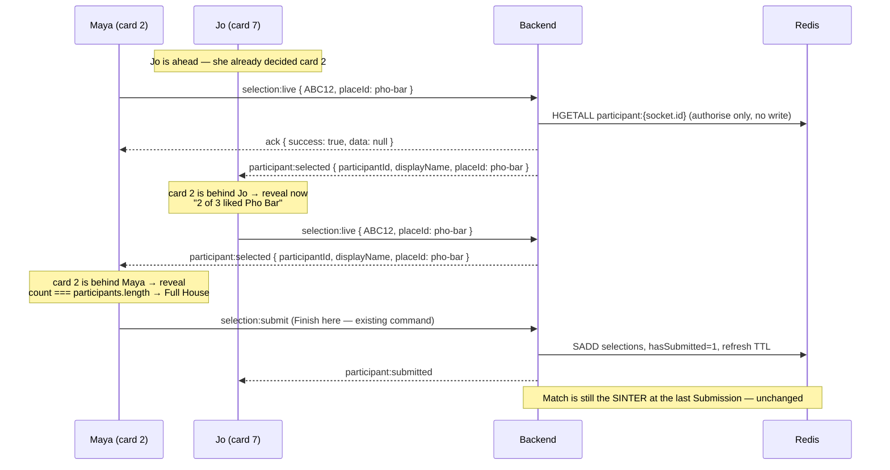

# The Live Swipe Room

While you swipe, the other Participants' Selections land on your screen the moment you have made your own call on that Restaurant: the strip above the card stack flips from "3 together" to "2 of 3 liked Pho Bar", and when a Restaurant turns out to have been liked by everyone, a full-screen moment interrupts the deck and offers to end it there. The Session Lobby stops claiming everyone is "Live" when they are not — a Participant who has dropped is shown as Offline until they come back (#6). Nothing about the Match changes: Selections are still client-held until Submission, and the Match is still the SINTER computed when the last Participant submits.

## Why

Swiping in Dinder is currently a solo activity performed in the same room as other people. The only sign anyone else exists is a static row of initials and the text `{n} together` (frontend/src/pages/SelectionPage.tsx:308-310), which never changes for the whole deck, and a header dot. The Session Lobby is worse than silent — it renders a lime `live-dot` and the accessible name `, live` for every Participant unconditionally (frontend/src/pages/SessionLobbyPage.tsx:171, :186-189), so a friend whose phone dropped off the network is still displayed as present; `participant:disconnected` arrives and produces only a 3-second toast (frontend/src/services/socketBindings.ts:136-147). Meanwhile every dopamine beat is deferred to the results screen, so a deck of 20 restaurants is 60 seconds of silence followed by one reveal. This spec makes the room audible during the deck, and makes the presence badge tell the truth.

## What the user sees

### 1. Swipe deck — resting state (unchanged except the strip)

```
375px
┌───────────────────────────────────────┐
│ ‹   Choose Restaurants        ♥ 3     │
│     ABC12 · 7 / 20            ● Live  │
├───────────────────────────────────────┤
│   ╭───────────────────────────────╮   │
│   │ (M)(J)(S)        3 together   │   │  ← existing pill row
│   ╰───────────────────────────────╯   │
│   ┌───────────────────────────────┐   │
│   │                               │   │
│   │        [ restaurant photo ]   │   │
│   │                               │   │
│   ├───────────────────────────────┤   │
│   │ Pho Bar                       │   │
│   │ Vietnamese                    │   │
│   │ ★ 4.5   $$   Open now         │   │
│   └───────────────────────────────┘   │
│                                       │
│       ( ✕ )     (↺)     ( ♥ )         │
│      Swipe or use buttons to choose   │
└───────────────────────────────────────┘
```

### 2. Swipe deck — a Live Selection is revealed

The right-hand text of the existing pill row is replaced for 4 seconds, then reverts to `3 together`. The Restaurant name truncates to one line (`truncate`) so the row never wraps inside its 343px budget.

```
375px
┌───────────────────────────────────────┐
│   ╭───────────────────────────────╮   │
│   │ (M)(J)(S)  2 of 3 liked Pho…  │   │  ← role="status", aria-live
│   ╰───────────────────────────────╯   │
│   ┌───────────────────────────────┐   │
│   │        [ next card ]          │   │
```

Exact copy (one string, always this shape):

- `2 of 3 liked Pho Bar`

There is no name, no avatar, and no "who". The count includes you if you liked it. This is deliberately the same count idiom the Near Miss card already uses (`{n} of {n} liked this`, frontend/src/pages/ResultsPage.tsx:517).

Offline Participants' avatars in that row render at 40% opacity with the accessible name `Maya is offline`; online ones keep `Maya is choosing` (frontend/src/pages/SelectionPage.tsx:301).

### 3. Swipe deck — Full House takeover

Fires at most once per visit to the swipe deck, only when the count reaches the full Participant count and there are at least two Participants.

```
375px
┌───────────────────────────────────────┐
│░░░░░░░░░░░░░░░░░░░░░░░░░░░░░░░░░░░░░░░│
│░░╭─────────────────────────────────╮░░│
│░░│                                 │░░│
│░░│           ♥ ♥ ♥                 │░░│
│░░│                                 │░░│
│░░│      EVERYONE LIKED THIS        │░░│
│░░│                                 │░░│
│░░│           Pho Bar               │░░│
│░░│                                 │░░│
│░░│  Lock it in now, or keep going  │░░│
│░░│  for more.                      │░░│
│░░│                                 │░░│
│░░│  ┌───────────────────────────┐  │░░│
│░░│  │      Finish here          │  │░░│  btn btn-primary, min-h-[56px]
│░░│  └───────────────────────────┘  │░░│
│░░│  ┌───────────────────────────┐  │░░│
│░░│  │      Keep swiping         │  │░░│  btn btn-ghost, min-h-[48px]
│░░│  └───────────────────────────┘  │░░│
│░░╰─────────────────────────────────╯░░│
└───────────────────────────────────────┘
```

Exact copy:

- Headline: `EVERYONE LIKED THIS`
- Restaurant name: the Restaurant's own name, e.g. `Pho Bar`
- Body: `Lock it in now, or keep going for more.`
- Primary button: `Finish here`
- Secondary button: `Keep swiping`

`Finish here` calls the existing `selection:submit` command with the Selections made so far — exactly what the end-of-deck `Submit Selections` button does (frontend/src/pages/SelectionPage.tsx:88). The user lands on the existing `All Done! / Waiting for other diners...` screen. `Keep swiping` dismisses and never re-fires.

**A Full House overlay is raised on every phone that reaches the full count**, not only the phone whose swipe completed it — each one reaches it as its own cursor passes the card. So if all Participants tap `Finish here`, the Session completes and, because they all liked it, the SINTER necessarily contains that Restaurant: **the Full House becomes the Match**. That is the intended ending and it needs no new code — completion is still the existing all-submitted path. It is not an early-completion mechanism: one Participant tapping `Finish here` submits only their own Selections and the others keep swiping.

**Failure and in-flight states** (the overlay is a submit surface, so it needs all three):

- In flight: the primary button is `disabled` and renders the existing spinner span verbatim (frontend/src/pages/SelectionPage.tsx:238-245) with the label `Submitting...`. `Keep swiping` stays enabled.
- Ack failure or a thrown error: the overlay **stays up**, re-enables the primary button, and renders one line above it in the existing error style (SelectionPage.tsx:227-231): `Could not submit — try again`.
- The existing `error` block is rendered only inside the `isDone` branch, so the overlay carries its own copy of it. `isSubmitting` and `error` are the same two state variables — no new state.

**Accessibility.** The overlay is `role="dialog" aria-modal="true"` with `aria-labelledby` pointing at the `EVERYONE LIKED THIS` headline. Focus moves to `Finish here` on mount. Escape and the hardware back button both mean `Keep swiping`. While it is up, the card stack and the three action buttons behind it are inert (`aria-hidden` on the deck container plus `pointer-events-none`) — without that, a keyboard or screen-reader user tabs straight past the takeover into a deck they cannot see.

### 4. Session Lobby — honest presence

```
375px
┌───────────────────────────────────────┐
│  Participants (3/4)                   │
│  ┌─────────────────────────────────┐  │
│  │ (A)  Alice   HOST      ● Live   │  │
│  └─────────────────────────────────┘  │
│  ┌─────────────────────────────────┐  │
│  │ (M)  Maya              ○ Offline│  │  ← grey dot, muted text
│  └─────────────────────────────────┘  │
│  ┌─────────────────────────────────┐  │
│  │ (J)  Jo                ● Live   │  │
│  └─────────────────────────────────┘  │
│  ┌ - - - - - - - - - - - - - - - - ┐  │
│  │  ·   Waiting for participant... │  │  ← unchanged, verbatim
│  └ - - - - - - - - - - - - - - - - ┘  │
└───────────────────────────────────────┘
```

Exact copy: `Live` (unchanged) and `Offline`. Accessible name on the avatar becomes `Maya, offline` instead of today's unconditional `Maya, live` (frontend/src/pages/SessionLobbyPage.tsx:171).

## Domain language

Two additions to CONTEXT.md, in the "Session flow" block, after **Selection**:

**Live Selection**:
A Selection broadcast to the other Participants at the moment it is made, and shown to each of them only once they have swiped that Restaurant themselves. Ephemeral chrome: it is never written to Redis and never affects the Match. Receivers hold it client-side, keyed by the sender's display name, so it survives the sender's reconnect.
_Avoid_: vote, live vote, real-time like

**Full House**:
A Restaurant every current Participant has made a Live Selection on, seen mid-deck before anyone has submitted. A Full House is a preview, not a Match — the Match is still computed at Submission and may not contain it.
_Avoid_: early match, instant match, mid-deck match

Presence needs no new term: a Participant shown as `Offline` is one in the existing **Disconnect** state.

## Design

### Kill-risks: what ships and what is cut

**The compelling version is not shippable, and would not work if it were.** "A live vote counter on the card you are currently looking at" fails on two of the three risks at once:

- **(a) Pace-sync.** With 2-4 people on a ~20-card deck, whoever swipes fastest reaches card 5 before the second-fastest reaches card 2. For the leader — usually the Host who is showing the app to the table — every card's counter reads `0 of 3` for the entire deck. The counter is inert precisely for the person doing the demo. No amount of engineering fixes this; it is a property of independent swipe rates.
- **(b) Anti-conformity.** A counter visible *before* you decide is the Muchnik 2013 / Salganik 2006 setup verbatim, and this is a pure-taste domain, which is the Salganik case where herding is strongest. The guard is to reveal only after you have swiped that card.

Applying the (b) guard resolves (a) as a side effect, and inverts it: because you only ever see reveals for cards *behind* you, the fast swiper is the one who receives the steady trickle (everyone else is behind them, arriving at cards the leader has already decided), and the slow swiper receives a burst as they pass each card. Both roles get a live room. What is lost is "the number is on the card" — it cannot be, so it lands in the strip above the deck and names the Restaurant instead.

- **(c) Rejoin safety.** Two halves, and only one of them is defused by "no Redis".

  **Server side: defused by not existing.** **No Live Selection is ever written to Redis.** The verified hazard is real — `removeParticipant` DELs `session:{code}:{pid}:selections` (backend/src/store/sessionStore.ts:326) and `addParticipant` writes `hasSubmitted: '0'` (backend/src/store/sessionStore.ts:310), and `joinSession` calls `removeParticipant(prior.participantId)` on every rejoin (backend/src/services/SessionService.ts:315-317). Any mid-deck persistence would be silently destroyed by a >2-minute reconnect. So the handler is a pure re-broadcast: it reads the participant record to authorise, and emits. Selections stay client-held until `selection:submit`, exactly as today, and the server-side rejoin path is untouched by this feature.

  **Client side: NOT defused by "no Redis" — it is defused by the identity key.** `participantId` **is** `socket.id` (backend/src/websocket/joinHandler.ts:68, :75, :86) and Socket.IO mints a new one on every reconnect and every reload. A receiver's buffer keyed by `participantId` would double-count one human the moment they reload mid-deck: they re-swipe the deck from `currentIndex` 0, re-emit every like under a second id, and on every other phone that placeId holds two ids for one person. With 3 Participants that is a false `EVERYONE LIKED THIS` on a Restaurant only 2 people liked; with 2 Participants the count reaches 3 while `participantCount` is 2, so `count === participantCount` never holds and the **real** Full House can never fire again. So **the buffer is keyed by `displayName`**, the identity that survives a reconnect, and reveals count only names that are still in `participants`. This is the same call `group-order.md` makes for the same reason, and it is the reason `participant:selected` carries `displayName` (§ Contract). See ADR 0009 — ephemeral group state is keyed by displayName, not participantId. `// ponytail: displayName is only as stable as claimDisplayName makes it — a rejoin under a NEW name double-counts. claimDisplayName forbids it today; if that ever relaxes, this needs a server-issued stable id.`

Also cut, with triggers, in "Out of scope for v1": a *server-side* early-completion path, retracting a Live Selection on Undo, and server-side presence truth. (A unanimous `Finish here` ending the Session is **not** cut — it falls out of the existing all-submitted path and is owned in § 3.)

### Data model

**No new Redis keys. No new Supabase tables. No migration.**

`selection:live` reads one existing key (`participant:{pid}`, via `store.getParticipant`) to authorise the sender and does not write. The 8-family keyspace documented at backend/src/store/sessionStore.ts:47-55 is unchanged, and `touch()` (backend/src/store/sessionStore.ts:121-142) does not need a new entry in its key list.

Deliberately **not** calling `touch()` on a Live Selection:

```ts
// ponytail: swiping does not refresh the 30-min TTL — 20 cards is ~2 min and
// join/submit both touch. Ceiling: a deck long enough to outlive the TTL.
// Upgrade: add `await store.touch(sessionCode)` here (it is already private to
// the store; export it) or debounce one touch per participant per deck.
```

Client-side state, in the existing `sessionStore`:

```ts
liveSelections: Record<string, string[]>;   // placeId -> displayNames who selected it (remote only)
recordLiveSelection: (placeId: string, displayName: string) => void;  // idempotent per displayName
```

**Keyed by `displayName`, not `participantId`** — see kill-risk (c) and ADR 0009. `participantId` is `socket.id` and does not survive a reconnect; `displayName` does, and it is what `allSelections` already keys by on the wire (shared/types/websocket-events.ts:`SessionResultsEvent.allSelections`). Idempotency per `displayName` is what makes a reloaded Participant's replayed likes collapse back onto one human.

Add `liveSelections: {}` to `initialState` (frontend/src/stores/sessionStore.ts:65-78). That gives `resetSession()` the clear for free, because `resetSession` is `set(initialState)` (:141) — do **not** write a second branch. `resetSelections()` clears it explicitly (it sets fields, not `initialState`), so a Restart wipes it.

It rides the existing persist blob without a `partialize` change (`partialize` drops only `isConnected`, :156-157) and needs no `version` bump: `merge` (:160-164) spreads persisted over `current`, so an old blob with no `liveSelections` falls back to `{}`. On reload `currentIndex` restarts at 0, so every buffered entry is ahead of the user and stays unrevealed until they swipe past it — which is the correct behaviour anyway.

**Denominator and clamp.** The reveal count is computed by the exported pure helper, which counts only selector names that are **still current Participants** and then clamps:

```ts
liveReveal({ placeId, selectorNames, likedByMe, participantNames }) -> { count, fullHouse }
// count = Math.min(selectorNames.filter(n => participantNames.includes(n)).length + (likedByMe ? 1 : 0),
//                  participantNames.length)
// fullHouse = count === participantNames.length && participantNames.length >= 2
```

The filter is what makes `participant:left` safe: three people live-select a card that is still ahead of your cursor, one leaves, `participants.length` drops to 2 — without the filter your first-ever reveal for that card reads the impossible `3 of 2`. The `Math.min` is belt-and-braces for any path the filter misses. **The strip may never render `{n} of {m}` with `n > m`.**

**One reveal slot, N unlocks.** A single effect run can newly unlock more than one placeId (two fast forward swipes batched by React; the whole buffer released as a reloaded Participant re-swipes; an Undo moving the cursor back and forward again). Policy: **announce the highest-index unannounced placeId and mark the rest announced** — they are stale by the time they would be shown. If any of the dropped ones is a Full House, the Full House wins over the plain reveal. `// ponytail: last-one-wins, no queue; upgrade to a 4s queue if testers report missed reveals.`

### Contract

Both additions are **NEW**. Widening was considered and rejected for each: `participant:submitted` is a count-only end-of-deck fact (`{ participantId, submittedCount, participantCount }`, shared/types/websocket-events.ts:81-85) and carries no Restaurant; `selection:submit` is terminal — it sets `hasSubmitted` and cannot be sent per card. Presence needs **no** contract change at all: `participant:joined` (shared/types/websocket-events.ts:73-77) and `participant:disconnected` (:117-121) already exist and already carry both `participantId` and `displayName`.

Additive per ADR 0007: a v1 frontend against a v2 backend simply never receives `participant:selected`; a v2 frontend against a v1 backend emits `selection:live` into the void and its own reveals never fire. Neither breaks.

```ts
// ============= Client → Server Events =============

/**
 * A Live Selection: this Participant just swiped yes on placeId, mid-deck.
 * Fire-and-forget chrome — the Selection is NOT persisted here; the Match is
 * still computed from `selection:submit`.
 */
export interface SelectionLivePayload {
  sessionCode: string;
  placeId: string;
}

/** No-data command: success acknowledges `data: null`. */
export type SelectionLiveResponse = Ack<null>;

// ============= Server → Client Events =============

/**
 * Another Participant made a Live Selection. The UI renders counts only — `displayName`
 * is never shown; it is the reconnect-stable key the receiver's buffer is indexed by
 * (see ADR 0009). `participantId` is socket-scoped and carried only for parity with the
 * other participant:* events.
 */
export interface ParticipantSelectedEvent {
  participantId: string;
  displayName: string;
  placeId: string;
}

// ============= added to the two event maps =============

export interface ClientToServerEvents {
  // ...existing four...
  'selection:live': (
    payload: SelectionLivePayload,
    callback: (response: SelectionLiveResponse) => void
  ) => void;
}

export interface ServerToClientEvents {
  // ...existing eight...
  'participant:selected': (data: ParticipantSelectedEvent) => void;
}
```

Broadcast target is `socket.to(sessionCode)` — sender excluded, matching `participant:joined` (backend/src/websocket/joinHandler.ts:85) — so a client never counts its own Live Selection twice; it adds itself locally from `selections`.

`displayName` costs the handler nothing: the authorisation read it already performs, `store.getParticipant(socket.id)`, returns the participant record including `displayName` (backend/src/store/sessionStore.ts:342-356). No second Redis call.

The client `void`s the ack (nothing branches on it), but the command still declares `Ack<null>` so it matches the canonical shape every other command uses and needs no special case in `emitAck` (frontend/src/services/socketService.ts:68-82).

### Flow



### Files touched

| path | change | why |
|---|---|---|
| `shared/types/websocket-events.ts` | add `SelectionLivePayload`, `SelectionLiveResponse`, `ParticipantSelectedEvent`; one key in each event map | the contract is the authority (ADR 0006); additive (ADR 0007) |
| `docs/adr/0009-*.md` | **new (or cite, if Group Order landed it first)** — ephemeral group state is keyed by displayName, not participantId | this feature's core correctness rests on it; a "consistency" refactor to participantId silently breaks Full House |
| `backend/src/websocket/liveSelectionHandler.ts` | **new** — Zod schema, `store.getParticipant(socket.id)` authorisation, `socket.to(code).emit('participant:selected', ...)` | one file per event, service/store injected — the existing handler shape |
| `backend/src/server.ts` | one `socket.on('selection:live', ...)` in the connection block (~line 226-243); pass `sessionStore` like `handleDisconnect` does | only wiring point for socket events |
| `frontend/src/services/socketService.ts` | `sendLiveSelection(sessionCode, placeId)` → `emitAck<null>('selection:live', ...)` | transport seam; 6 lines mirroring `submitSelection` |
| `frontend/src/services/socketBindings.ts` | `onEvent['participant:selected']` → `recordLiveSelection`; re-export `sendLiveSelection`; flip `isOnline` false in `participant:disconnected` and true in the `participant:joined` rejoin branch | the only module allowed to mutate stores from socket traffic |
| `frontend/src/stores/sessionStore.ts` | `liveSelections` (keyed by `displayName`) + `recordLiveSelection`; add it to `initialState` (which gives `resetSession` the clear for free) and clear it in `resetSelections` | Restart must not leak last round's reveals |
| `frontend/src/types.ts` | `isOnline?: boolean` on `Participant` (undefined = online, so no construction site changes) | smallest presence change |
| `frontend/src/pages/SelectionPage.tsx` | emit on like in `handleSwipeRight`; exported pure `liveReveal()`; one `useEffect([liveSelections, currentIndex])` that announces the highest-index unannounced placeId behind the cursor and marks the rest announced; clear the reveal text in the existing `Undo` handler (:381-390); reveal text in the existing pill row; Full House overlay with dialog semantics, in-flight and failure states; dim offline avatars | the whole feature surface |
| `frontend/src/pages/SessionLobbyPage.tsx` | badge and `aria-label` become conditional on `participant.isOnline !== false` | #6: stop asserting a falsehood |
| `CONTEXT.md` | add **Live Selection** and **Full House** | binding glossary |
| `backend/tests/unit/websocketHandlers.test.ts` | 3 cases for the new handler | where handler emission behaviour lives |
| `backend/tests/contract/ack-contract.test.ts` | add `SelectionLiveResponse` to the no-data ack array | proves the canonical wire shape |
| `frontend/tests/unit/liveSwipeRoom.test.tsx` | **new** — the pace-sync buffer, the anti-conformity gate, the rejoin/leave over-count | the one test that fails if the core logic breaks |
| `frontend/tests/unit/socketBindings.test.ts` | presence flip on disconnect/rejoin | keeps #6 honest |
| `frontend/tests/unit/selectionMobileGeometry.test.tsx` | **will go red without this**: its partial `vi.mock` of socketBindings (:24-27) exports only `submitSelection`/`leaveSession`, and its test at :179 clicks `Like` → `handleSwipeRight` → `sendLiveSelection` is `undefined`. Add `sendLiveSelection: vi.fn(async () => ({ success: true, data: null }))`. Plus the 375px reveal-state assertions | CI runs this (`ci-cd.yml:57`) |
| `frontend/tests/unit/neon-components.test.tsx` | **mock factory gains one key only** (`sendLiveSelection`, :28-32). It renders `SelectionPage` (:34, :74, :91). **No assertion changes** — `top-pick.md:299` ring-fences this file's assertions, and that constraint is respected | same partial-mock breakage, latent (it never clicks `Like` today) |

`page-branches.test.tsx`, `resultsPage.test.tsx` and `CreateSessionPage.test.tsx` also `vi.mock` socketBindings partially, but none of them renders `SelectionPage`, so they need no key and are not in the table.

## What this reuses instead of building

- **The pill row above the card stack** (frontend/src/pages/SelectionPage.tsx:296-311) — the reveal replaces its right-hand text. No new layout, no new width budget: the row already fits inside 343px at 375px.
- **The `lastAction` timeout pattern** (frontend/src/pages/SelectionPage.tsx:63-65, `setTimeout(..., 600)`) — the 4-second reveal decay is the same two lines.
- **`participantRingClass(index)`** (frontend/src/utils/participantStyles.ts) and the existing avatar markup — offline is one opacity class on top.
- **The `{n} of {n} liked this` count idiom** already shipped on the Near Miss card (frontend/src/pages/ResultsPage.tsx:517) — same phrasing, no new vocabulary for the user.
- **`selection:submit`** for `Finish here`. No early-completion path, no new backend semantics: it is the existing `handleSubmit` (frontend/src/pages/SelectionPage.tsx:78-100) bound to a second button.
- **`participant:joined` / `participant:disconnected`** for presence — both events already exist and already fire; only the client reaction changes. Zero contract, zero backend.
- **`store.getParticipant`** (backend/src/store/sessionStore.ts:342-356) for authorisation — one HGETALL that both proves membership and yields `sessionCode` to compare, the same check `leaveSession` makes (backend/src/services/SessionService.ts:477-479).
- **`emitAck<T>`** (frontend/src/services/socketService.ts:68-82) — no new transport code.
- **The `swipeVisuals` precedent** (frontend/src/components/SwipeCard.tsx:21-28, tested at frontend/tests/unit/selectionMobileGeometry.test.tsx:53-71) — `liveReveal()` is exported as a pure function for the same reason: the logic is unit-testable without a DOM.
- **Genuinely new:** the reveal buffer (a `useEffect` over `[liveSelections, currentIndex]` plus a `useRef<Set<string>>` of announced placeIds), the Full House overlay, and the `selection:live` / `participant:selected` pair. Nothing existing does either job.

## Hard cases

| case | behaviour |
|---|---|
| Session expires mid-deck | Unchanged: the keyspace notifier emits `session:expired` and the client sets status `expired` (frontend/src/services/socketBindings.ts:182-185). Live Selections are ephemeral; nothing to clean. `selection:live` deliberately does **not** refresh the TTL (see the ponytail note) — a ~20-card deck is ~2 minutes against a 30-minute window. |
| Participant disconnects mid-deck | Their Live Selections stop arriving. Already-revealed lines stay on screen. They remain a current Participant (FR-025), so the denominator is unchanged and a Full House still requires their like — a disconnected Participant blocks a Full House. Conservative and correct. Their avatar dims and the Lobby shows `Offline`. |
| Participant leaves mid-deck | `participant:left` removes them from the store, so `participants.length` drops and the denominator shrinks. Their buffered-but-unrevealed Live Selections are **not** counted: `liveReveal` filters `selectorNames` against the current `participantNames` (see § Data model). Without that filter, three Participants live-selecting a card still ahead of your cursor followed by one `participant:left` would make the card's *first ever* reveal read `3 of 2`. Already-announced reveals are not re-computed and no retro Full House fires. |
| Rejoin after > 2 minutes | Nothing is lost that this feature owns: no Live Selection is in Redis, so `removeParticipant`'s DEL of `session:{code}:{pid}:selections` (backend/src/store/sessionStore.ts:326) destroys nothing new. The rejoiner's own `selections` array is in the persisted Zustand store and survives. Their `liveSelections` survive too; because the page keeps its `currentIndex`, reveals continue. (The pre-existing `hasSubmitted` wipe on rejoin is untouched and out of scope — it is a separate, known defect.) |
| Rejoin **as seen by everyone else** | The rejoiner gets a new `socket.id` and, if they reloaded, re-swipes from `currentIndex` 0 and re-emits every like. On the other phones `recordLiveSelection` is idempotent per `displayName`, so the replay collapses onto the one entry that is already there — no double-count, no false Full House, no permanently-blocked real one. This is the whole reason the buffer is not keyed by `participantId` (kill-risk (c), ADR 0009). |
| Restart | `session:restarted` → `resetSelections()`, which now also clears `liveSelections`. The user re-enters the deck from the results screen, remounting `SelectionPage`, so `currentIndex`, the announced-set ref and the once-per-deck Full House flag all reset. |
| Solo Session (1 Participant) | No `participant:selected` ever arrives; the strip shows `1 together` forever. Full House is hard-gated on `participantCount >= 2` so a solo swiper never sees `1 of 1 liked X` or a takeover. |
| Empty deck / zero likes | No emits, no reveals, no overlay. Identical to today. |
| Undo after a like — **outgoing** | The broadcast is **not** retracted — others may have already seen `2 of 3`. The Match is authoritative and comes from the Submission, which omits the undone Restaurant. Live Selections are chrome; a retraction event is out of scope. |
| Undo after a like — **incoming** | `Undo` (frontend/src/pages/SelectionPage.tsx:381-390) runs `currentIndex` **backwards**, so "behind the cursor" is not monotonic and a card you have already been shown a reveal for can end up at or ahead of you again — with the 4-second decay still on screen while you re-decide. That is exactly the anti-conformity setup guard (b) exists to prevent, one tap away. So: **the reveal text is cleared immediately on Undo**, and the announced-set ref suppresses re-announcement while `currentIndex <= indexOf(placeId)`. The ref is never un-marked, so a re-swipe of that card produces no second reveal. |
| Duplicate display names | Cannot occur within a Session: `joinSession` throws `DISPLAY_NAME_TAKEN` when `store.claimDisplayName` fails (backend/src/services/SessionService.ts:297-313, Lua CAS at sessionStore.ts:267-288). That uniqueness is the precondition the `displayName` keying rests on — recorded in ADR 0009 so nobody relaxes it without reading this. |
| Non-participant emits `selection:live` | Rejected with `NOT_IN_SESSION` via the `getParticipant` + `sessionCode` check, before any broadcast. A stranger who guesses a 5-char code cannot inject reveals. |
| Unknown / foreign placeId in the payload | Not validated against `session:{code}:restaurant_ids` — that would cost an SMEMBERS per swipe. `// ponytail: unvalidated placeId; the receiver only reveals ids present in its own deck, so a junk id is inert. Upgrade: SISMEMBER restaurant_ids if abuse appears.` |
| External API failure | Not applicable — this feature calls no external API. Google Places and Apify are not touched. |
| Cost | **$0.** No Places call, no Apify run, no Supabase row, no new Redis key. Traffic ceiling is 4 Participants × ≤20 likes = ≤80 payloads of ~80 bytes per Session, each costing one HGETALL. |
| Two Participants swipe the same card in the same second | Both emits are independent; each client's reveal `useEffect` recomputes from the whole `liveSelections[placeId]` array, so the announced line is `3 of 3`, not two separate `2 of 3` lines. The announced-set ref keys on placeId, so a placeId announces once. |
| Reduced motion | The overlay uses no animation of its own; the global `prefers-reduced-motion` rule (frontend/src/index.css:295-303) already zeroes durations app-wide. The reveal is a text swap and needs none. |

## Out of scope for v1

- ~~**Ending the Session on a Full House.**~~ **Not cut — owned.** This bullet used to claim the ending was out of scope on the grounds that "`Finish here` submits *your* Selections; the others still have to submit". True and irrelevant: every phone raises the overlay as its own cursor passes the card, so all of them are asked at the same moment by the same button. Three taps end the Session, and the SINTER necessarily contains that Restaurant. Owning it costs zero code — see § 3. What **is** still out of scope is a *server-side* early-completion path: no new command, no "end now" broadcast, no unilateral finish. Revisit only if we want one Participant to be able to end it for everyone.
- **Retracting a Live Selection on Undo.** Revisit if user testing shows people undoing likes often enough that stale counts are noticed; the fix is a `liked: false` field on the same event, still additive.
- **Server-side presence truth.** v1 flips `isOnline` purely from events this client has seen. Two accepted holes, both decisions rather than omissions: (i) a Participant who dropped *before* you joined shows as `Live` to you; (ii) **your own** reconnect resets every badge to `Live` — `socketBindings.ts:44-54` auto-rejoins on `connect` and `joinSession` (:236-244) *replaces* the participant list from `SessionJoinData.participants`, which is `{ participantId, displayName, isHost }` only (shared/types/websocket-events.ts:29-33), so every `isOnline: false` is dropped. Badges stay honest again from the next `participant:disconnected`. Hole (ii) is the likelier one — Acceptance 7's own scenario is a table on one flaky wifi. Not fixed here because merging by `displayName` would be equally wrong in the other direction: someone who rejoined while *you* were offline sent you no event either, so a preserved `false` would be a fresh lie. `// ponytail: client-only presence; a pre-join disconnect is invisible and your own reconnect resets every badge to Live. Upgrade: hset an offline flag on participant:{pid} in disconnectHandler and widen SessionJoinData.participants with isOnline?: boolean (additive) — that fixes both holes at once.` Revisit on the first report of a stale badge.
- **Showing who liked what mid-deck.** Counts only. Revisit never for passes; names could be revisited if the results screen's per-Participant disclosure proves uncontroversial in use.
- **Live pace / "Jo is on card 12" indicators.** Revisit if the strip proves too quiet for slow swipers in a 2-person Session.
- **A reveal on the results screen or the Lobby.** The deck is the only surface.
- **Broadcasting passes.** They would leak information the results screen never shows and buy nothing the like-count needs.

## Acceptance

1. Two devices in one Session: device A swipes right on the first card while device B has not yet swiped it. Device B's strip shows nothing. Device B then **passes** that card, and within a second B's strip reads `1 of 2 liked <name>`. (With two devices a *mutual* like is by definition a Full House — `count === participantCount` — so it raises the overlay, never a `2 of 2` strip line. The strip's like-branch is a three-device check: see #4a.) Verified by hand and by `frontend/tests/unit/liveSwipeRoom.test.tsx`.
   - 1a. Three devices: A and B like a card that C has not reached; C then swipes it either way and C's strip reads `2 of 3 liked <name>`.
2. Nothing about another Participant's Selection is visible for any card at or ahead of your current card, **including after an Undo**. Checked by driving `participant:selected` for a card ahead and asserting the strip still reads `{n} together`; then, in a second case, swiping past a revealed card, tapping `Undo`, and asserting the reveal text is gone and does not return (`frontend/tests/unit/liveSwipeRoom.test.tsx`).
3. The fast swiper is not starved: with device A five cards ahead of device B, A receives a reveal each time B passes one of A's decided cards. Verified by hand.
4. With three devices, when all three like the same Restaurant, **each** device sees the full-screen `EVERYONE LIKED THIS` overlay naming that Restaurant as its own cursor passes the card, with `Finish here` and `Keep swiping`. On mount, focus is on `Finish here`; the overlay is `role="dialog" aria-modal="true"`; Escape dismisses it exactly as `Keep swiping` does; the deck behind it takes neither tab focus nor taps. `Keep swiping` returns to the deck and the overlay never re-appears for the rest of that deck. Focus placement and the dialog role are asserted in `frontend/tests/unit/liveSwipeRoom.test.tsx`.
5. `Finish here` produces the existing `All Done! / Waiting for other diners...` screen, and the other devices receive `participant:submitted` — i.e. it goes through `selection:submit` and no other path. Verified by hand plus the unchanged `backend/tests/unit/websocketHandlers.test.ts` submit cases.
   - 5a. Failure path: with the ack forced to `{ success: false }`, the overlay stays up, the primary button is disabled with the spinner while in flight, then re-enables, and `Could not submit — try again` is on screen. A second tap while in flight sends nothing. Asserted in `frontend/tests/unit/liveSwipeRoom.test.tsx`.
   - 5b. All three tapping `Finish here` completes the Session and the Match contains that Restaurant. This is the owned ending, not an accident (§ 3). Verified by hand.
6. Solo Session: swiping a whole deck alone produces no reveal and no overlay.
7. In the Session Lobby, killing one device's network shows that Participant as `Offline` on the *observing* devices that stayed connected, within the socket's disconnect detection window; restoring the network returns them to `Live`. If the observing device itself reconnects in between, its badges all reset to `Live` — that is the accepted v1 behaviour (§ Out of scope, hole (ii)), not a failure of this criterion. Verified by hand and by `frontend/tests/unit/socketBindings.test.ts`.
8. A Participant who drops mid-deck for more than two minutes and rejoins still holds every like they had made, and the deck continues from where they left off. (Their `hasSubmitted` reset is the pre-existing defect and is not in scope.) Verified by hand.
   - 8a. **On the other devices**, that rejoin (and a full reload that replays the whole deck) does not inflate any count: the strip never reads `{n} of {m}` with `n > m`, no `EVERYONE LIKED THIS` fires on a Restaurant fewer than all Participants liked, and a genuine Full House afterwards still fires. Asserted in `frontend/tests/unit/liveSwipeRoom.test.tsx` (same `displayName`, two `participantId`s, one placeId ⇒ count 1) and checked by hand.
9. During a live deck, `redis-cli --scan --pattern 'session:*'` shows the seven `session:`-prefixed key families and `--pattern 'participant:*'` shows only `participant:{pid}` — no new key in either. (The eighth documented family, `participant:{pid}` at backend/src/store/sessionStore.ts:55, is not `session:`-prefixed, so one pattern cannot see all eight.)
10. A socket that never joined the Session emits `selection:live` for that Session Code and receives `{ success: false, error: { code: 'NOT_IN_SESSION' } }`; no other client receives anything. Verified by `backend/tests/unit/websocketHandlers.test.ts`.
11. At a 375px viewport with the longest Restaurant name in the deck, the pill row does not wrap and the action buttons stay inside the safe area. Covered by extending `frontend/tests/unit/selectionMobileGeometry.test.tsx`.
12. CI's `lint` and `contract-tests` jobs are green. (`npm run typecheck` already begins with `npm run build --workspace=shared`, so there is no separate step to run.)
13. **CONTEXT.md** carries **Live Selection** and **Full House** in the "Session flow" block, and **ADR 0009** exists (written here or by Group Order) recording that ephemeral group state is keyed by displayName. Both land in the contract issue, not after it — see § Issue breakdown.

## Test plan

Extended suites:

- **`backend/tests/unit/websocketHandlers.test.ts`** (unit project, ioredis-mock, existing `socket()`/`io()` fakes at lines 47-64): three cases for `handleLiveSelection` — (i) a joined participant's emit acks `{ success: true, data: null }` and calls `socket.to(sessionCode).emit('participant:selected', { participantId, displayName, placeId })` with the `displayName` from the participant record; (ii) a socket with no participant record acks `NOT_IN_SESSION` and emits nothing; (iii) a malformed `sessionCode` acks `VALIDATION_ERROR`. A fourth assertion pins the no-persistence promise: after the emit, `redis.smembers('session:WSH12:socket-1:selections')` is empty.
- **`backend/tests/contract/ack-contract.test.ts`**: add `SelectionLiveResponse` to the `no-data commands acknowledge data: null` array (line 43-50). This is the ADR 0006 wire proof for the new command.
- **`frontend/tests/unit/socketBindings.test.ts`**: `participant:disconnected` sets that Participant's `isOnline` to `false` in the store (today it only toasts); a subsequent `participant:joined` with `isRejoin: true` sets it back to `true`.
- **`frontend/tests/unit/selectionMobileGeometry.test.tsx`**: **first**, add `sendLiveSelection: vi.fn(async () => ({ success: true, data: null }))` to the partial `vi.mock` factory at :24-27 — without it the existing `Like` click at :179 calls an `undefined` import and the suite goes red on `ci-cd.yml:57`. Then extend the existing 375px assertions to the reveal state — the pill row stays one line and the action row stays inside the safe area while a reveal is showing.
- **`frontend/tests/unit/neon-components.test.tsx`**: the same one key on its factory at :28-32. **No assertion changes** (`top-pick.md:299` ring-fences this file).

New test — the one that fails if the core logic breaks:

- **`frontend/tests/unit/liveSwipeRoom.test.tsx`** — picked up by `frontend/vite.config.ts`'s `tests/unit/**` include (the frontend has no vitest workspace and no named projects), so it runs under `npm run test:unit --workspace=@dinder/frontend`. It covers both defused kill-risks in one file, against the exported pure helper and the rendered page:
  - `liveReveal({ placeId, selectorNames, likedByMe, participantNames })` returns `{ count, fullHouse }`: `count` includes the local Participant only when `likedByMe`, counts only names still in `participantNames`, and is clamped to `participantNames.length`; `fullHouse` is true only when `count === participantNames.length && participantNames.length >= 2`.
  - **anti-conformity gate**: render `SelectionPage` with three Participants and a seeded deck, push a `participant:selected` for the card at `currentIndex` and for a card ahead of it, assert the strip still reads `3 together`.
  - **anti-conformity gate, after Undo**: swipe past a revealed card, tap `Undo`, assert the reveal text is cleared and does not re-appear when the card is re-decided.
  - **pace-sync buffer**: with those events still pending, swipe past both cards and assert the strip now reads `2 of 3 liked <name>` — i.e. an event that arrived before the user reached the card is held and released, not dropped.
  - **rejoin does not double-count**: the same `displayName` sends `participant:selected` for one placeId under two different `participantId`s; assert the reveal reads `1 of 3`, and that a subsequent genuine Full House on that placeId still fires.
  - **`participant:left` before reveal**: three Participants live-select a placeId ahead of the cursor, one `participant:left` arrives, then the user swipes past it — assert the strip reads `2 of 2`, never `3 of 2`. Both of these cases assert the general invariant: the strip never renders `{n} of {m}` with `n > m`.
  - **Full House once**: drive a third Participant's Live Selection so `count === 3`, assert the overlay with `EVERYONE LIKED THIS` renders with `role="dialog"` and focus on `Finish here`, click `Keep swiping`, drive another full-house placeId, assert no second overlay.
  - **`Finish here` failure**: force the submit ack to `{ success: false }`; assert the overlay is still mounted, `Could not submit — try again` is on screen, and the primary button is enabled again.

Not covered by CI, stated plainly: backend `tests/integration/*` and every Playwright spec never run in `.github/workflows/ci-cd.yml` (it runs `typecheck` :45, both eslints :48/:51, both `test:unit` :54/:57, and backend `test:contract` :97 — the job ids are literally `lint` and `contract-tests`). So this feature adds no e2e spec — everything above lands in `unit` and `contract`, which are the gates that actually execute.

The multi-device criteria (1, 1a, 3, 4, 5b, 7, 8) are **not** a "run it once before merge" afterthought: they need two phones (three for 1a/4/5b) against a deployed backend, a killed radio (#7) and a >2-minute airplane-mode wait (#8). That is a **0.5-day device pass**, budgeted as its own line in § Issue breakdown.

## Issue breakdown

Six issues, **4.5 days** (was four issues / 3.5d — the reveal row was carrying six files and two suites, and the glossary, ADR and device pass had no home at all). README § Sprint 4 now carries the authoritative version of this table (4.75d, seven rows): the same work, with the ADR 0009 + glossary half of the contract row split into its own 0.25d row.

| issue | days | depends on | contents |
|---|---|---|---|
| `selection:live` contract + `liveSelectionHandler` re-broadcast (no Redis write) | 0.5 | — | `shared/types/websocket-events.ts`, the new handler, `server.ts` wiring, backend unit + `ack-contract` cases. **Acceptance also includes**: the two CONTEXT.md terms (**Live Selection**, **Full House**) and **ADR 0009** land in this PR — the glossary and the decision merge *with* the contract that depends on them, not after it. If Group Order landed ADR 0009 first, cite it instead. |
| Live-selection store + transport | 0.5 | contract | `frontend/src/types.ts`, `stores/sessionStore.ts` (`liveSelections` keyed by displayName, `recordLiveSelection`, `initialState`, `resetSelections`), `services/socketService.ts`, `services/socketBindings.ts`, plus the one mock key in `selectionMobileGeometry.test.tsx` and `neon-components.test.tsx` so CI stays green from this PR onward. |
| Reveal buffer + anti-conformity gate + strip copy on the swipe deck | 1.5 | store/transport | the `SelectionPage` effect, exported `liveReveal`, Undo handling, the 375px reveal-state assertions, and the new `liveSwipeRoom.test.tsx`. |
| Full House takeover with `Finish here` / `Keep swiping` | 1 | reveal buffer | overlay, dialog semantics and focus, in-flight and failure states. |
| Honest presence in the Session Lobby (closes #6) | 0.5 | — | `SessionLobbyPage` badge + `aria-label`, `socketBindings` presence flips, `socketBindings.test.ts`. |
| Multi-device acceptance pass | 0.5 | all of the above | Acceptance 1, 1a, 3, 4, 5b, 7, 8 by hand on two/three phones against the deployed backend. |

## Review notes

Two independent reviews, 22 findings. **21 accepted and fixed above. 1 rejected. 0 deferred.**

### Rejected

- **"Merge rather than replace in `joinSession` so your own reconnect preserves other Participants' `isOnline`."** Rejected on evidence: a preserved `isOnline: false` is a *fresh* lie, because a Participant who rejoined while you were disconnected sent you no event either — so merging trades one wrong badge for a stickier wrong badge, for real code. The reviewer's own alternative (write it down as a decision) is taken instead: § Out of scope now names hole (ii) explicitly, Acceptance 7 excludes it, and the ponytail note carries the one upgrade that actually fixes both holes (a server-side offline flag on `participant:{pid}` plus an additive `isOnline?` on `SessionJoinData.participants`).

### Accepted with a different fix than proposed

- **Over-counting (blocking, both reviewers).** Both proposed remedies were partial. Keying by `displayName` alone (reviewer 2) does not survive the `participant:left` case — three selectors, denominator drops to 2, first reveal reads `3 of 2` with no rejoin involved. Clamping alone (reviewer 1, option b) hides `3 of 2` but converts it into a **false Full House** at `min(3, 2) === 2`. So `liveReveal` does both: it filters `selectorNames` against the current `participantNames` (exact, and the reason the count is right rather than merely plausible) and then clamps as belt-and-braces. `ParticipantSelectedEvent` gains `displayName`, which costs no extra Redis call — `getParticipant` already returns it.
- **`Finish here` ending the Session (material).** Reviewer offered "own it" or "gate the overlay to the completing swiper". Owned. Gating would need code to suppress an overlay that is already correct on every phone, to protect a cut that was never worth having: a unanimous `Finish here` producing the Full House as the Match is the good ending. The genuinely-cut thing — a *server-side* early-completion path — is now stated as what the bullet actually means.

### Confirmed, no spec change needed

- **CI gates.** `ci-cd.yml` runs `typecheck`, both eslints, both `test:unit`, backend `test:contract`. `test:integration` and Playwright never run. The existing honesty note was exact; line numbers and job ids added.
- **No new Redis keys / no `touch()` edit / persist blob needs no `partialize` or `version` change / Restart remount resets everything.** All four verified independently. The one addition made: `liveSelections` goes in `initialState` so `resetSession` clears it for free.
- **`SESSION_CODE_LENGTH = 5`.** The spec's "5-char code" is right; the *product brief* saying 6 is stale (`shared/types/models.ts:4`). No change here — flagged for whoever owns the brief. CONTEXT.md is fine (it says only "short shareable code").

### From the completeness review (`completeness-gaps.md`)

- **#3, ownerless CONTEXT.md edits** — fixed: § Issue breakdown puts **Live Selection** and **Full House** in the contract issue's acceptance, and Acceptance 13 checks it.
- **#4, ADR-grade decisions in a table row** — fixed for the half this spec depends on: ADR 0009 (ephemeral group state keyed by displayName) is now in Files touched, kill-risk (c), § Data model and Acceptance 13. The second half of that finding (Dinder never places the order / holds no Platform credential) belongs to `group-order.md`; this feature holds no credential and touches no Platform.
- **#5, one failure screen out of six** — the same pattern was present here: § 3 specified six strings, two buttons and zero failure states. The overlay's cold path is now fully drawn (in-flight, ack failure, double-tap) with real copy.
- **#6, 375px geometry gate** — already satisfied (Acceptance 11), now with the mock fix that keeps that suite runnable.
- **#1 (`__empty__` sentinel vs a group-orderable Top Pick) and #2 (`Order together` on collapsed cards)** — not this spec: no Live Selection is written to Redis, this feature never reads `session:{code}:results`, and it renders nothing on `ResultsPage`.

### Deltas owed by `docs/specs/README.md` — all delivered

All four deltas this section used to list (Sprint 4 heading and table, the unreachable `2 of 2` demo line, the "fully independent" critical-path claim, and the Full House out-of-scope wording) have been applied to `docs/specs/README.md` by the sprint-1 resync. README § Sprint 4 is the authority; nothing is owed.
