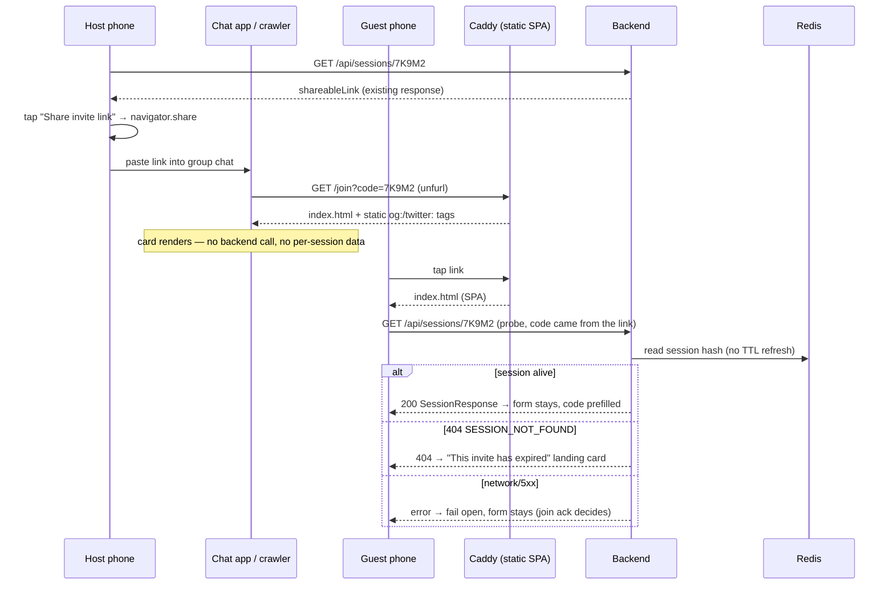

# Tap-to-Join Invite

A Host pastes the Session link into a group chat and it unfurls as a branded Dinder card instead of a naked `https://www.dinder.it.com/join?code=7K9M2` that reads as spam. On a phone, the lobby's link button opens the native share sheet (chat apps, AirDrop, Messages) rather than silently writing to the clipboard. And when someone taps that link two days later — link previews outlive a 30-minute Session by days — they land on a Dinder screen that tells them the Session is over and offers to start a new one, instead of a prefilled form that rejects them only after they type their name.

## Why

Today the Invite Link is a bare URL. Sent in iMessage or WhatsApp it renders with no image, a bare `Dinder` title, and a query string that looks machine-generated — the exact shape of a phishing link, which is a real reason friends don't tap. `frontend/index.html:4-21` has charset, viewport, description, theme-color, three mobile-web-app metas, icons and `<title>Dinder</title>` — and no Open Graph or Twitter tags at all. The share affordance is also wrong for the device: `SessionLobbyPage.tsx:57-64` writes `shareableLink` to the clipboard and toasts, so the Host still has to switch apps and paste, on a flow that is mobile-first by constraint. Finally the expired case is unhandled: a stale link lands on `/join?code=…`, `JoinSessionPage.tsx:32-37` prefills the code, and the person holding the link only learns the Session is gone after entering a name and submitting, as an inline red string from `JoinSessionPage.tsx:77-78`.

## What the user sees

### 1. The unfurled link (any chat app, not a Dinder screen)

```
375px ────────────────────────────────────
 Zac                                 09:41
 ┌───────────────────────────────────────┐
 │ dinder.it.com/join?code=7K9M2         │
 │ ┌───────────────────────────────────┐ │
 │ │ [neon night market photo, 1.87:1] │ │
 │ └───────────────────────────────────┘ │
 │ Dinder — Swipe. Match. Eat.           │
 │ Your group is picking dinner. Tap to  │
 │ join the session and start swiping.   │
 │ DINDER.IT.COM                         │
 └───────────────────────────────────────┘
```

Exact tag values (static, identical on every route) — twelve tags:

- `og:site_name` = `Dinder`
- `og:title` / `twitter:title` = `Dinder — Swipe. Match. Eat.`
- `og:description` / `twitter:description` = `Your group is picking dinner. Tap to join the session and start swiping.`
- `og:image` / `twitter:image` = `https://www.dinder.it.com/images/og-card.jpg`
- `og:image:width` = `1200`, `og:image:height` = `640`
- `og:image:alt` = `A neon-lit night market food stall`
- `og:type` = `website`, `twitter:card` = `summary_large_image`

**The card image is a recompressed derivative, not the full-size page photo.** `frontend/public/images/neon-night-market.jpg` is 1717×916 / 314 KB, and WhatsApp's preview fetcher drops images over roughly 300 KB — the card would silently lose its image on the one platform this feature exists for. One `sips` call fixes it, measured, not guessed:

```bash
sips -Z 1200 --setProperty formatOptions 65 \
  frontend/public/images/neon-night-market.jpg \
  --out frontend/public/images/og-card.jpg   # → 1200×640, 118 KB
```

`og:image:width` / `og:image:height` are what let Facebook-family and Slack scrapers render the large card on the *first* scrape instead of deferring to a link-only preview — which is exactly the first impression the feature exists to fix.

No `og:url`. It would have to be static, and Facebook-family scrapers treat `og:url` as canonical — a static `og:url` would rewrite every Session link's preview to point at the home page. Omitting it makes the preview target the URL that was actually shared.

### 2. The lobby screen (`SessionLobbyPage`) — share button (changed)

Only the button label and its handler change. The Session Code heading, the code display and the copy-code button above it (`SessionLobbyPage.tsx:124-146`) are untouched; the button being changed is the `{shareableLink && (…)}` block at `:147-154`.

```
375px ────────────────────────────────────
 ← Make the Call            ● connected
   Invite friends, then start swiping
 ┌───────────────────────────────────────┐
 │            SESSION CODE               │
 │  ┌─────────────────────────────┐ ⧉    │
 │  │       7 K 9 M 2             │      │
 │  └─────────────────────────────┘      │
 │  ┌─────────────────────────────────┐  │
 │  │      Share invite link          │  │  ← navigator.share present
 │  └─────────────────────────────────┘  │
 └───────────────────────────────────────┘
      ↓ tap
 ╔═══════════════════════════════════════╗
 │  Dinder                               │
 │  https://www.dinder.it.com/join?...   │
 │  [Messages] [WhatsApp] [Copy] [More]  │  ← OS sheet, not ours
 ╚═══════════════════════════════════════╝
```

- Button label when `navigator.share` exists: `Share invite link`
- Button label otherwise (desktop Firefox, older browsers): `Copy shareable link` — the string today, unchanged
- Share payload: `{ title: 'Dinder', url: shareableLink }` — the `shareableLink` already fetched from `GET /api/sessions/:sessionCode`. **No `text` field.** Share targets that accept plain text only may take `text` and drop `url` entirely, which would ship an invite carrying no link and silently defeat the unfurled card. The card already says "Dinder — Swipe. Match. Eat." and names the Session, so the prose was redundant anyway.
- Clipboard fallback toasts, unchanged: `Link copied to clipboard!` / `Could not copy link`
- The Host dismisses the share sheet: nothing. No toast, no error.

### 3. Join page from a dead link (new state)

The probe is fire-and-forget, so the form paints first and this card replaces it once a 404 comes back (~150–300 ms). That flash is deliberate: blocking the form on a settled probe would make every *live* Invite Link one round-trip slower, and live links are the common case. `ponytail:` accept the flash; gate the form on the probe only if someone reports losing a half-typed name.

```
375px ────────────────────────────────────
 ← Join Session
   Enter the session code shared by your host
 ┌───────────────────────────────────────┐
 │                                       │
 │                 ⏳                     │
 │                                       │
 │      This link has expired            │
 │                                       │
 │  Dinder sessions last 30 minutes.     │
 │  This one is over — or the code was   │
 │  mistyped.                            │
 │                                       │
 │  ┌─────────────────────────────────┐  │
 │  │      Start a new session        │  │  btn btn-primary → /create
 │  └─────────────────────────────────┘  │
 │  ┌─────────────────────────────────┐  │
 │  │      Enter a code instead       │  │  btn btn-secondary → setLinkDead(false)
 │  └─────────────────────────────────┘  │
 └───────────────────────────────────────┘
```

Exact copy: heading `This link has expired`; body `Dinder sessions last 30 minutes. This one is over — or the code was mistyped.`; buttons `Start a new session` and `Enter a code instead`.

One card covers both expiry and a mistyped code, because Redis keeps no tombstone — `GET /api/sessions/:sessionCode` returns the same 404 `SESSION_NOT_FOUND` for a code that expired and one that never existed (`backend/src/api/sessions.ts:116-153`). The copy says so rather than guessing.

### 4. Join page from a live link (unchanged)

While the probe is in flight the form renders as it does today, with the code prefilled and the Join button already enabled by `JoinSessionPage.tsx:155` once a name is typed. No spinner, no blocking: a live link must not feel slower than it does now.

## Domain language

One new term. `Session Invite` is already taken by the Friend-graph feature (`CONTEXT.md:79-81`) and `Friend Request`'s _Avoid_ line explicitly reserves the word "invite" for it, so the shared URL needs its own name.

```
**Invite Link**:
The URL that carries a Session Code to a phone that has not joined yet — `/join?code=<code>`, minted by the backend as `shareableLink` and shared by hand. Anyone holding it can join while the Session lives; it grants nothing once the Session expires. Not a Session Invite — that term is reserved for one Profile inviting a Friend through the social graph.
_Avoid_: share link, magic link, deep link — and never "Session Invite", which is the Friend-graph term
```

The word "invite" stays reserved (`CONTEXT.md:77`) as a *bare* noun; **Invite Link** is a two-word term and the only place UI copy may use it — hence the button `Share invite link` and the card heading `This link has expired` (not "this invite"). Everything else uses the existing vocabulary: Session, Session Code, Host, Participant — the screen at `/session/:sessionCode` is "the lobby screen (`SessionLobbyPage`)", never "the lobby" on its own, which `CONTEXT.md:11` puts on Session's _Avoid_ list.

## Design

### Data model

No new Redis keys. No Supabase tables. No migration.

The expiry probe reads an existing Session through the existing `GET /api/sessions/:sessionCode`, which calls `SessionService.getSession` → `store.readSession`. Reads do not call `touch()` (only `createSession`, `addParticipant`, `recordSubmission`, `computeAndStoreResults` and `resetForRestart` do), so **probing an Invite Link does not extend the 30-minute TTL** — a link opened repeatedly by a chat app's crawler cannot keep a dead Session alive or lengthen a live one.

### Contract

**No additions to `shared/types/websocket-events.ts`.** Nothing new goes on the wire and no socket event is widened. ADR 0007 is satisfied trivially: the frontend/backend contract is unchanged, so the two deployments are independent by construction.

The feature rides entirely on types that already exist in `shared/types/session-contract.ts:24-31`:

```ts
// EXISTING — unchanged, quoted here because it is the whole contract this feature needs
export interface SessionResponse {
  sessionCode: string;
  hostName: string;
  participantCount: number;
  state: string;
  expiresAt: string;
  shareableLink: string; // `${FRONTEND_URL}/join?code=${sessionCode}` — backend/src/config/index.ts:22-25
}
```

`FRONTEND_URL` is a runtime env with a `http://localhost:3000` fallback (`backend/src/config/index.ts:7`) and is pinned nowhere in the tree, so **the host every acceptance criterion curls must be confirmed against production before checking, not assumed**: if prod mints apex links rather than `www`, `https://www.dinder.it.com/...` is a host no Invite Link points at. Record the production value in the implementing issue and curl that host.

Failure shape is also existing: `ApiClientError` (`frontend/src/services/apiClient.ts:156-166`) carries `status`, so the probe branches on `err.status === 404` and nothing else.

### Flow



### Files touched

| path | change | why |
|---|---|---|
| `frontend/index.html` | add 12 static `og:`/`twitter:` meta tags after the existing `description` meta (`:9`) | the whole unfurl feature; Caddy serves this same head on every route including `/join` |
| `frontend/public/images/og-card.jpg` | **new file**, one `sips -Z 1200` derivative of the existing photo | 1200×640 / 118 KB, under WhatsApp's ~300 KB preview cap that the 314 KB original blows |
| `frontend/src/pages/SessionLobbyPage.tsx` | `handleCopyLink` (`:57-64`) gains a `navigator.share` branch; button label at `:147-154` becomes conditional | native share sheet with the existing clipboard write as the else-branch |
| `frontend/src/pages/JoinSessionPage.tsx` | extend the existing `code`-param effect (`:32-37`) with a `getSession` probe + a `linkDead` render branch above the form | the expired-link landing state |
| `frontend/tests/unit/page-branches.test.tsx` | **a new `it(…)` block**, not an extension of the lobby case at `:194-208` | that case renders `/lobby` first and only mounts `/session/AB123` at `:202`; defining `navigator.share` anywhere before that flips the `Copy shareable link` string it asserts at `:203` |
| `frontend/tests/unit/JoinSessionPage.test.tsx` | **new file** | the one test that fails if the landing-state logic breaks |
| `CONTEXT.md` | add **Invite Link** to the Session section, after **Session Code** (`:13-15`) | new binding term |

Seven files. No backend change, no shared-types change, no new route, no new component, no new dependency.

## What this reuses instead of building

- **The link itself**: `shareableLink` from `backend/src/config/index.ts:22-25`, already fetched and held in `SessionLobbyPage.tsx:17,31`. No new URL shape, no `/j/:code`.
- **The expiry check**: `getSession` in `frontend/src/services/apiClient.ts:76-78` against `GET /api/sessions/:sessionCode` (`backend/src/api/sessions.ts:113-166`), which already returns a canonical 404 `SESSION_NOT_FOUND` for both expired and never-existed codes. `SessionLobbyPage.tsx:30` already calls it — same function, second caller.
- **The error branch**: `ApiClientError.status` (`apiClient.ts:156-166`). No new error type, no new API error code.
- **The clipboard fallback**: the existing `navigator.clipboard.writeText` + toast pair in `SessionLobbyPage.tsx:59-63` becomes the else-branch verbatim. Not rewritten.
- **The prefill**: the `searchParams.get('code')` effect and `cleanSessionCode` at `JoinSessionPage.tsx:10-14,32-37` already exist; the probe hangs off the same effect.
- **The og image**: `frontend/public/images/neon-night-market.jpg`, already shipped and already the brand backdrop — recompressed by one `sips` call into `og-card.jpg` (1200×640, ratio 1.87 against the 1.91 that Facebook/Twitter want). No designer, no new photograph. `ponytail:` reusing a page photo instead of commissioning a 1200×630 card — the ceiling is that the card carries no wordmark or session context; render a proper OG image when the Invite Link becomes the primary acquisition channel.
- **The landing card chrome**: `.card`, `btn btn-primary`, `btn btn-secondary` from `frontend/src/index.css`, and the `NavigationHeader` the page already renders (`JoinSessionPage.tsx:93-98`).
- **Genuinely new**: the `navigator.share` call itself, and the `linkDead` render branch. Nothing in the repo does either today (`grep navigator.share frontend/src` → no hits).
- **One piece of state, not two**: `linkDead` alone. "Enter a code instead" is `setLinkDead(false)` — the effect deps are `[searchParams]` and never re-fire, so a second `showForm` flag would be behaviourally identical to clearing the first. The probe's `.catch` needs no `cancelled` guard either: React 18 no-ops `setState` on an unmounted component, and a StrictMode double-mount would just set `true` twice.

## Hard cases

| case | behaviour |
|---|---|
| Link tapped after the 30-min TTL expired | Probe 404s → landing card. Zero backend work beyond one Redis read. |
| Link tapped while the Session is alive | Probe 200s → form as today, code prefilled, nothing slower. |
| Mistyped / hand-edited code in the URL (`?code=ZZ`) | Cleaned by `cleanSessionCode`, then probed like any other code. The backend already rejects malformed codes before touching Redis (`SESSION_CODE_PATTERN` at `backend/src/api/sessions.ts:121-134` → 404 `SESSION_NOT_FOUND`), so the same landing card renders through the same path. No frontend length branch — one code path, not two. The only skip is a code that cleans to the empty string (`?code=!!!`), which has no URL to request: form renders, exactly as today. |
| Code typed by hand into the form (no `?code=`) | No probe at all. Unchanged today's behaviour: the join ack returns `SESSION_NOT_FOUND` and `JoinSessionPage.tsx:77-78` shows the inline string. One probe per link-open, never per keystroke. |
| Probe fails on network / 5xx / CORS | Fail open: form renders. The `session:join` ack remains the authority on whether a Session can be joined. A flaky probe must never block a live Session. |
| Session is `complete` or mid-Restart when the link is tapped | Probe 200s → form renders → the join ack rejects with `SESSION_ALREADY_STARTED` and shows the existing inline error. `ponytail:` the probe only distinguishes gone-vs-there; a dedicated "this dinner already finished" screen waits until someone actually hits it. |
| Session is full (4 Participants) | Unchanged — probe 200s, join ack returns `SESSION_FULL`, existing copy at `JoinSessionPage.tsx:75-76`. |
| Host disconnects / leaves while the link is out | Irrelevant to this feature. The Session lives on its TTL; the probe reads the same key. A leave normally does not refresh TTL — `removeParticipant` (`sessionStore.ts:321`) and `setParticipantCount` (`:378`) do not `touch`. The one exception is a leave that *completes* the Session (`SessionService.ts:494-500` → `computeAndStoreResults` → `touch` at `sessionStore.ts:495`), which extends it like any other write. Either way the probe only reads. |
| Restart after a completed Session | Session state flips to `selecting`, so the probe still 200s and the form renders — but the join ack rejects a *new* Participant with `SESSION_ALREADY_STARTED`. Correct: after a Restart only rejoin-token holders may return. |
| User dismisses the native share sheet | `navigator.share` rejects `AbortError` → swallow it. No toast, no clipboard write. Cancelling is not a failure. |
| `navigator.share` rejects for any other reason (`NotAllowedError`, insecure context, no handler) | Fall through to the clipboard write and its existing toasts. The user always ends up with the link somewhere. |
| `navigator.share` absent (desktop Firefox, older Safari) | Button reads `Copy shareable link` and behaves exactly as today. Feature-tested with `typeof navigator.share === 'function'`, never by user-agent sniffing. |
| Chat-app crawler hammers the URL | It only ever fetches static `index.html` straight off disk from Caddy — no `/api` call, no Redis read, no TTL touch. (It does *not* get the edge-cache headers: the `@document` matcher at `Caddyfile:53` requires `Accept: *text/html*` and `facebookexternalhit` / WhatsApp / Slackbot send `Accept: */*`. Consequence is nil — the response is a static file either way.) |
| Cost | £0/$0 marginal. No Google Places call (the probe reads Redis only), no Apify run. 13 lines of HTML plus a 118 KB image derivative, both static and both already in `dist`. |

## Out of scope for v1

- **`/j/:code` short route** — revisit when the `/join?code=` query string is measurably the reason people don't tap (i.e. someone reports the link looking untrustworthy *after* the card unfurls).
- **Any Caddyfile `reverse_proxy` work** — revisit only if a dynamic unfurl is adopted, which is the next bullet.
- **Dynamic per-Session unfurl** ("Zac wants pizza — 2 of 4 joined") — needs an SSR or edge-function hop on `/join`, and leaks Host names into chat-app crawler logs. Revisit when static-card tap-through is proven and the ceiling is card content, not card existence.
- **`og:url` / canonical tags** — revisit if a crawler is observed rewriting the shared link.
- **A bespoke 1200×630 OG image with the wordmark** — revisit when the Invite Link is the main way new users arrive.
- **Distinguishing "expired" from "never existed"** — needs a Redis tombstone key with its own TTL. Revisit if users report confusion about mistyped codes.
- **Rejoining from a link with a stored rejoin token** — the `dinder:rejoin:<code>:<name>` localStorage key already exists; auto-rejoin from a tapped link is a separate behaviour with its own hard cases.

## Acceptance

1. `curl -s 'https://www.dinder.it.com/join?code=7K9M2' | grep -c 'property="og:image"'` returns `1`, and the same for `og:title`, `og:description`, `twitter:card`. (Grep the `property="…"` form for `og:image`: `grep -c 'og:image'` counts *lines* and would return `4` — `og:image`, `og:image:width`, `og:image:height`, `og:image:alt` are separate lines and Vite does not minify `index.html`.) `grep -c 'og:url'` returns `0`.
2. `curl -sI https://www.dinder.it.com/images/og-card.jpg` is `200 image/jpeg` with `content-length` under 300000.
3. Pasting a live Invite Link into iMessage, WhatsApp and Slack each render a card with the night-market image and the title `Dinder — Swipe. Match. Eat.` (Slack/Facebook debuggers may need a cache flush on first check.) This is a spot-check against third-party scrapers, not a deterministic gate — if a platform still drops the image, re-encode smaller rather than treating the feature as broken.
4. Tapping the preview card in a chat app opens the shared URL including `?code=<code>` — not the home page.
5. On an iPhone in Safari, the lobby button reads `Share invite link` and tapping it opens the OS share sheet carrying the link.
6. Dismissing that share sheet shows no toast and writes nothing to the clipboard.
7. In desktop Firefox the same button reads `Copy shareable link`, copies the link and toasts `Link copied to clipboard!` — identical to today.
8. Opening `/join?code=<code of a session left to expire>`: once the probe resolves, `This link has expired` is on screen and the code/name form is gone. `Start a new session` navigates to `/create`, `Enter a code instead` brings the form back with the code still prefilled. (The form is on screen for the ~200 ms before the probe resolves — see §3.)
9. Opening `/join?code=<live code>` shows the form with the code prefilled and joins successfully — no regression, no visible delay.
10. `frontend/tests/unit/JoinSessionPage.test.tsx` passes (see below).
11. `npm run test:unit --workspace=frontend` and `npm run typecheck` are green; no change to `backend/tests/**` is required. Note that `typecheck` does **not** cover the new test file — root `typecheck` is `tsc --noEmit -p frontend` and `frontend/tsconfig.json` has `"include": ["src"]`, so `frontend/tests/**` is transpiled by esbuild without type checking. `test:unit` is the real gate for mock-shape and `instanceof` mistakes.

## Test plan

Frontend unit only (`vitest`). No backend, contract or integration suite changes — nothing crosses the wire that did not before. Playwright is not a gate here: CI runs neither `test:integration` nor any `.spec.ts` (`.github/workflows/ci-cd.yml:24-100`), so no acceptance criterion above is phrased as an e2e test.

**New — the one test that fails if the core logic breaks:** `frontend/tests/unit/JoinSessionPage.test.tsx` (naming follows the existing `CreateSessionPage.test.tsx` / `ComparePage.test.tsx` convention), mocking `../../src/services/apiClient`:

- `getSession` rejects `new ApiClientError('SESSION_NOT_FOUND', '…', 404)` → `await screen.findByText('This link has expired')`, and `screen.queryByLabelText('Session Code')` is `null`; then clicking `Enter a code instead` restores the input with `value === 'AB123'`. (`findByText`, because the form paints first and the card arrives when the probe settles.)
- `getSession` resolves a `SessionResponse` → asserts the input renders with the prefilled code and the landing copy is absent.
- `getSession` rejects a bare `Error` (network) → asserts the form renders (fail-open).
- Route `/join` with no `code` param → asserts `getSession` was never called.

**New case in `frontend/tests/unit/page-branches.test.tsx`** — a *separate* `it('shares the invite link through the native sheet', …)`, **not** an extension of the lobby case at `:194-208`. That case renders `/lobby` first (no `sessionCode`, so `getSession` never fires and no share button exists), unmounts, and only then mounts `/session/AB123` at `:202`; because the button label is computed at render time, defining `navigator.share` anywhere before that flips the `Copy shareable link` string asserted at `:203` and breaks it. The new case defines `navigator.share` with `Object.defineProperty(navigator, 'share', { value: vi.fn(), configurable: true })` **before** `renderApp('/session/AB123')` and `delete (navigator as any).share` afterwards:

- `navigator.share` resolving → clicking `Share invite link` calls it once with `{ title: 'Dinder', url: 'http://localhost:3000/join?code=AB123' }` (the `shareableLink` from the existing `serviceMocks.getSession`) and `navigator.clipboard.writeText` is not called. The clipboard is already stubbed in `frontend/tests/unit/setup.ts:53-58`, so the negative assertion works out of the box.
- `navigator.share` rejecting `new DOMException('', 'AbortError')` → `expect(useToastStore.getState().toasts).toHaveLength(0)` and the clipboard is still untouched. **Assert on the store, not the screen**: `renderApp` mounts a bare `<Routes>` with no `ToastProvider` (that lives only in `frontend/src/App.tsx:121`), so toasts are never in the DOM in this file and a screen-based "no toast" assertion passes vacuously. Import `useToastStore` from `../../src/hooks/useToast`.
- `navigator.share` rejecting a non-`AbortError` → `navigator.clipboard.writeText` was called and `useToastStore.getState().toasts` contains `{ message: 'Link copied to clipboard!' }`.
- The existing lobby case at `:194-208` stays byte-identical and green — jsdom has no `navigator.share`, so it already covers the fallback label and path.

**Not automated:** the static meta tags. They contain no logic, no test in the repo parses `index.html`, and `frontend/scripts/benchmark-pages*.mjs` does not read it. `ponytail:` acceptance criteria 1–4 are the check — add a grep-based node assertion only if someone deletes the tags in a refactor.

## Review notes

Two independent reviews were applied to this spec. Everything material was accepted and fixed above. Rejected or partially rejected:

- **"Correct the page-branches citations to `:193-207` and `:202`."** Rejected — the original citations were right. `grep -n` puts the `it(…)` at line **194** and the `Copy shareable link` assertion at **203**. The *substance* of that finding (do not extend the case; the render-time label would break the existing assertion) was accepted and is now the `Files touched` row and the Test-plan case.
- **"Delete the short-code branch entirely; `?code=!!!` cleans to `''` and 404s from the router."** Accepted for every non-empty code — the backend's `SESSION_CODE_PATTERN` guard already produces the identical card without a Redis read. Rejected for the empty string: a cleaned `''` would build `GET /api/sessions/` , which matches no route and whose failure shape is not something this spec should depend on. One `if (!code) return;` covers it, and the resulting behaviour (form renders, as today) is correct for a caller who supplied no usable code.
- **"Cut all three estimates to 0.25 / 0.25 / 1."** Partially accepted. Issue 2 drops to 0.25. Issue 1 stays at 0.5 because the reclaimed time went straight into the work the same reviewer said was unbudgeted — the image recompress and the post-deploy device checks. Total 1.75 days.
- **"`Invite Link`'s _Avoid_ line bans a word the spec then ships."** Accepted, resolved by keeping the two-word term in UI copy (`Share invite link`) and renaming the card heading to `This link has expired`, rather than by weakening `CONTEXT.md:77`.
- **"Reads never call `touch()`" (flagged confirmed, no change requested).** Kept verbatim — re-verified: `touch(` appears only at `sessionStore.ts:204, 316, 417, 495, 528`.
