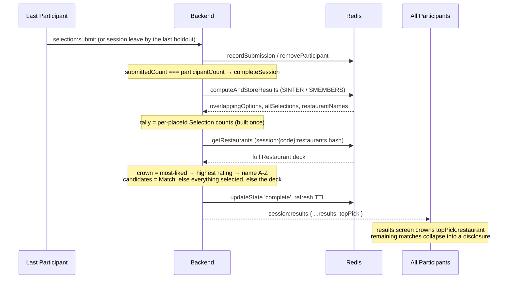

# Top Pick — Dinder always names one restaurant

When a Session completes, the results screen crowns exactly one Restaurant and says in one line why it won — whether the Match has three restaurants, one, or none at all. The crown is chosen server-side by most Selections → highest rating → name A-Z, from the same per-placeId tally `completeSession` already builds for the Near Miss metric, and it travels on the existing `session:results` event as a new optional `topPick` field carrying a full Restaurant (name, rating, price level, cuisine, address, photo). Any remaining matched Restaurants collapse into a disclosure below the crown. Three small riders ship with it: `openNow === false` sinks to the bottom of the restaurant sort, socket-delivered `photoUrl`s are run through the existing `resolvePhotoUrls` so the hero actually renders in production, and issue #12 is verified against its existing regression tests and closed.

## Why

Today the results screen has two endings and only one of them answers the question the group opened the app to settle. With a Match, it lists every overlapping Restaurant as an equal-weight card and leaves a group of four to re-argue over three Matches (`frontend/src/pages/ResultsPage.tsx:407-471`). With no Match, it shows a frowning face and "No restaurants were selected by all participants" (`ResultsPage.tsx:475-499`) — the app gives up and hands the decision back. The Near Miss tier softens that for 3+ Participants (`ResultsPage.tsx:270-286`) but is deliberately a list of counts, not a decision, and never appears for a pair. The data to decide already exists: `completeSession` counts Selections per placeId to log `nearMissCount` and then throws the tally away (`backend/src/services/SessionService.ts:395-402`). We are computing the answer and not shipping it.

## What the user sees

Three screens change. All sketches are a 375px-wide viewport; the page container is `max-w-2xl mx-auto px-4 py-6` (`ResultsPage.tsx:391`), so content sits in 343px.

### 1. Match exists (2 matched Restaurants)

```
┌───────────────────────────────────────┐
│ ←   Perfect Match!            [share] │
│     Tonight's pick is locked in       │
│     AB123                             │
├───────────────────────────────────────┤
│                                       │
│               MATCH!                  │
│      Everyone found the same spark.   │
│                                       │
│ ┌───────────────────────────────────┐ │
│ │▒▒▒▒▒▒▒▒ hero photo ▒▒▒▒▒▒▒▒▒▒▒▒▒▒▒│ │
│ │ TONIGHT'S PICK                    │ │
│ │ Noodle House                      │ │
│ │ Everyone swiped yes — best rated  │ │
│ │ of your 2 matches.                │ │
│ │ ★ 4.8   $$   Ramen                │ │
│ │ ⌖ 12 Smith St, Fitzroy            │ │
│ │ ───────────────────────────────── │ │
│ │ [ Uber Eats ↗ ] [ DoorDash ↗ ]    │ │
│ │ [ Compare prices › ]              │ │
│ └───────────────────────────────────┘ │
│                                       │
│ ┌ Other matches (1)              ▾  ┐ │
│ └───────────────────────────────────┘ │
│                                       │
│ ┌ See everyone's Selections      ▾  ┐ │
│ └───────────────────────────────────┘ │
│                                       │
│ [           Select Again           ]  │
│ [           Share Results          ]  │
│ [            Start Fresh           ]  │
└───────────────────────────────────────┘
```

### 2. No Match, three Participants

```
┌───────────────────────────────────────┐
│ ←   Tonight's Pick            [share] │
│     No unanimous Match — here's the   │
│     closest one                       │
│     AB123                             │
├───────────────────────────────────────┤
│ ┌───────────────────────────────────┐ │
│ │▒▒▒▒▒▒▒▒ hero photo ▒▒▒▒▒▒▒▒▒▒▒▒▒▒▒│ │
│ │ TONIGHT'S PICK                    │ │
│ │ Pizza Palace                      │ │
│ │ 2 of 3 swiped yes — the closest   │ │
│ │ you got.                          │ │
│ │ ★ 4.2   $$   Pizza                │ │
│ │ ───────────────────────────────── │ │
│ │ [ Uber Eats ↗ ] [ DoorDash ↗ ]    │ │
│ │ [ Compare prices › ]              │ │
│ └───────────────────────────────────┘ │
│                                       │
│ ┌─ So Close ────────────────────────┐ │
│ │ All but one of you liked these —  │ │
│ │ worth a second look?              │ │
│ │ ┌───────────────────────────────┐ │ │
│ │ │ Noodle House                  │ │ │
│ │ │ 2 of 3 liked this             │ │ │
│ │ │ ★ 4.8                         │ │ │
│ │ │ [Uber Eats ↗][DoorDash ↗]     │ │ │
│ │ │ [Compare prices ›]            │ │ │
│ │ └───────────────────────────────┘ │ │
│ └───────────────────────────────────┘ │
│                                       │
│ ┌─ Everyone's Selections ───────────┐ │
│ │ (A) Alice                         │ │
│ │     Pizza Palace                  │ │
│ └───────────────────────────────────┘ │
│ [           Select Again           ]  │
│ [           Share Results          ]  │
│ [            Start Fresh           ]  │
└───────────────────────────────────────┘
```

The crowned Restaurant is removed from the "So Close" list, so no Restaurant appears twice.

### 3. Nobody swiped yes on anything

```
┌───────────────────────────────────────┐
│ ←   Tonight's Pick            [share] │
│     No unanimous Match — here's the   │
│     closest one                       │
├───────────────────────────────────────┤
│ ┌───────────────────────────────────┐ │
│ │ TONIGHT'S PICK                    │ │
│ │ Noodle House                      │ │
│ │ Nobody swiped yes, so here's the  │ │
│ │ highest rated nearby.             │ │
│ │ ★ 4.8   $$   Ramen                │ │
│ │ ───────────────────────────────── │ │
│ │ [ Uber Eats ↗ ] [ DoorDash ↗ ]    │ │
│ │ [ Compare prices › ]              │ │
│ └───────────────────────────────────┘ │
└───────────────────────────────────────┘
```

### Exact copy

| Element | String |
| --- | --- |
| Header title, Match | `Perfect Match!` (unchanged) |
| Header subtitle, Match | `Tonight's pick is locked in` (replaces `Everyone agrees on these options`) |
| Header title, no Match, crown exists | `Tonight's Pick` (replaces `No Match Found`) |
| Header subtitle, no Match, crown exists | `No unanimous Match — here's the closest one` (replaces `No restaurants matched everyone's preferences`) |
| Header title/subtitle, **no crown at all** | `No Match Found` / `No restaurants matched everyone's preferences` (today's copy, unchanged) — the header is gated on `pick`, not on `hasOverlap`, so the page never promises a pick above the empty-state card |
| Crown eyebrow | `TONIGHT'S PICK` |
| Reason — everyone liked it, one match | `Everyone swiped yes on this one.` |
| Reason — everyone liked it, N>1 matches | `Everyone swiped yes — best rated of your {N} matches.` |
| Reason — partial agreement | `{likedBy} of {of} swiped yes — the closest you got.` |
| Reason — nobody selected anything | `Nobody swiped yes, so here's the highest rated nearby.` |
| Other-matches disclosure summary | `Other matches ({N})` |
| Near Miss heading / blurb | `So Close` / `All but one of you liked these — worth a second look?` (unchanged) |
| Near Miss card count | `{n-1} of {n} liked this` — the shape is unchanged, but `n` becomes `pick.of` when a crown exists (see below) |
| Buttons | `Select Again`, `Share Results`, `Start Fresh` (unchanged) |

Unchanged and deliberately kept: the `MATCH!` celebration block and its rays (`ResultsPage.tsx:397-403`), the `See everyone's Selections` disclosure (#85, `ResultsPage.tsx:547-573`).

One copy correction the crown forces: the Near Miss card hardcodes its denominator from the client's `participants` array (`ResultsPage.tsx:516-518`), while the crown's `of` comes from `Object.keys(allSelections).length` on the wire. On the #12 leave-completion path those populations differ — `computeAndStoreResults` builds `allSelections` from `listParticipants` *after* `removeParticipant`, but the client's `participants` only shrinks when `participant:left` lands — so the two lines can disagree ~100px apart ("2 of 3 swiped yes" above "2 of 4 liked this"). Since the crown already carries an authoritative `of`, the Near Miss card uses `{pick.of - 1} of {pick.of}` when `pick` exists and keeps `participants.length` when it does not. One expression, no new data.

## Domain language

One new term for `CONTEXT.md`, placed immediately after **Match**:

**Top Pick**:
The single Restaurant a completed Session crowns, together with the one-line reason it won. Chosen by most Selections, then highest rating, then name A-Z — from the Match when the Match is non-empty, from every Restaurant anyone selected when it is empty, and from the Session's open Restaurants when nobody selected anything. Every completed Session with at least one Restaurant has exactly one Top Pick; a Session whose Restaurant deck is empty has none.
_Avoid_: winner, best match, recommendation, top result, the answer

This term deliberately reclaims `pick`, which **Selection** currently lists under _Avoid_ (`CONTEXT.md:29-31`). Amend Selection's line in the same edit to `_Avoid_: like, vote, pick (except in **Top Pick**)`. The wire field stays `likedBy` — it is a contract field name, not user-facing copy, and renaming it buys nothing.

## Design

### Data model

**No new Redis key, no new Supabase table, no TTL change.** The Top Pick is derived at completion time from state that already exists:

| Existing key | Type | Used for | TTL |
| --- | --- | --- | --- |
| `session:{code}:{pid}:selections` | set of placeIds | the tally (already read by `computeAndStoreResults`, `backend/src/store/sessionStore.ts:472-476`) | refreshed by `touch` |
| `session:{code}:restaurant_ids` | set of placeIds | the id list `getRestaurants` iterates with SMEMBERS before hydrating each one (`sessionStore.ts:542`) | refreshed by `touch` |
| `session:{code}:restaurants` | hash placeId → Restaurant JSON | the full Restaurant for the crown and the no-Selections fallback, via the existing `store.getRestaurants` (`sessionStore.ts:539-551`) | refreshed by `touch` |

`session:{code}:results` is untouched — it stays the write-only sentinel set it is today (`sessionStore.ts:488-493`). Persisting the crown would buy nothing: nothing reads that key (`ponytail:` the Top Pick is recomputed on any recompute; there is no re-delivery path for `session:results` at all, so there is nothing to be consistent with).

### Contract

`shared/types/websocket-events.ts` — three additive edits, **no new event**. `session:results` is WIDENED.

```ts
export interface WsRestaurant {
  placeId: string;
  name: string;
  rating?: number;
  priceLevel?: number;
  cuisineType?: string;
  address?: string;
  /** Already sent at runtime by every producer; declared so the crown can render a hero. */
  photoUrl?: string;
}

/** The single Restaurant a completed Session crowns, and why it won. */
export interface TopPick {
  restaurant: WsRestaurant;
  /** Participants who selected it. 0 when nobody selected anything. */
  likedBy: number;
  /** Participants counted in the tally (Object.keys(allSelections).length). */
  of: number;
}

export interface SessionResultsEvent {
  sessionCode: string;
  overlappingOptions: WsRestaurant[];
  allSelections: Record<string, string[]>;
  restaurantNames: Record<string, string>;
  hasOverlap: boolean;
  /** Additive (ADR 0007): absent from an older backend; a Session with zero Restaurants has none. */
  topPick?: TopPick;
}
```

Why `topPick` is optional and not required: ADR 0007 forbids a shape break across two independent deployments. Optional means an old backend + new frontend renders today's screen, and a new backend + old frontend ignores the field. The frontend keeps a one-line fallback (below) so the optionality is not a second UI code path.

Why the reason is numbers, not a string: `likedBy`/`of` are already computed; a server-rendered sentence would put user-facing copy in the backend, where none of it lives today.

### Flow



### Crown rule

One comparator, one candidate list, one code path for both endings — inside `completeSession`, immediately after the tally that already exists:

```ts
// SessionService.completeSession, after `tally` is built (SessionService.ts:396-401)
const of = selections.length;
let pool = results.overlappingOptions;
if (!results.hasOverlap) {
  const deck = (await store.getRestaurants(sessionCode)).restaurants;
  const selected = deck.filter((r) => (tally.get(r.placeId) ?? 0) > 0);
  // Nobody selected anything: fall back to the deck so the screen still answers,
  // but don't crown a venue Places says is shut when an open one exists.
  const open = deck.filter((r) => r.openNow !== false);
  pool = selected.length > 0 ? selected : open.length > 0 ? open : deck;
}
const crowned = [...pool].sort(
  (a, b) =>
    (tally.get(b.placeId) ?? 0) - (tally.get(a.placeId) ?? 0) ||
    (b.rating ?? -1) - (a.rating ?? -1) ||
    a.name.localeCompare(b.name)
)[0];
const topPick = crowned
  ? { restaurant: crowned, likedBy: tally.get(crowned.placeId) ?? 0, of }
  : undefined;
```

`store.getRestaurants` is read **lazily — not at all when the Match is non-empty**, and at most once otherwise. It is a SMEMBERS plus a *sequential awaited HGET per placeId* (`sessionStore.ts:534-551`) over a 20-60 card deck; hoisting it above the branch would run those round-trips on every completed Session including the common happy path where the deck is never read.

The `openNow` filter is applied to the deck fallback **only**. It is deliberately not a term in the comparator: demoting a Restaurant people actually selected below one nobody selected, because Places reports it shut, would be wrong — a group can be planning ahead, and Selections are the stronger signal. Nobody-selected-anything has no such signal, so "highest rated nearby" should at least be open.

Both broadcast sites already spread the service's return value — `backend/src/websocket/submitHandler.ts:96-100` and `backend/src/websocket/leaveHandler.ts:90-94` both emit `{ sessionCode, ...results }` — so **no handler changes**, and the leave path (#12) gets the Top Pick for free.

### Frontend fallback (one line)

```ts
// ResultsPage: an older backend sends no topPick; crown the best-rated Match rather than branching the UI.
const fallbackCrown = [...overlappingOptions].sort((a, b) => (b.rating ?? -1) - (a.rating ?? -1))[0];
const pick =
  topPick ??
  (fallbackCrown
    ? { restaurant: fallbackCrown, likedBy: participants.length, of: participants.length }
    : undefined);
```

The sort is load-bearing, not decoration: `overlappingOptions` arrives in raw SINTER member order and is never rating-sorted (`backend/src/store/sessionStore.ts:457-468`), so crowning `[0]` would let the screen assert "best rated of your N matches" about an arbitrary card. Sorting makes the fallback obey the same crown rule the copy claims, at zero cost.

When `pick` is undefined (old backend AND no Match, or an empty Restaurant deck) the page renders exactly what it renders today — today's header copy **and** the existing empty-state card. Both are gated on `pick`, so the header never announces a pick the page cannot show. That branch is the compatibility path only, not a designed state.

### Hero photo (rider, folded in)

`photoUrl` on a socket payload is a *relative* `/api/comparison/photo?name=…` path (`backend/src/services/RestaurantSearchService.ts:153-155`). REST responses are corrected by `resolvePhotoUrls`, but it is module-private in `frontend/src/services/apiClient.ts:102-131` and only applied at `:85` and `:99`; `socketBindings.ts:161-170` passes the payload straight through. In production `VITE_API_BASE_URL` is a different origin (`frontend/.env.production:2`) and the frontend Caddy has no `/api` route — `Caddyfile` falls every unmatched path through to `/index.html` — so the `` requests `https://www.dinder.it.com/api/comparison/photo?…`, gets HTML, and `MatchHero`'s `onError` strips it. Every match hero is already dead in production, and the crown's hero would be too.

This was going to be deferred, but the frontend work already edits `socketBindings.ts`, and all three sketches lead with a hero. Fold it in: export `resolvePhotoUrls` from `apiClient.ts` and wrap the socket payload in the same handler — `overlappingOptions: resolvePhotoUrls(event.overlappingOptions)` and `topPick: event.topPick && { ...event.topPick, restaurant: resolvePhotoUrls([event.topPick.restaurant])[0] }`. Three lines, one file already in the diff, and it is the only reason `photoUrl?` is being added to `WsRestaurant` at all.

### Files touched

| path | change | why |
| --- | --- | --- |
| `shared/types/websocket-events.ts` | add `TopPick`, `topPick?` on `SessionResultsEvent`, `photoUrl?` on `WsRestaurant` | the contract; additive per ADR 0007 |
| `backend/src/services/SessionService.ts` | crown inside `completeSession` (~:402) reusing the existing `tally`; widen the `results` type on `submitSelections`/`leaveSession` | the single completion path both endings ride |
| `backend/src/services/RestaurantSearchService.ts` | `:451` sort gains `Number(a.openNow === false) - Number(b.openNow === false) ||` before the rating compare | free-rider: closed venues sink |
| `frontend/src/types.ts` | `topPick?` on `Result` (typed `Restaurant`, not `WsRestaurant`) | frontend-owned local shape |
| `frontend/src/stores/sessionStore.ts` | `topPick` in state, `initialState`, `setResults`, `resetSelections` | survives a results-page reload; cleared by a Restart |
| `frontend/src/services/apiClient.ts` | `export` the existing `resolvePhotoUrls` (`:102`) — no body change | the socket path needs the same correction the REST path already gets |
| `frontend/src/services/socketBindings.ts` | pass `event.topPick` through at `:163-169`; run `overlappingOptions` and `topPick.restaurant` through `resolvePhotoUrls` | one key plus the hero-photo rider, same handler |
| `frontend/src/pages/ResultsPage.tsx` | extract the existing match-card JSX as `MatchCard`; crown `pick`; collapse the rest into `Other matches (N)`; exclude the crown from `nearMisses` by placeId; Near Miss denominator from `pick.of`; header copy gated on `pick`; ungate `Select Again` when `pick` exists | the whole feature's UI |
| `CONTEXT.md` | add **Top Pick** after **Match**; amend **Selection**'s `_Avoid_` line to except it | binding glossary |
| `backend/tests/unit/SessionService.test.ts` | new `describe('Top Pick')` | crown-rule proof |
| `backend/tests/unit/websocketHandlers.test.ts` | assert `topPick` on the `session:results` emit from submit and from leave | wire-shape proof (ADR 0006) |
| `backend/tests/unit/RestaurantSearchService.test.ts` | one case for the `openNow` sink | rider proof |
| `frontend/tests/unit/resultsPage.test.tsx` | new `describe('Top Pick')`; **one edit to the existing hero-photo case** (see Test plan) | render + reason copy |
| `frontend/tests/unit/socketBindings.test.ts` | one assertion that a socket `photoUrl` comes out absolute | hero rider proof |
| `frontend/tests/unit/neon-components.test.tsx` | **at risk, must stay green unedited** — it renders `ResultsPage` and asserts `[data-match-card]` has `border-lime` (`:187-202`) | the extracted `MatchCard` must keep the attribute and classes verbatim |

Fourteen rows, six of them tests. No file is created and none is deleted.

**Constraint that keeps `neon-components.test.tsx` green:** the extracted `MatchCard` must carry `data-match-card` and the exact classes `p-4 bg-lime/10 border border-lime rounded-market-md shadow-glow-lime` (`ResultsPage.tsx:411-412`) on the crown *and* on every disclosure card. Restyling the crown is out of scope for this spec; if the crown ever needs its own treatment, that test moves with it.

## What this reuses instead of building

- **The tally.** `completeSession` already builds `Map<placeId, count>` from `results.allSelections` for `nearMissCount` (`SessionService.ts:396-402`). The crown reads the same Map; nothing is counted twice.
- **The completion path.** `completeSession` is already the only producer of results and is already called from both `submitSelections` (`SessionService.ts:453`) and `leaveSession` (`SessionService.ts:500`). One insertion serves both endings.
- **The broadcast.** `submitHandler.ts:96-100` and `leaveHandler.ts:90-94` already spread `...results` into `session:results`. Zero handler edits, zero new event, zero `server.ts` registration.
- **The Restaurant store.** `store.getRestaurants` (`sessionStore.ts:539-551`) already hydrates the deck — SMEMBERS on `session:{code}:restaurant_ids`, then one HGET per id against `session:{code}:restaurants`. No new key, no new query, no Google Places call. Called only when the Match is empty.
- **`resolvePhotoUrls`.** Already written and already correct (`apiClient.ts:102-131`); the hero rider only widens its export and calls it from the socket handler.
- **The match card.** The crowned card is the existing `[data-match-card]` markup (`ResultsPage.tsx:409-468`) extracted to a component and reused verbatim — same attribute, same classes — for the collapsed "other matches".
- **The disclosure pattern.** `Other matches (N)` copies the native `<details className="card group mb-6">` from the #85 unanimous disclosure (`ResultsPage.tsx:547-573`) — no JS state, no modal.
- **The action row.** `DeliveryActions` (`ResultsPage.tsx:35-137`) is reused unchanged; the no-Match crown reuses `nearMissRedirectUrl` (`ResultsPage.tsx:30-31`) so its taps stay server-countable.
- **The tap-source vocabulary.** `COMPARISON_TAP_SOURCES = ['match_card','near_miss']` is reused: the crown tags `match_card` when there is a Match and `near_miss` when there is not. `// ponytail: reusing near_miss for the no-Match crown keeps the #68 kill-gate vocabulary closed; if the gate needs to separate crowned taps from listed ones, add 'top_pick' to COMPARISON_TAP_SOURCES (additive).`
- **#12's regression tests.** Both already exist — `backend/tests/unit/SessionService.test.ts` → "completes the session when everyone remaining has submitted" (asserts `results` and `state === 'complete'`) and `backend/tests/unit/websocketHandlers.test.ts` → "should broadcast results when leaving completes the session". Refer to them by name: the crown work inserts a `describe` into the first and edits the emit assertion in the second, so any line anchor recorded on the closed issue rots immediately. **Genuinely new: nothing.** The work is running them and closing the issue.
- **Genuinely new:** the crown comparator itself (~8 lines), the `TopPick` type, and the reason copy. Nothing else in this spec is new code.

## Hard cases

| case | behaviour |
| --- | --- |
| Match has exactly one Restaurant | Crowned with `Everyone swiped yes on this one.`; the `Other matches` disclosure is not rendered. |
| Match has 2+ Restaurants | Highest-rated is crowned (tally is equal by definition); the rest render inside `Other matches (N)`, same card markup, same actions. |
| Empty Match, some Selections | Crown is the most-selected Restaurant across everyone (`{likedBy} of {of} swiped yes — the closest you got.`). It is filtered out of the Near Miss list. |
| Empty Match, nobody selected anything | Crown falls back to the highest-rated **open** Restaurant in the Session's deck, or the highest-rated one overall if Places reports every venue shut (`Nobody swiped yes, so here's the highest rated nearby.`). Reuses `store.getRestaurants`; zero external calls. |
| Session with zero Restaurants in the deck | `topPick` is `undefined`; the screen renders today's `No Match Found` header **and** today's empty-state card. This is the only remaining "Dinder doesn't answer" state and it means the Places search returned nothing, which the Selection screen already surfaces. |
| Two Restaurants tie on count and rating | `name.localeCompare(a, b)` decides. Deterministic across every Participant's phone because the crown is computed once, server-side. |
| Crowned Restaurant missing its hash entry | Impossible for the Match branch (`computeAndStoreResults` already drops such placeIds, `sessionStore.ts:463-468`) and impossible for the other branches, because `getRestaurants` already drops ids whose hash entry is missing and reports them as `missingCount` (`sessionStore.ts:544-549`). No extra guard. |
| Broadcast `participantCount` ≠ `of` | The host slot stays reserved in `participantCount` while no host is present (`SessionService.ts:276`, `:488-489`), so the broadcast count can exceed the number of Submissions. `of` derives from `allSelections`, which only ever holds present Participants — display names are unique, `joinSession` throws `DISPLAY_NAME_TAKEN` on a live collision and treats a token-matched reuse as a rejoin that removes the prior entry first (`SessionService.ts:297-317`). So the reason line stays internally consistent, and the Near Miss card below it now shares the same `of`. |
| Leave completes the Session (#12) | `leaveSession` calls the same `completeSession`, and `leaveHandler.ts:90-94` spreads the same object — the leaver's departure produces a Top Pick with no extra code. Covered by the existing test at `websocketHandlers.test.ts:396-422`. |
| Disconnect | Nothing. `disconnectHandler` never removes a Participant and never completes a Session; the Match still waits on their Submission. |
| Restart | `resetForRestart` wipes Selections and the results key; the frontend's `resetSelections` clears `topPick` alongside `overlappingOptions`. The next completion crowns from the new Selections over the same (free, un-refetched) Restaurant deck. |
| Session expiry mid-results | Unchanged: `session:expired` flips `sessionStatus` and the results screen's data is whatever the client last received. The Top Pick is not re-fetchable — same as the Match today (`session:{code}:results` is never read back). |
| Reconnect beyond the 2-minute recovery window | Unchanged and still the known stall: a rejoin wipes that Participant's Submission (`SessionService.ts:315-325`). Out of scope; a rejoiner who missed `session:results` sees no Top Pick, exactly as they see no Match today. |
| External API failure (Google Places) | Not on this path. The crown reads Redis only; a Places outage fails earlier, at Restaurant search. |
| External API failure (Apify) | Not on this path. The crown's `Compare prices` link behaves exactly as it does from a Match card today, including the 6-hour Snapshot cache and the 5/hour cold-compare limit. |
| Cost | Zero additional Google Places spend, zero additional Apify spend, zero additional Supabase rows. One extra local-Redis read (`getRestaurants`) per completed Session. |
| Old frontend, new backend | `topPick` is ignored; today's screen renders. |
| New frontend, old backend | `topPick` is absent; the fallback crowns the highest-rated member of `overlappingOptions`, or renders today's header plus empty-state card when there is no Match. |
| Crowned Restaurant is closed | Possible and accepted when people selected it — Selections outrank Places' opening hours. Not possible on the nobody-selected fallback unless the entire deck is shut. The swipe deck also sinks `openNow === false` (rider), but that ordering is discarded by the crown's own sort, so the two mechanisms are independent by design. |

## Out of scope for v1

- **The gold star / "I really want this" button.** Revisit when the session-outcome log shows groups Restarting straight after a Match — evidence the crown is picking the wrong thing.
- **A runoff round between tied matches.** Revisit if ties on count *and* rating are common enough that A-Z ordering visibly randomises the answer.
- **"Nearest" as a tie-break.** `Restaurant` carries no distance field (`shared/types/models.ts:7-16`); only `Venue` does. Revisit if distance is added to the Restaurant search path for another reason.
- **Persisting the Top Pick or re-delivering `session:results`.** Revisit when someone can actually miss a result and recover — i.e. when a results REST endpoint exists.
- **A `top_pick` comparison tap source.** Revisit if the #68 kill gate needs crowned taps separated from listed ones.
- **Reconciling the two `participantCount` meanings on the wire.** The broadcast counts are untouched; `of` deliberately derives from `allSelections`, and the Near Miss card now reads the same `of` so the screen is at least self-consistent. Revisit if a third consumer needs the reserved-host-slot count.
- **`openNow` in the crown comparator.** The deck fallback filters closed venues; a Restaurant people actually selected is still crownable while closed. Revisit if session-outcome logs show groups Restarting off a shut crown.

## Acceptance

1. Three phones join a Session, everyone likes the same two Restaurants, everyone submits: every phone shows the identical single crowned Restaurant under `TONIGHT'S PICK` with `Everyone swiped yes — best rated of your 2 matches.`, and the second Restaurant is inside a collapsed `Other matches (1)`.
2. Three phones join, Alice and Bob like Pizza Palace, Cara likes Noodle House only: every phone crowns Pizza Palace with `2 of 3 swiped yes — the closest you got.`, and Pizza Palace does **not** also appear in the `So Close` list.
3. Two phones join and pick disjoint Restaurants: the screen still crowns one Restaurant with a reason. (Today this screen is the frowning-face dead end; there are no Near Misses for a pair.)
4. Every Participant submits zero Selections: the screen crowns the highest-rated **open** Restaurant in the deck with `Nobody swiped yes, so here's the highest rated nearby.`
4b. A Session whose Restaurant deck is empty renders today's `No Match Found` header above today's empty-state card — the header never announces a pick the page cannot show.
4c. A crowned Restaurant with a `photoUrl` renders its hero on `https://www.dinder.it.com`, not just on localhost.
5. The crowned card shows the Restaurant's rating, price level, cuisine and address where present, and offers `Uber Eats`, `DoorDash` and `Compare prices` — verified by `frontend/tests/unit/resultsPage.test.tsx`.
6. Crown ordering is most-liked → highest rating → name A-Z — verified by `backend/tests/unit/SessionService.test.ts` `describe('Top Pick')`.
7. `topPick` is present on the `session:results` payload emitted from **both** `handleSelectionSubmit` and `handleSessionLeave` — verified by `backend/tests/unit/websocketHandlers.test.ts`.
8. A Restaurant with `openNow === false` sorts below every open Restaurant in the swipe deck regardless of rating — verified by `backend/tests/unit/RestaurantSearchService.test.ts` — and is not crowned on the nobody-selected fallback unless the whole deck is shut — verified by `backend/tests/unit/SessionService.test.ts`.
9. `npm run typecheck` passes after `npm run build --workspace=shared` (the shared `dist/` is gitignored and must be rebuilt before backend/frontend typecheck).
10. #12: `npm run test:unit --workspace=@dinder/backend` passes, including `completes the session when everyone remaining has submitted` and `should broadcast results when leaving completes the session`; #12 is already closed — it receives a comment (`gh issue comment 12`, do not close or reopen) naming both tests **by name, not by line number** — the crown work edits both files and moves the anchors. No code and no new test is written for #12.

## Test plan

Extended suites, all in projects CI actually runs (`.github/workflows/ci-cd.yml` runs `test:unit` in both workspaces and `test:contract` in the backend; integration and Playwright do not run):

- `backend/tests/unit/SessionService.test.ts` — new `describe('Top Pick')` over the existing ioredis-mock fakes: crowns the most-selected Restaurant when the Match is empty; crowns from the Match when it is non-empty; breaks a count tie by rating; breaks a count+rating tie by name A-Z; falls back to the highest-rated deck Restaurant when every Submission is empty; skips a closed deck Restaurant on that fallback even when it is the highest rated; returns `undefined` when the deck is empty; and a spy asserting `store.getRestaurants` is **not** called when the Match is non-empty.
- `backend/tests/unit/websocketHandlers.test.ts` — extend the existing submit and leave emit assertions to include `topPick`. Per this repo's convention (`backend/tests/contract/ack-contract.test.ts:1-4`: "The handler suite asserts what each handler emits"), this is the transport proof ADR 0006 requires for a server-pushed event; no new contract file.
- `backend/tests/unit/RestaurantSearchService.test.ts` — one case inside `describe('searchNearbyRestaurants')`, mocked fetch returning a 4.9-rated closed place and a 3.1-rated open place, asserting the open one sorts first.
- `frontend/tests/unit/resultsPage.test.tsx` — new `describe('Top Pick')` using the existing `seedStore` helper (now seeding `topPick`): each of the four reason strings; `Other matches (N)` contains the non-crowned matches and **not** the crowned placeId; the crowned placeId is absent from `[data-near-miss-card]`; the Near Miss count uses `pick.of`; with `topPick` absent and no Match, today's `No Match Found` header **and** empty-state copy still render.
- `frontend/tests/unit/socketBindings.test.ts` — one case: a `session:results` frame carrying a relative `photoUrl` lands in the store with an absolute URL, on both `overlappingOptions` and `topPick.restaurant`.
- **One existing case must change.** `resultsPage.test.tsx:111-130` (`Match card hero photo (#75)`) destructures `[withPhoto, withoutPhoto]` from `querySelectorAll('[data-match-card]')` in DOM order, seeding `overlappingOptions: [pizza(4.2, photo), noodle(4.8)]`. The rating-sorted fallback crowns Noodle House, so the photo card moves into the disclosure and the positional destructure inverts. Change it to look each card up by name (`screen.getByText('Pizza Palace').closest('[data-match-card]')`); the assertions themselves are unchanged. This is the one place the earlier "no existing frontend test is touched" claim was wrong.
- **Not rewritten:** every other existing `resultsPage.test.tsx` case seeds no `topPick`, keeps exercising the fallback path, and stays green — `<details>` content stays in the DOM, so name-based queries still find collapsed cards.
- **At risk, must stay green unedited:** `frontend/tests/unit/neon-components.test.tsx:187-202` renders `ResultsPage` and asserts `[data-match-card]` carries `border-lime` and that the `MATCH!` heading keeps its classes. It passes iff the extracted `MatchCard` keeps the attribute and classes verbatim. Run it explicitly before opening the PR.
- **Optional, local only:** `frontend/tests/e2e/flows/multi-participant.spec.ts` can gain a crown assertion, but Playwright runs in no workflow — it is not a gate.

**The one test that fails if the core logic breaks:** `backend/tests/unit/SessionService.test.ts` → `describe('Top Pick')` → `it('crowns by most Selections, then rating, then name')` — a four-Participant Session with an empty Match where the expected crown loses on rating and wins on count, plus a second assertion where two Restaurants tie on both count and rating and the A-Z name decides. If the comparator, the tally reuse, or the candidate list regresses, this test is red.

## Review notes

Two independent reviews ran against this spec — one checking every factual claim against the code, one hunting plan defects. Everything they flagged is applied above except the following, rejected on evidence:

- **"`dependsOn: \"top-pick-backend-crown\"` is an unmatched string; the frontend issue could be scheduled first and would not compile."** Rejected. The orchestrator's issue schema defines `dependsOn` as *keys of issues that must land first*, and `top-pick-backend-crown` is exactly the `key` of the backend issue in the same set. The reviewer could not see the schema from the repo; the reference resolves. The ordering constraint is real and correctly declared.
- **"Redraw sketches 1 and 2 without the hero photo, and drop `photoUrl?` from `WsRestaurant`."** Rejected as stated — the underlying defect is real and worse than reported (the frontend `Caddyfile` has no `/api` route at all, so the relative photo path resolves to `index.html` on `www.dinder.it.com`), but the answer is to fix it, not to draw around it. The frontend work already edits `socketBindings.ts`; exporting `resolvePhotoUrls` and calling it there is three lines. Folded in above as a rider. The sketches stand and `photoUrl?` earns its place in the contract.
- **"Rename the wire field `likedBy` to `selectedBy` to stay clear of Selection's `_Avoid_` list."** Rejected. `_Avoid_` governs the words we write and speak, not TypeScript identifiers. `likedBy`/`of` never reach the screen — the reason sentence is assembled client-side. The term **Top Pick** does reclaim `pick`, and that collision is handled explicitly by amending Selection's `_Avoid_` line.
- **"`store.getRestaurants` is called at most once" is fine as an acceptance criterion.** Rejected as too weak — see the crown sketch. The hoisted read costs 20-60 sequential HGETs on the *common* path, where the deck is never read. The criterion is now "not called at all when the Match is non-empty", with a spy proving it.

Two findings were reported as confirmed with no action required and are recorded here so a future reader does not re-derive them:

- `session:{code}:results` is genuinely write-only. `resultsKey` appears only in `sadd` (`sessionStore.ts:490`, `:492`), `del` (`:255`, `:520`) and the `touch` EXPIREAT list (`:129`). There is no read anywhere, which is why persisting the crown buys nothing.
- `useSessionStore.restaurants` has no production writer. `setRestaurants` is referenced only by `sessionStore.test.ts`; `SelectionPage.tsx:18` uses an unrelated local `useState` of the same name. The crown must therefore ride the wire. The same fact explains an existing oddity a future reader might otherwise "fix": the Near Miss builder's `restaurantsById` lookup (`ResultsPage.tsx:278`) always misses in production and falls back to `{placeId, name}` with no rating.
